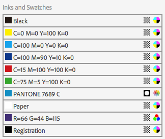
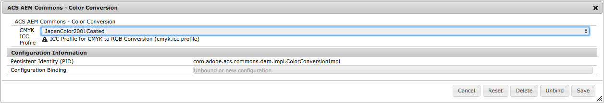
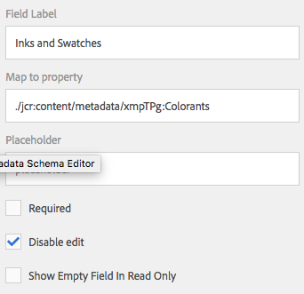

> This feature is AEM 6.2+ ONLY!

## Purpose

Images and documented edited with Adobe creative applications contain a variety of interesting metadata automatically  inserted into them using the XMP metadata standard. AEM provides components for viewing and editing simple text and numeric values but in some cases, the metadata is defined in a structure and so the primitive fields can't display them properly.

## How to Use



In order to take advantage of the automatic activation of any of these components, it is necessary to activate an OSGi component which handles the activation.

To do this, create a new node named `com.adobe.acs.commons.dam.impl.CustomComponentActivatorListServlet` of type `sling:OsgiConfig` in any valid `config` folder in the repository.

The Color Swatches component displays the colors used in an asset. The display of this component will vary between InDesign and Illustrator files as InDesign stores a flat list of colors (in the `xmpTPg:Colorants` structure) whereas Illustrator structures the colorants into Swatch Groups (in the `xmpTPg:SwatchGroups` structure). For each colorant, a color swatch and the name of the colorant are displayed along with the type and color space.

CMYK and LAB to RGB color conversions are performed using the JapanColor2001Coated ICC profile by default. If necessary, this can be changed by configuring the `com.adobe.acs.commons.dam.impl.ColorConversionImpl` OSGI component.

### Activation

To activate this component, add a new disabled text field with the "Map to property" setting of `./jcr:content/metadata/xmpTPg:Colorants`.

