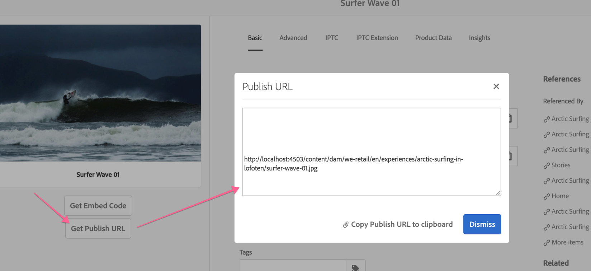

## Purpose

AEM authors quickly want to grab the asset's publish URL for sharing or for use with external tools like Adobe Target.

## How to Setup



Note that your [AEM Externalizer](https://helpx.adobe.com/experience-manager/6-4/sites/developing/using/externalizer.html) OSGi service must be set up for the Publish URL to use the correct domain.

## How to Use

1. Ensure the asset is published
2. Click into the asset
3. Click the new **Get Publish URL** button
4. Copy the Publish URL

