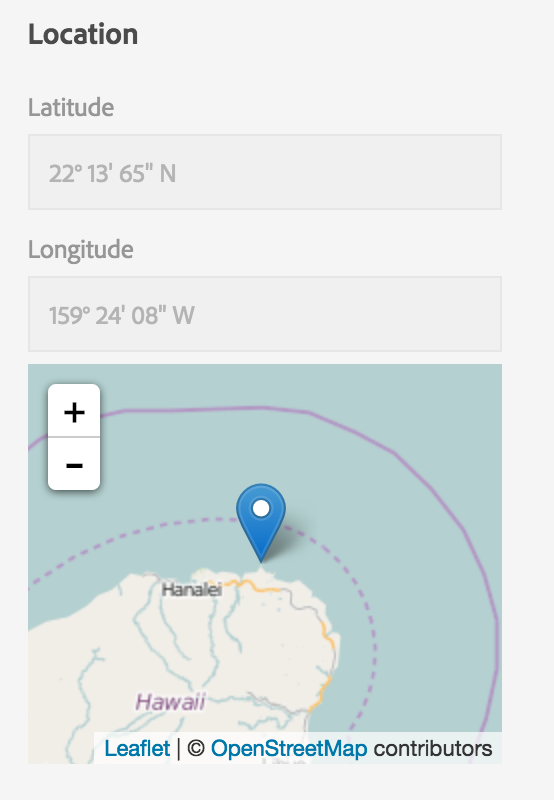
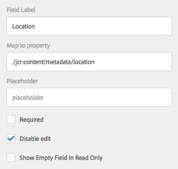

> This feature is AEM 6.2+ ONLY!

## Purpose

Provide a way to rewrite the values in the `exif:GPSLatitude` and `exif:GPSLongitude` metadata fields from their stored notation (`DD,MM.SS[NEWS]`) to the more user-friendly `DD° MM' SS" [NEWS]` view.

Provide a visual map in the Assets metadata editor view, powered by OpenStreeMap via the Leaflet (http://leafletjs.com/) JS library.

## How to Use - Location Properties



To configure the display JavaScript bit, you need to add

`wrapperClass=acs-dam-location-degrees`

To the metadata field definition for `exif:GPSLatitude` and `exif:GPSLongitude`

## How to Use - Map (since 3.2.0)



This component can be automatically activated in the metadata schema editor.

To do this, it is first necessary to activate an OSGi component which handles the activation. To do this, create a new node named `com.adobe.acs.commons.dam.impl.CustomComponentActivatorListServlet` of type `sling:OsgiConfig` in any valid `config` folder in the repository.

Then create a new textfield component in the Metadata Schema Editor and specify a "Map to property" of `./jcr:content/metadata/location` and ensure the field is disabled. This field will be automatically replaced with the map component when the asset editor is loaded.

<!--
### Legacy (pre-3.2.0 approach)

To add the map, create a new component of type `acs-commons/components/dam/asset-location-map` in the metadata schema editor.

> IMPORTANT: Once making manual changes like this to a Metadata Schema you can no longer reliably edit the schema using the GUI.

#### Example


<col2
    jcr:primaryType="nt:unstructured"
    granite:rel="aem-assets-metadata-form-column"
    listOrder="1"
    sling:resourceType="granite/ui/components/coral/foundation/container">
  <items
      jcr:primaryType="nt:unstructured">
    <header
        jcr:primaryType="nt:unstructured"
        fieldLabel="Scheduled (de)activation"
        sling:resourceType="dam/gui/coral/components/admin/schemaforms/formbuilder/sectionfield">
      <granite:data
        jcr:primaryType="nt:unstructured"
        metaType="section"/>
    </header>

    <ontime
        jcr:primaryType="nt:unstructured"
        displayedFormat="YYYY-MM-DD HH:mm"
        fieldLabel="On Time"
        name="./jcr:content/onTime"
        renderReadOnly="true" sling:resourceType="granite/ui/components/coral/foundation/form/datepicker"
        type="datetime">
      <granite:data
        jcr:primaryType="nt:unstructured"
        metaType="datepicker"
        typeHint="Date"/>
    </ontime>

    <offime
        jcr:primaryType="nt:unstructured"
        displayedFormat="YYYY-MM-DD HH:mm"
        fieldLabel="Off Time"
        name="./jcr:content/offTime"
        renderReadOnly="true"
        sling:resourceType="granite/ui/components/coral/foundation/form/datepicker" type="datetime">
      <granite:data
        jcr:primaryType="nt:unstructured"
        metaType="datepicker"
        typeHint="Date"/>
    </offime>

    <header2
        jcr:primaryType="nt:unstructured"
        fieldLabel="Location" sling:resourceType="dam/gui/coral/components/admin/schemaforms/formbuilder/sectionfield">
      <granite:data
        jcr:primaryType="nt:unstructured"
        metaType="section"/>
    </header2>

    <latitude
        jcr:primaryType="nt:unstructured"
        disabled="true"
        fieldLabel="Latitude"
        name="./jcr:content/metadata/exif:GPSLatitude"
        renderReadOnly="true"
        showEmptyInReadOnly="true" sling:resourceType="granite/ui/components/coral/foundation/form/textfield"
        wrapperClass="acs-dam-location-degrees">
      <granite:data
        jcr:primaryType="nt:unstructured"
        metaType="text"/>
    </latitude>

    <longitude
        jcr:primaryType="nt:unstructured"
        disabled="true"
        fieldLabel="Longitude"
        name="./jcr:content/metadata/exif:GPSLongitude"
        renderReadOnly="true"
        showEmptyInReadOnly="true"
        sling:resourceType="granite/ui/components/coral/foundation/form/textfield"
        wrapperClass="acs-dam-location-degrees">
      <granite:data jcr:primaryType="nt:unstructured" metaType="text"/>
    </longitude>

    <map
      jcr:primaryType="nt:unstructured"
      sling:resourceType="acs-commons/components/dam/asset-location-map"/>
  </items>

  <jcr:content jcr:primaryType="nt:unstructured"/>

</col2>

-->

## Video Walk-through

<iframe width="945" height="532" src="https://www.youtube.com/embed/yMi-Qab14-o?rel=0" frameborder="0" allowfullscreen></iframe>
