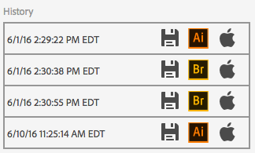
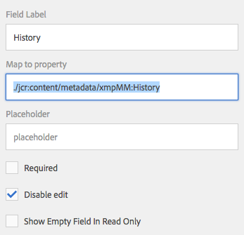

> This feature is AEM 6.2+ ONLY!

## Purpose

Images and documented edited with Adobe creative applications contain a variety of interesting metadata automatically  inserted into them using the XMP metadata standard. AEM provides components for viewing and editing simple text and numeric values but in some cases, the metadata is defined in a structure and so the primitive fields can't display them properly.

## Usage - General

In order to take advantage of the automatic activation of any of these components, it is necessary to activate an OSGi component which handles the activation.

To do this, create a new node named `com.adobe.acs.commons.dam.impl.CustomComponentActivatorListServlet` of type `sling:OsgiConfig` in any valid `config` folder in the repository.

### Wrapper Client Library (required as of 4.0.0)

The following wrapper Client Library node definition must be used to enable this feature.

* [Wrapper Client Library node definition](https://github.com/Adobe-Consulting-Services/acs-aem-commons/blob/master/content/src/main/content/jcr_root/apps/acs-commons/components/dam/custom-component-activator/clientlib/.content.xml#L11-L17)

## History

The History component displays the content of the `xmpMM:History` structure showing the edit history of an asset.

### Activation

To activate this component, add a new disabled text field with the "Map to property" setting of `./jcr:content/metadata/xmpMM:History`.

