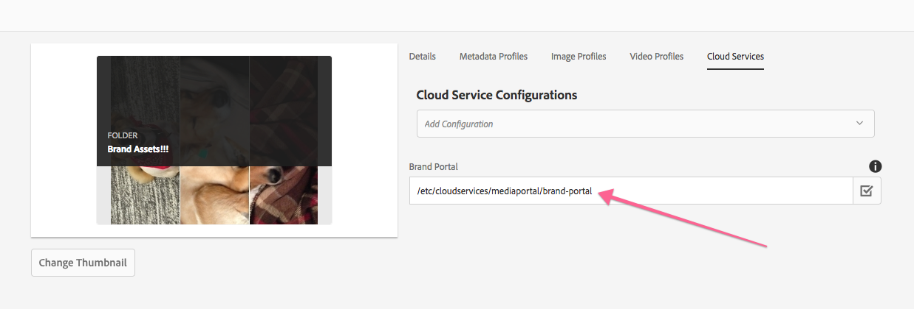

## Purpose

OOTB AEM Assets does not directly support adding custom properties to Asset Folders, however this is useful to indirectly apply metadata or define how descendant assets should be treated by workflow.

This feature allows custom properties to be set on and read from the Assets Folders `jcr:content` via the Assets Folder Settings Web UI,
using OOTB UI Widgets and leveraging the Sling POST Servlet to persist data.

## How to use

### Create an OSGi configuration
 
Create an empty `sling:OsgiConfig` config for AEM Author to enable the ACS Commons Asset Folder Properties support.

`/apps/mysite/config.author/com.adobe.acs.commons.dam.impl.AssetsFolderPropertiesSupport.xml`


<?xml version="1.0" encoding="UTF-8"?>
<jcr:root xmlns:sling="http://sling.apache.org/jcr/sling/1.0" xmlns:cq="http://www.day.com/jcr/cq/1.0" xmlns:jcr="http://www.jcp.org/jcr/1.0" xmlns:nt="http://www.jcp.org/jcr/nt/1.0"
    jcr:primaryType="sling:OsgiConfig"/>


### Resource-merge the asset-folder-properties-support "Read Properties" overlay

The OSGi configuration above auto-enabled the persisting of properties to the Asset Folder's `jcr:content` node, 
however a second configuration is required to allow the Asset Folders Properties Web UI to read and display these persisted properties.

To do this, create a resource-merged node at `/apps/dam/gui/content/assets/foldersharewizard/jcr:content/body/items/form/items/wizard/items/settingStep/items/fixedColumns/items/fixedColumn2/items/tabs/items/tab1/items/asset-folder-properties-support/.content.xml`


<?xml version="1.0" encoding="UTF-8"?>
<jcr:root xmlns:sling="http://sling.apache.org/jcr/sling/1.0" xmlns:granite="http://www.adobe.com/jcr/granite/1.0" xmlns:cq="http://www.day.com/jcr/cq/1.0" xmlns:jcr="http://www.jcp.org/jcr/1.0" xmlns:nt="http://www.jcp.org/jcr/nt/1.0"
    jcr:primaryType="nt:unstructured"
    sling:orderBefore="titlefield"
    sling:resourceType="acs-commons/touchui-widgets/asset-folder-properties-support"/>                                                                   


This new node must be merged directly AFTER `/apps/dam/gui/content/assets/foldersharewizard/jcr:content/body/items/form/items/wizard/items/settingStep/items/fixedColumns/items/fixedColumn2/items/tabs/items/tab1/items/folderproperties` and BEFORE the first real field, which is `titlefield`.

### Add your own fields to the Asset Folder Properties

Following the same pattern as adding the Read Properties overlay (above), resource-merge custom fields into the folder properties Web UI.

### Example package

[Download example package](./acs-aem-commons-assets-folder-properties-support-1.0.0.zip)

This package contains:

* Read Properties overlay
* Brand Portal path field (`jcr:content/mpConfig`)

This sample package can be used in conjunction with the [ACS AEM Commons Brand Portal Sync workflow process](/acs-aem-commons/features/workflow-processes/brand-portal/index.html).