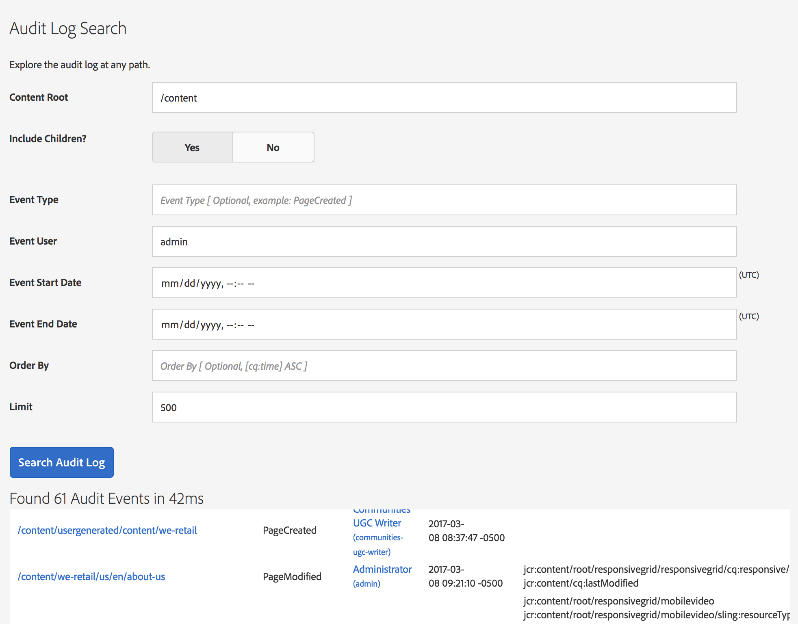
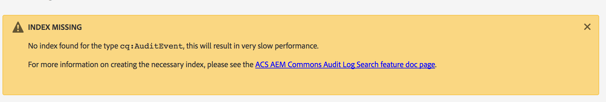

## Purpose

Allows administrators to easily search the AEM Audit Log to determine what user modified content and when. This can be useful when diagnosing content issues, job results or unknown changes on a site.

## Using Audit Log Search

To use the Audit Log Search:

1. Navigate to [/etc/acs-commons/audit-log-search.html](http://localhost:4502/etc/acs-commons/audit-log-search.html) on your environment. 
2. Enter your search parameters
3. Click the `Search Audit Log` button

This will perform the search and return the results in a table below. 

The first time you use the Audit Log Search, you may see a warning about a missing Oak Index, see [Installing Oak Index](#Installing-Oak-Index) for more information in resolving the issue.

### Search Fields

The following fields are supported for searching:

 - **Content Root** *Required* - The repository path under which the Audit Log entries were logged
 - **Include Children?** - If set to `Yes` only Audit Log events for the exact path in the content root will be returned, if `No` all Audit Log events under the Content Root will be returned. Only returning the exact path, is significantly faster.
 - **Event Type** - The Audit Log event type, e.g. PageCreated, PageDeleted, etc
 - **Event User** - The user which triggered the Audit Log event
 - **Event Start Date** - Sets the date / time start bounds for when the event occurred
 - **Event End Date** - Sets the date / time end bounds for when the event occurred
 - **Order By** - Controls the ordering of the results
 - **Limit** - Limits the number of results, increasing this can significantly increase result times
 
### Result Fields

The following columns will be available in the results:

 - **Path** - The event path, clicking opens the resource in CRXDE Lite
 - **Type** - The type of event, matches the `Event Type` in the search fields
 - **User** - The user who triggered the Audit Log event, matches the `Event User` in the search fields
 - **Time** - the Date / Time the event was triggered
 - **Modifications** - A list of properties modified, locations moved or other changes in the Audit Log event
 - **CRXDE** - Link to the Audit Log event in CRXDE

## Installing Oak Index

If you receive the Oak Index missing warning when using the Audit Log search or if the results are slow, you will need to install an Oak Index to improve query performance.

You can generate an Oak Index based on the queries in the Audit Log Search tool with the [Oak Index Definition Generator](http://oakutils.appspot.com/generate/index) or download a [package with a simple Oak Index definition](/acs-aem-commons/packages/audit-log-search/acs-aem-commons-audit-log-oak-index-4.8.6.zip).