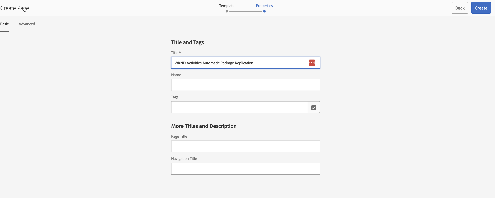
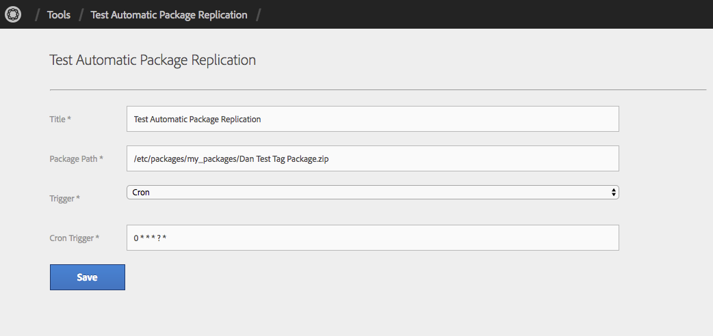
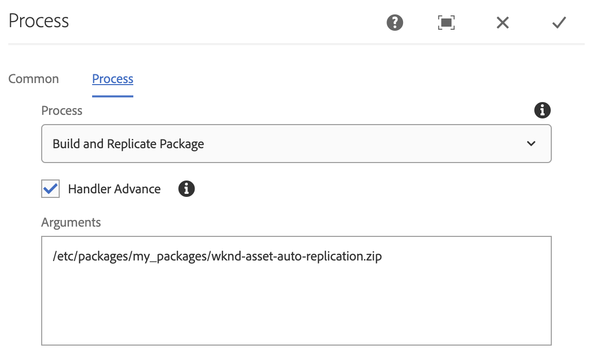

## Purpose

Allows developers to easily build and replicate a pre-defined AEM Package from a schedule, trigger or workflow process. AEM packages can be used to easily promote large amounts of content from Author to Publisher instances without having the load of tree replications. 

## Using Automatic Package Replication

There are two primary methods for invoking the Automatic Package Replication feature. This can be invoked by a scheduler / event or can be invoked as a workflow process step. 

## Schedules or Event Triggers

To use the Automatic Package Replication feature:

1. Navigate to `AEM Author > Tools > Automatic Package Replication`
2. From the top right corner select `Create > Page`
3. On the *Create Page*, select `Automatic Package Replication Configuration > Next`
4. Enter the Title / Name of your Automatic Package Replication and Click *Create*
    
5. Open and configure the Automatic Package Replication configuration

### Configuration Fields

The following fields are supported for configuring the Automatic Package Replication instance:

 - **Title** *Required* - The jcr:title of the page
 - **Package Path** *Required* - The path of the package to build and replicate. This will display a list of the currently available packages.
 - **Trigger** *Required* - The trigger for this Automatic Package Replication configuration, may be one of:
   - *Cron* - Triggers on a schedule
   - *Sling Event* - Triggers on a Sling Event topic
 - **Cron Trigger** *Required if Cron* - The [Quartz Cron Trigger expression](http://www.quartz-scheduler.org/documentation/quartz-2.x/tutorials/crontrigger.html) for the schedule on which to invoke this configuration
 - **Event Topic** *Required if Sling Event* - The [Sling OSGi Event topic](http://felix.apache.org/documentation/subprojects/apache-felix-event-admin.html) name to invoke this configuration. You can view and trigger events from the OSGi Console at [/system/console/events](http://localhost:4502/system/console/events)
 - **Event Filter** - A LDAP expression for filtering the events on which the configuration should be invoked.

## Workflow Process

To invoke the Automatic Package Replication feature from a workflow, add a `Process Step` into your workflow and configure it as such:

 - **Process** - `Build and Replicate Package`
 - **Arguments** - The path to the package to build and replicate

