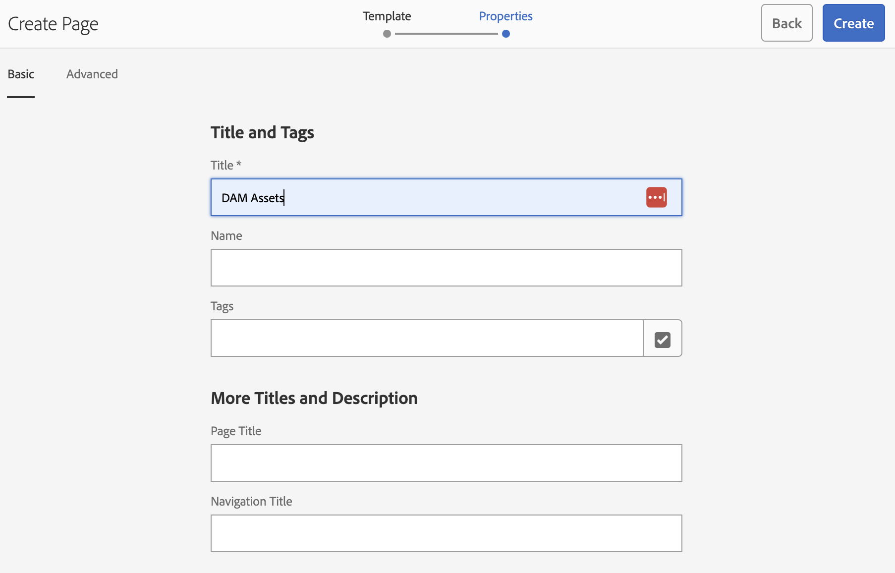
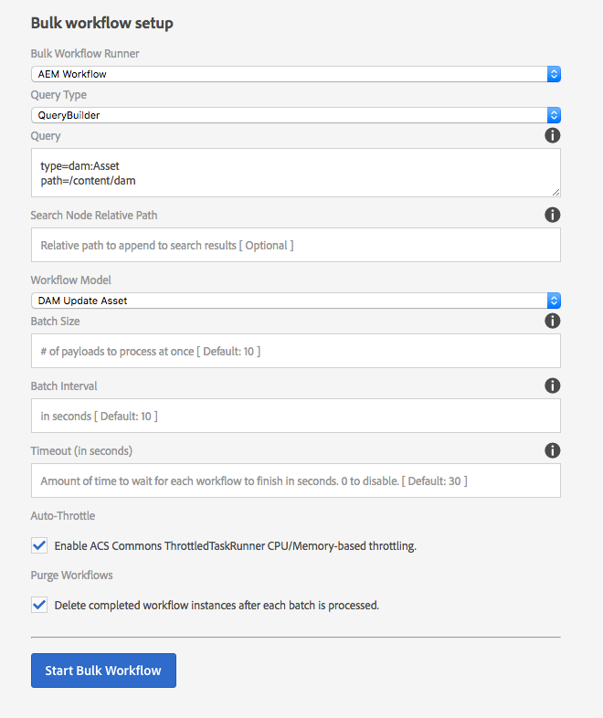
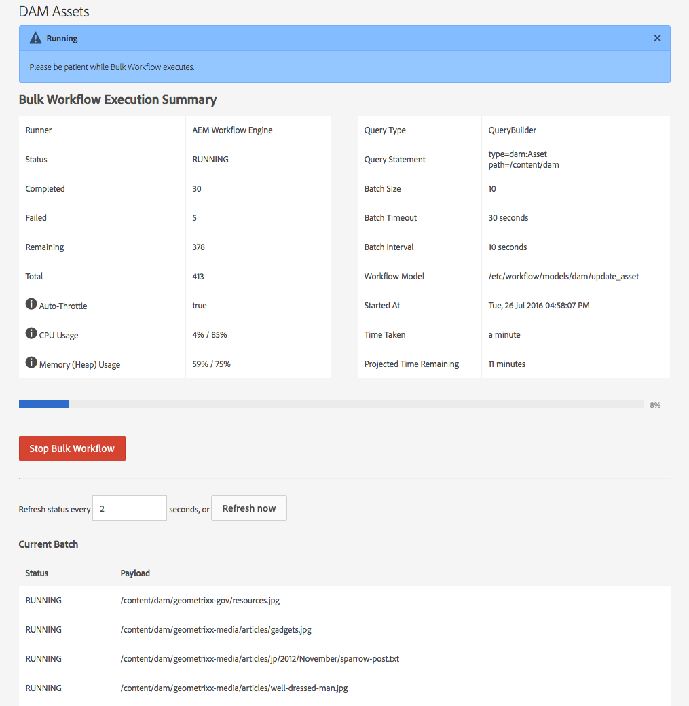
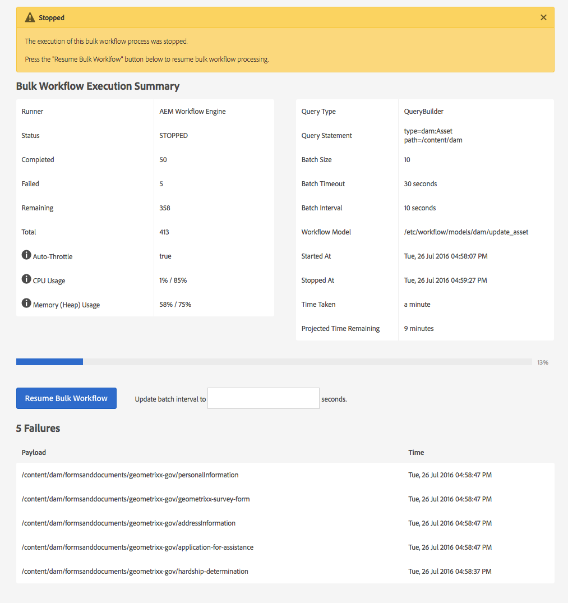
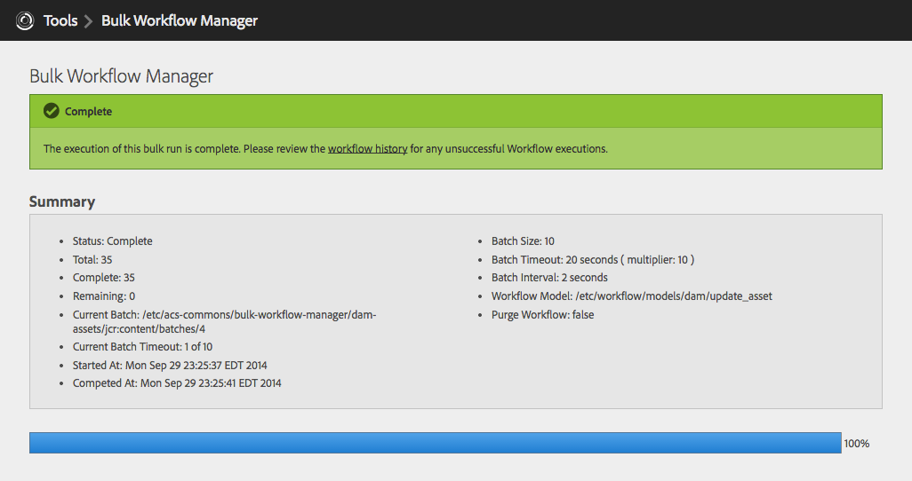

> This version of Bulk Workflow Manager replaces the previous Bulk Workflow Manager implementation.

# Purpose

Execute Workflow in bulk across a variety of resources is difficult in AEM. OOTB Workflow initiation is on a per resource basis, via Workflow Packages or folders of limited size (15).

The ACS AEM Commons Bulk Workflow Manager allows resources to be selected via a query

* `QueryBuilder`
* `xPath`
* `JCR-SQL`
* `JCR-SQL`

or `List` of paths, and put under managed Workflow execution ensuring only a fixed number of items are queued or under workflow at a time.

Bulk Workflow Manager supports executing OOTB AEM Workflow, Serial [Synthetic Workflow](/acs-aem-commons/features/synthetic-workflow/index.html) or [Synthetic Workflow](/acs-aem-commons/features/synthetic-workflow/index.html) via [Fast Action Manager](/acs-aem-commons/features/fast-action-manager/index.html).

# How to Use

* Log in to AEM Author
* Navigate to the Classic UI Tools Console (from the Touch UI, this is Tools:Operations:Configuration)
* Under the `acs-commmons` folder, create a folder named `Bulk Workflow Manager`
* Under the `Bulk Workflow Manager` folder, create a new Page of Template type "Bulk Workflow Manager"

* Use the configuration forms to define the Bulk Workflow run.

* Upon pressing "Start Bulk Workflow" the resources will be queried and prepped for workflow. Please note, if the repository is large and the query inefficient it may take some time to collected all candidate resources. Ensure your query is correct before starting Bulk Workflow. During Bulk Workflow execution, the process can be stopped.

* Stopped Bulk Workflow processes can be resumed. Note; Bulk Workflow Manager processing will stop/restart automatically during re-deploys of the ACS AEM Commons bundle.

* When the Bulk Workflow execution is complete, the page will display the final results.

* To start another Bulk Workflow run, create a new `Bulk Workflow Manager` page.

## Runner Types (v2.6.4/3.2.4)

### AEM OOTB Workflow

Select AEM OOTB Workflow to execute the workflow using the AEM Workflow Engine. This provides all the usual functionality AEM Workflow provides. This uses the Sling Job Engine and large sets 10,000+ payloads, this can be slower as as Bulk Workflow Manager throttles/manages the # of workflows being executed at once.

> Since v2.8.0/3.4.0 - the AEM OOTB Workflow Runner has limited support of Transient Workflows. Transient workflows can be executed and run with basic job queue size-based throttling, and failures are not detected. AEM logs must be monitored for failures.

### Synthetic Workflow

Select Synthetic Workflow to execute the workflow using [ACS Commons Synthetic Workflow](/acs-aem-commons/features/synthetic-workflow/index.html), in a single thread and serial fashion. This requires that the Workflow model is supported by Synthetic Workflow; make sure to full test the workflow model against Synthetic Workflow become processing payloads at scale.  

### Synthetic Workflow w/ FAM

Select Synthetic Workflow to execute the workflow using [ACS Commons Synthetic Workflow](/acs-aem-commons/features/synthetic-workflow/index.html), but allow [ACS Commons Fast Action Manager](/acs-aem-commons/features/fast-action-manager/index.html) to run the work in a multi-threaded fashion. This is typically the fastest approach but carries all the same considerations in the use of Synthetic Workflow.

## Video Walkthrough

<iframe width="945" height="532" src="https://www.youtube.com/embed/tK4yE6Ys14Q?rel=0" frameborder="0" allowfullscreen></iframe>

## Service User

On AEM 6.2 or above, this service uses a Service User for repository access. This user is configured with
the expected permissions required, but additional permissions may be required if your repository design
deviates from the expected structure.

User name: `acs-commons-bulk-workflow-service`

ACLs:

* `jcr:read`, `jcr:modifyProperties` on `/etc/acs-commons/bulk-workflow-manager`