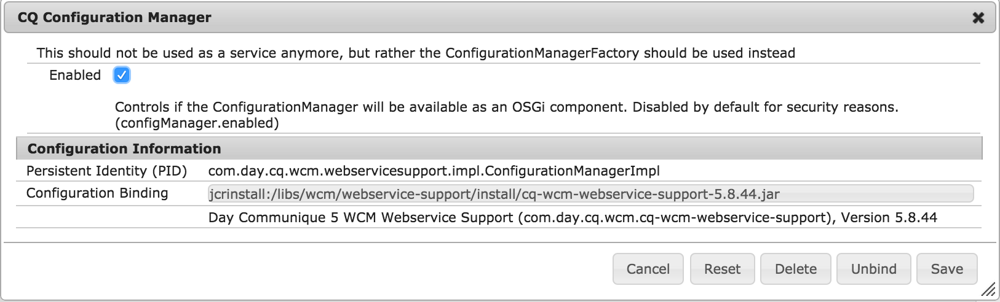



## General Requirements

In order to use these Cloud Services, ensure that the Cloud Service configuration components are included in *both* the head and body of the page. This typically is done by including `<cq:include script="/libs/cq/cloudserviceconfigs/components/servicelibs/servicelibs.jsp"/>` in _headlibs.jsp_ and `<cq:include path="cloudservices" resourceType="cq/cloudserviceconfigs/components/servicecomponents"/>` in _body.jsp_. If you run into trouble with these Cloud Services, compare your page component scripts to the Foundation page component.

## Special Requirement when using AEM 6.1+

On AEM 6.1, use of these components generally require enabling of the CQ Configuration Manager component, which is disabled by default. This is required for cross-compatibility with AEM 6.0 and AEM 6.1.

This must be done in both author and publish.

