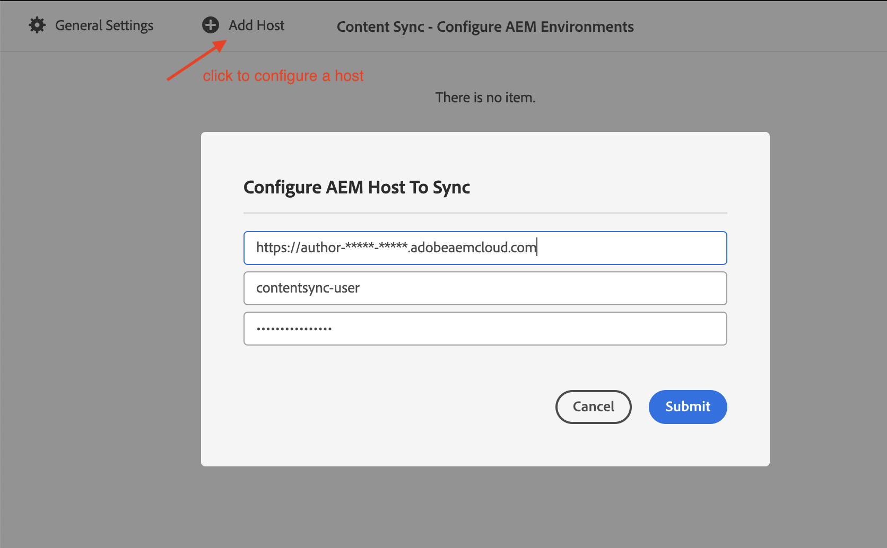

## Purpose
Incrementally synchronize content between AEM Author instances.

ACS Content Sync is yet another solution aiming to overcome the shortcomings of using CRX Package Manager / VLT RCP 
to copy content between AEM environments.

### Why do I need Content Sync?
Using CRX Package Manager to copy content between AEM environments has a number of limitations:

- CRX Package Manager requires escalated access, which is not always possible, especially in production environments
- Installing a package resets the version history.  
- There are challenges to set up incremental updates.

### How does Content Sync Work?
Content Sync uses JSON Export/Import between Sling GET/POST servlets. The tool fetches a catalog of resources from the source instance, e.g.
```
/content/path1  lastModified1
/content/path2  lastModified2
/content/path3  lastModified3
```
then it compares it with the local state, computes the delta and synchronizes it via JSON Export/Import.

### What can I sync?
In general - any content resources, like

- Pages
- Assets
- Experience Fragments
- Content Fragments
- Tags
- /conf/* data

### How many HTTP calls does Content Sync make?
The ballpark estimation is O(N) where N is the number of content resources (cq:Page, dam:Asset, etc.) being sync-ed.
For example, it takes an HTTP call to sync a `cq:Page` resource, so to sync a tree of _N_ `cq:Page` nodes the tool will make minimum _N_ HTTP calls.
To sync a _dam:Asset_ resource the tool will make an HTTP call to grab the _jcr:content_ and sub-nodes, and an HTTP call  to grab binary data for each rendition. 

## Features
- AEM CS compatible, e.g. you can sync https://author-xxxxx.adobeaemcloud.com from https://author-yyyyy.adobeaemcloud.com
- Binary data is preserved
- Version history is preserved
- Node ordering is preserved
- Incremental updates based on _jcr:lastModified/cq:lastModified_

## How to Use

In order to use the Content Sync tool, you need the latest version of ACS Commons installed on the source and target AEM instances.

### Configure Sling Get Servlet on the source AEM instance
ContentSync requires a few tweaks in the Sling Get Servlet configuration to ensure it renders the correct JSON .

Create an OSGi configuration for PID `org.apache.sling.servlets.get.DefaultGetServlet` and make sure that:
- JSON Renderer is enabled
- JSON Max Results parameter is set to at least 1000
- Legacy ECMA date format is unchecked

  

#### AEM Publish configurations

In order to sync content from an AEM Publish environment, the following configuration much be made to the Apache Sling Authentication Service OSGi configuruation, adding the path `+/apps/acs-commons/content/contentsync` to paths with authenticationr requirements.


`/apps/example-app/osgiconfig/config.publish/org.apache.sling.engine.impl.auth.SlingAuthenticator.cfg.json`

```
{
  "auth.annonymous":true,
  "auth.sudo.cookie":"sling.sudo",
  "sling.auth.requirements":[
    "+/libs/granite/oauth/content/authorization",
    "+/apps/acs-commons/content/contentsync"
  ],
  "auth.http.realm":"Sling (Development)",
  "auth.http":"preemptive",
  "auth.sudo.parameter":"sudo"
}
```


### Configure the host(s) to synchronize from

Navigate to the Content Sync tool http://localhost:4502/apps/acs-commons/content/contentsync.html and click the _Configure_
button in top right corner:


Add a host to synchronize from: 


The _contentsync-user_ user needs read permissions on the content you are going to sync. 

### Run the Content Sync tool
Navigate to the Content Sync tool http://localhost:4502/apps/acs-commons/content/contentsync.html and select a path to synchronize.
The default mode is Incremental, which means only new or modified resources will be downloaded. If the Incremental option is unchecked
then the tool will do full sync and download the entire content tree.

The 'On-complete' workflow option allows you to define a custom post-update action. 
For example, you can define a workflow to clear properties like cq:replicationStatus, or automatically publish a resource
if it is published in the source environment.


## Pluggable Update Strategy
The strategy to select incremental delta is pluggable.
The default algorithm is based on the _cq:lastModified/jcr:lastModified_ timestamp.
As an example, Content Sync ships with _AssetChecksumStrategy_ strategy which synchronizes dam:Asset nodes based 
on the _dam:sha1_ checksum in the asset metadata.

Users can plug in their custom strategies by implementing _com.adobe.acs.commons.contentsync.UpdateStrategy_ interface;

## Content Sync and IP Allow Lists

> [!WARNING]  
> Content Sync is not compatible with IP allow lists.
If you want to use Content Sync, IP allow lists must not be enabled.

## OAuth

In some AEMaaCS environments, security policies may disallow Basic Auth. In such cases, ContentSync can use an Adobe IMS Technical Account with OAuth.

### OAuth Configuration

1. Create an [AEMaaCS technical account](https://experienceleague.adobe.com/en/docs/experience-manager-learn/getting-started-with-aem-headless/authentication/service-credentials) and download the service credentials JSON from the Adobe Dev Console
2. Convert the service credentials JSON into a `com.adobe.acs.commons.adobeio.service.impl.IntegrationServiceImpl.cfg.json` OSGi configuration. This can be done via one-liner script:
 ```shell
cat cm-p12345-e9876-integration-1.json | \
jq -r '.integration | {
  "endpoint": ("https://" + .imsEndpoint + "/ims/exchange/jwt"),
  "loginEndpoint": "https://ims-na1.adobelogin.com/c/",
  "privateKey":  .privateKey,
	"clientId":  .technicalAccount.clientId, 
	"clientSecret": .technicalAccount.clientSecret,
	"amcOrgId": .org,
	"techAccountId": .id,
	"adobeLoginClaimKey": ("https://" + .imsEndpoint + "/s/ent_aem_cloud_api")
 }' >com.adobe.acs.commons.adobeio.service.impl.IntegrationServiceImpl.cfg.json
```
which will output

```json
{
  "endpoint": "https://ims-na1.adobelogin.com/ims/exchange/jwt",
  "loginEndpoint": "https://ims-na1.adobelogin.com/c/",
  "privateKey": "************************************",
  "clientId": "cm-p12345-e9876-integration-1",
  "clientSecret": "************************************",
  "amcOrgId": "************************************@AdobeOrg",
  "techAccountId": "************************************@techacct.adobe.com",
  "adobeLoginClaimKey": "https://ims-na1.adobelogin.com/s/ent_aem_cloud_api"
}
```
3. deploy the OSGi config and change the Auth type in the host configuration to OAuth:
   

4. Ensure the Technical Account User has read access to the content being sync-ed
