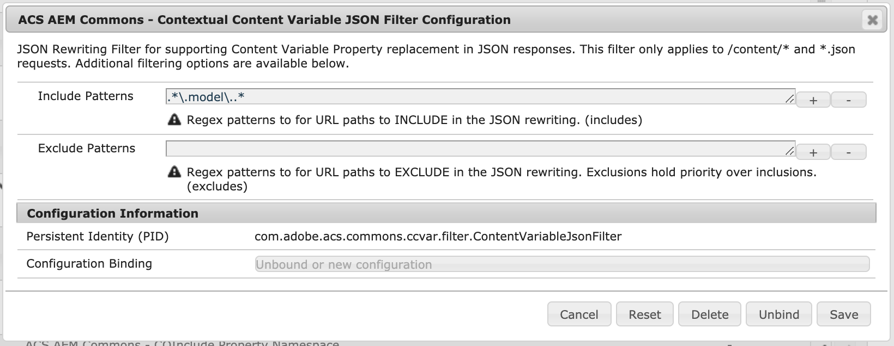

## Purpose

Contextual Content Variables is a tool built to enable authors to use content variables directly in their authored text.
The tool replaces variables present in the content (either JSON or HTML) on the server-side at render-time, keeping caching enabled for the
site and decreasing any impact on performance.

## How to Use

### Enabling CCVAR

#### Enabling property aggregation
This step is required to enable any rewriting to occur - whether JSON or HTML.
This is done via the Felix console or by deploying a blank OSGi configuration file from your project deployment.

`/apps/myapp/config/com.adobe.acs.commons.ccvar.impl.PropertyAggregatorServiceImpl.xml`


<?xml version="1.0" encoding="UTF-8"?>
<jcr:root xmlns:sling="http://sling.apache.org/jcr/sling/1.0" xmlns:jcr="http://www.jcp.org/jcr/1.0"
  jcr:primaryType="sling:OsgiConfig"/>


#### Configuring the property aggregation
The property aggregation mechanism has the ability to exclude properties. The configuration can take either property names
or a regex expression. By default, all `cq:.*` properties are excluded from being able to be replaced in the content. 

#### Enabling HTML Rewriting
To enable HTML rewriting add the `ccvar-transformer` transformer type to your existing project's Sling rewriter configuration.

If your project does not have an existing configuration, the easiest way to configure a new rewriter pipeline is just to 
copy `/libs/cq/config/rewriter/default` to a path inside your application, e.g. `/apps/myapp/config/rewriter/ccvar-transformer`. 
Note that the configuration node *must* be inside a four-level path that ends in `config/rewriter`.

To validate that your configuration was successful, look at the Sling Rewriter tab in the OSGi Web Console.

    /apps/myapp/config/rewriter/ccvar-transformer.xml


<?xml version="1.0" encoding="UTF-8"?>
<?xml version="1.0" encoding="UTF-8"?>
<jcr:root xmlns:jcr="http://www.jcp.org/jcr/1.0" xmlns:nt="http://www.jcp.org/jcr/nt/1.0"
          jcr:primaryType="nt:unstructured"
          contentTypes="[text/html]"
          enabled="{Boolean}true"
          generatorType="htmlparser"
          order="0"
          paths="[/content/myapp]"
          serializerType="htmlwriter"
          transformerTypes="[ccvar-transformer]">
    <generator-htmlparser
        jcr:primaryType="nt:unstructured"
        includeTags="[A,/A,DIV,/DIV,SPAN,/SPAN,P,/P,SECTION,/SECTION,H1,/H1,H2,/H2,H3,/H3,H4,/H4,H5,/H5,LI,/LI,BUTTON,/BUTTON]"/>
</jcr:root>
        

> Other transformers may or may not be necessary. Please refer to the default configuration at `/libs/cq/config/rewriter/default` 
> to see the default set of transformers.

#### Enabling JSON Rewriting
To enable the ability to have JSON outputs rewritten with the property replacements, the JSON rewriting filter needs to be activated.
This is done via the Felix console or by deploying a blank OSGi configuration file from your project deployment.

`/apps/myapp/config/com.adobe.acs.commons.ccvar.filter.ContentVariableJsonFilter.xml`


<?xml version="1.0" encoding="UTF-8"?>
<jcr:root xmlns:sling="http://sling.apache.org/jcr/sling/1.0" xmlns:jcr="http://www.jcp.org/jcr/1.0"
  jcr:primaryType="sling:OsgiConfig"/>


The JSON Filter comes with additional configuration values that allow you to tailor the JSON responses that are actually
processed by this tool. By default, only `.model.json` requests are processed. To change the included and excluded patterns,
add the `includes` and `excludes` properties into the sample configuration above.

### Authoring Usage
Authors are able to reference available properties directly in their authored text, giving them the ability to use variables
that are relevant to the context of the page without needing to rely on developers to concatenate these values to the text
they have entered.

The format for referencing these variables is as follows: 

`((prefix.propertyName!optionalAction))`

The prefix is going to define the Content Variable Provider used to pull the property from. This enables the ability to 
have the same property key (e.g. `title`) used across multiple providers than can potentially return different values.
The tool is available OOTB with two prefixes:
- `page_properties`
- `inherited_page_properties`

These are included by default as they represent a common use-case for content on pages that need to reference properties
present on the page (or inherited from a page above).

The property name is going to be the key associated to the value that is supposed to be shown to the users. The property 
names available OOTB with the tool will map one-to-one with the actual property names present on the pages in the tree.  

The `optionalAction` defined above in the example format will tie to a `TransformAction` class available. OOTB the tool
comes with the ability to URL encode the value (`!url`), which is useful in the case of trying to pass a query parameter. 
See below for more information on how to add custom actions to suit your use cases.

Examples:
- `((page_properties.pageTitle!url))`
- `((page_properties.jcr:title))`
- `((inherited_page_properties.jcr:language))`
- `((custom_prefix.customProp))`

### Extending the properties
Included alongside the tool is a service interface called `ContentVariableProvider` that can be extended to increase the
properties available to authors. The interface has two methods necessary to be overridden:
- `addProperties`
  - The method that takes the currently aggregated properties and allows the custom provider to add their own.
  - It is strongly recommended to use the `PropertyAggregatorUtil.addPropertiesToMap` util method that comes with the 
  tool to add the properties to the map. It will respect the overall configured ignore rules able to be configured. 
- `accepts`
  - This method takes a request and is used to determine whether the current request is processable by the new provider.
  This can be used to ensure that multi-tenant systems are able to support their own unique providers by limiting the 
  requests that will be processed by each provider. 
  
The class used to extend the `ContentVariableProvider` capabilities will need to be registered as a 
`ContentVariableProvider.class` service as well to ensure the new provider is brought into the referenced list in the 
property aggregation. 

### Extending the actions
Just like the variable providers, the actions are extensible with this tool as well. There is a service interface called 
`TransformAction` present that can be extended to provide additional functionality to authors on the variables they are 
trying to use in their content. The interface has the following methods necessary to be overridden:
- `getName`
  - Should return the action name for the custom transform action. This will be what the author references in the authored
  variable declaration (e.g. `url` for URL encoding available OOTB)
- `execute`
  - This will do the actual processing on the value that is going to be outputted to the user after rendering the page. 
- `disableEscaping`
  - The tool comes with basic XSS protection that will escape HTML characters within the replacement values, but with a 
  custom action this behavior can be overridden to support rendering HTML with the tool. Use with caution. 
