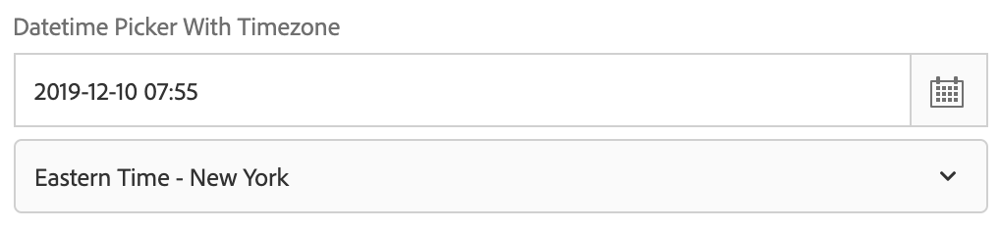
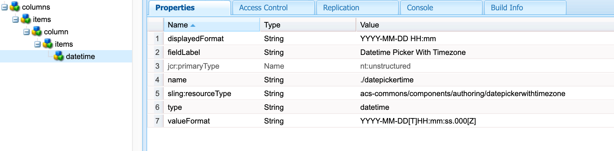
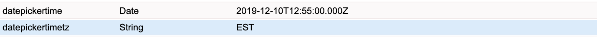

## Purpose
To fix issue of Datetime value saved in multiple timezones by Content Authors around the world and avoid different error prone scenarios if same datetime is consumed by other third party services.

Datepicker with timezone dropdown allows to save datetime value in UTC format in AEM but when Content Author views it, saved datetime value is displayed in selected timezone. 

## How to Use

Create datetime field with property sling:resourceType value as acs-commons/components/authoring/datepickerwithtimezone

## Touch UI Example

<?xml version="1.0" encoding="UTF-8"?>
<jcr:root xmlns:sling="http://sling.apache.org/jcr/sling/1.0" xmlns:cq="http://www.day.com/jcr/cq/1.0" xmlns:jcr="http://www.jcp.org/jcr/1.0" xmlns:nt="http://www.jcp.org/jcr/nt/1.0"
    jcr:primaryType="nt:unstructured"
    jcr:title="Sample Dialog with a Datepicker-with-timezone field"
    sling:resourceType="cq/gui/components/authoring/dialog">
    <content jcr:primaryType="nt:unstructured">
        <items jcr:primaryType="nt:unstructured">
            <tabs jcr:primaryType="nt:unstructured">
                <items jcr:primaryType="nt:unstructured">
                    <properties
                        jcr:primaryType="nt:unstructured"
                        jcr:title="Properties"
                        sling:resourceType="granite/ui/components/coral/foundation/container"
                        margin="{Boolean}true">
                        <items jcr:primaryType="nt:unstructured">
                            <columns
                                jcr:primaryType="nt:unstructured"
                                sling:resourceType="granite/ui/components/coral/foundation/fixedcolumns"
                                margin="{Boolean}true">
                                <items jcr:primaryType="nt:unstructured">
                                    <column
                                        jcr:primaryType="nt:unstructured"
                                        sling:resourceType="granite/ui/components/coral/foundation/container">
                                        <items jcr:primaryType="nt:unstructured">
                                            <datetime
                                                jcr:primaryType="nt:unstructured"
                                                sling:resourceType="acs-commons/components/authoring/datepickerwithtimezone"
                                                displayedFormat="YYYY-MM-DD HH:mm"
                                                fieldLabel="Datetime Picker With Timezone"
                                                name="./datepickertime"
                                                type="datetime"
                                                valueFormat="YYYY-MM-DD[T]HH:mm:ss.000[Z]"/>
                                        </items>
                                    </column>
                                </items>
                            </columns>
                        </items>
                    </properties>
                </items>
            </tabs>
        </items>
    </content>
</jcr:root>



## Value saved in AEM JCR node

