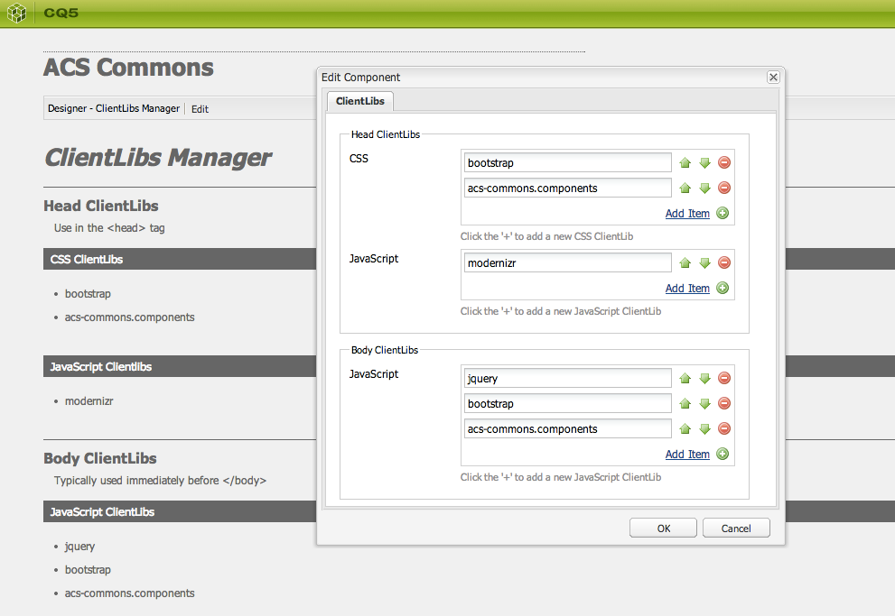

## Why is this deprecated?

The modern to managing Client Libraries to be added to an AEM Site is using Editable Templates (via Policies) and not using the legacy Designs paradigm.

Likewise, since AEM 6.4, [recommendation](https://helpx.adobe.com/experience-manager/6-4/sites/deploying/using/sites-repository-restructuring-in-aem-6-4.html#StaticTemplateDesigns) is to move any existing Designs out for `/etc` and into `/apps/settings` which renders them immutable at runtime (you cant modify them in the JCR via UIs)

Lastly, the API tooling to support this is geared towards JSPs, which have been superseded by HTL.

## Purpose

AEM Designs (/etc/designs) traditionally holds data that does not have the same scope;

* Design content: "per site"
* Front End Assets: "cross-site"

Designer - ClientLibs Manager provides a simple interface and common abstraction for decoupling Front-end assets (CSS/JS Clientlibs) with Designs AND Page implementations.

## Use Cases

Create one ClientLib (/etc/clientlibs/us-brands) and use it across all US Sites but not European sites simply by configuring the association on each site's Design.

## Usage

- Override of the OOTB CQ Design Page implementation to allow for customization of "Head" and "Body" based ClientLibs.

  > Body Clientlibs only accept JavaScript as CSS should always be loaded in the Head.

- Leverages the [ACS Commons - Delegating Servlet](/acs-aem-commons/features/delegating-servlet.html) to provide an unobtrusive overlay

- [DesignHtmlLibraryManager](/acs-aem-commons/apidocs/index.html?com/adobe/acs/commons/designer/DesignHtmlLibraryManager.html) Service

  > Wraps the OOTB HtmlLibraryManager Service but is driven by the ClientLib configuration from the current design (first bullet point)

### Required Sling OSGi Configuration

To enable the CQ Design Page overlay, the following `sling:OsgiConfig` must be added to the project.

    /apps/myapp/config.author/com.adobe.acs.commons.util.impl.DelegatingServletFactoryImpl-DesignerClientLibsManager.xml


<?xml version="1.0" encoding="UTF-8"?>
<jcr:root xmlns:sling="http://sling.apache.org/jcr/sling/1.0" xmlns:cq="http://www.day.com/jcr/cq/1.0" xmlns:jcr="http://www.jcp.org/jcr/1.0" xmlns:nt="http://www.jcp.org/jcr/nt/1.0"
    jcr:primaryType="sling:OsgiConfig"
    sling.servlet.resourceTypes="wcm/core/components/designer"
    sling.servlet.selectors=""
    sling.servlet.extensions="html"
    sling.servlet.methods="GET"
    prop.target-resource-type="acs-commons/components/utilities/designer"/>


## JSP Integration

Since version 1.1.0, a custom tag can be used in JSP pages. Be sure to include the JSP taglib declaration:

    <%@ taglib prefix="dhlm" uri="http://www.adobe.com/consulting/acs-aem-commons/dhlm" %>


<!DOCTYPE html>
<html>
    <head>
        <title>Demo Page</title>
        <dhlm:includeClientLibraries css="true" js="true" region="head" />
    </head>
    <body>
        <h1>Demo Page</h1>

        
CSS has no business being in the body of a document, and its almost always better to push JS load to the end of the body

        <dhlm:includeClientLibraries js="true" region="body" />
    </body>
</html>


### Scriptlet Example


<% DesignHtmlLibraryManager dhlm = sling.getService(DesignHtmlLibraryManager.class); %>

<!DOCTYPE html>
<html>
    <head>
        <title>Demo Page</title>
        ...

        dhlm.writeCssInclude(slingRequest, currentDesign, PageRegion.HEAD, out);
        dhlm.writeJsInclude(slingRequest, currentDesign, PageRegion.HEAD, out);

        <!-- OR, manually pass the list to the OOTB cq:includeClientLib tag; Effectively the same thing -->

        <cq:includeClientLib css="<%= StringUtils.join(dhlm.getCssLibraries(currentDesign, PageRegion.HEAD), ',') %>"/>
        <cq:includeClientLib js="<%= StringUtils.join(dhlm.getJsLibraries(currentDesign, PageRegion.HEAD), ',') %>"/>
    </head>
    <body>
        <h1>Demo Page</h1>

        
CSS has no business being in the body of a document, and its almost always better to push JS load to the end of the body

        dhlm.writeJsInclude(slingRequest, currentDesign, PageRegion.BODY, out);

        <!-- OR, manually pass the list to the OOTB cq:includeClientLib tag; Effectively the same thing -->

        <cq:includeClientLib js="<%= StringUtils.join(dhlm.getJsLibraries(currentDesign, PageRegion.BODY), ',') %>"/>
        <cq:includeClientLib categories="<%= StringUtils.join(dhlm.getLibraries(currentDesign, PageRegion.BODY), ',') %>"/>
    </body>
</html>


## Sightly Integration (Since 1.6.0)

In a Sightly script, you can use the `head` and `body` templates in the script `/apps/acs-commons/sightly/templates/dhlm.html`. The `body` template does not take any arguments. The `head` template accepts a `mode` argument which can be `js`, `css`, or `all`.


<html data-sly-use.dhlm="${'/apps/acs-commons/sightly/templates/dhlm.html'}">
  <head>
      <title>Demo Page</title>
      
  </head>
  <body>
      <h1>Demo Page</h1>

      
CSS has no business being in the body of a document, and its almost always better to push JS load to the end of the body

      <section data-sly-call="${dhlm.body}" data-sly-unwrap></section>
  </body>
</html>


