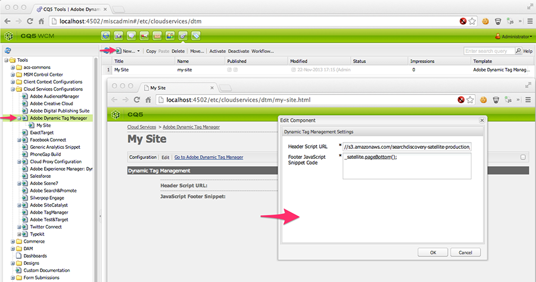

## Deprecation notice

> This feature is deprecated as of ACS AEM Commons 2.0.0. Please use the [Cloud Service](https://docs.adobe.com/docs/en/aem/6-2/administer/integration/marketing-cloud/dtm.html) provided with AEM 6.0 and higher.

## Purpose

Centrally manage and distribute JavaScript across all your web properties.

## General Requirements

In order to use these Cloud Services, ensure that the Cloud Service configuration components are included in *both* the head and body of the page. This typically is done by including `<cq:include script="/libs/cq/cloudserviceconfigs/components/servicelibs/servicelibs.jsp"/>` in _headlibs.jsp_ and `<cq:include path="cloudservices" resourceType="cq/cloudserviceconfigs/components/servicecomponents"/>` in _body.jsp_. If you run into trouble with these Cloud Services, compare your page component scripts to the Foundation page component.

## Special Requirement when using AEM 6.1+

On AEM 6.1, use of these components generally require enabling of the CQ Configuration Manager component, which is disabled by default. This is required for cross-compatibility with AEM 6.0 and AEM 6.1.

This must be done in both author and publish.

### How to Use

1. Navigate to `AEM Author > Tools > Cloud Services Configurations`
2. Select `Adobe Dynamic Tag Manager`
3. Select `New > New Page`
4. Select `Adobe Dynamic Tag Manager Configuration` and open the newly created page
5. Enter the Header Script URL and Footer JavaScript provided by the [Adobe DTM site](http://dtm.adobe.com)
6. Apply this Adobe Dynamic Tag Manager Configuration to any AEM Page in the usual manner
	`Page Properties > Cloud Services Tab > Add Service > Adobe Dynamic Tag Manager > Select the configuration`

