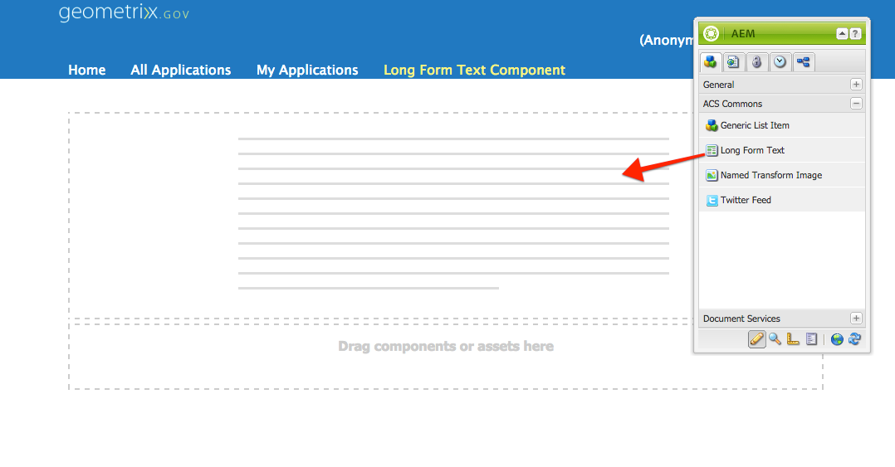
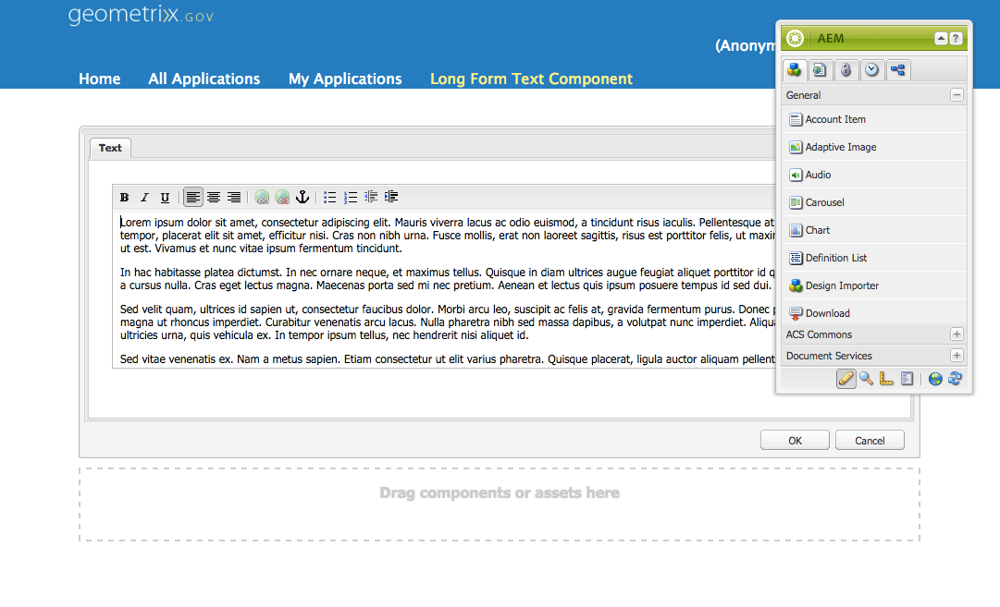
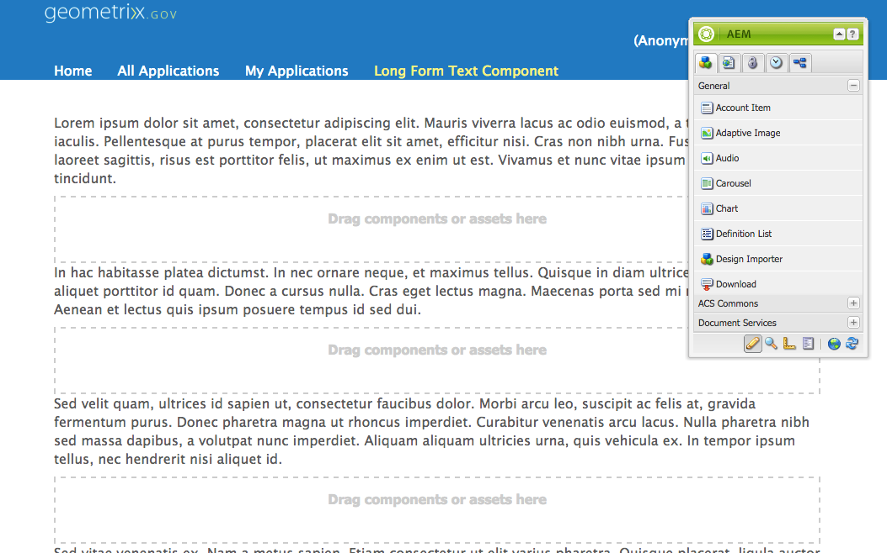
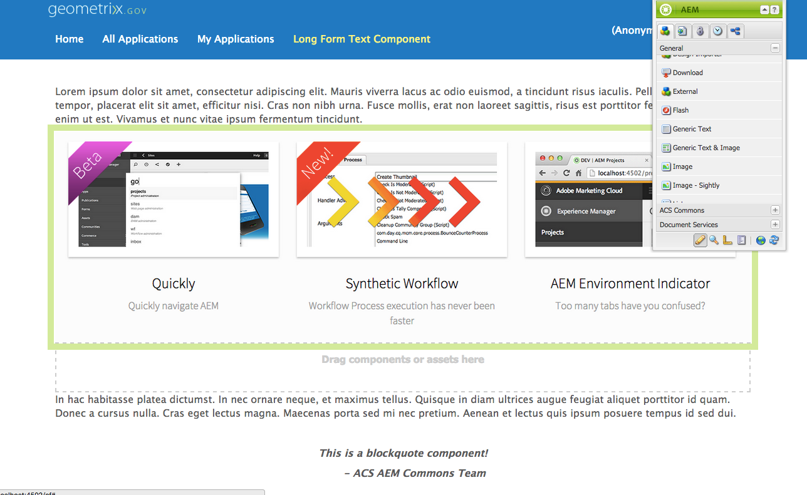

## Purpose

Often text on a Web page is best managed as a large, long-form piece similiar to that of an article. It is great to enrich the text by adding AEM components (images, block-quotes, carousels, videos, etc.) "into" the text. 

With the usual AEM tooling this requires creating special RTE ExtJS widgets to inject behavior into the RTE, or breaking the Web page text into multiple components, while placing the other components between them, resulting in a sub-par authoring experience.

The ACS AEM Commons Long-form Text Component addresses this issue but allowing multiple paragraphs of text to be maintained in a single RTE, adn normal AEM components to be dragged between paragraphs.

## How to Use

> Note: It's always a good idea to `sling:resourceSuperType` components to ensure you can easily modify component behavior in the future.

1. Drag (or cq:include) the long-form text component into the page

2. Add your text to the RTE

3. Close the RTE dialog; note the parsys drop-zones between each paragraph

4. Drag AEM components into the inter-paragraph parsys (Image and Blockquote components shown below)

### Configuring Allowed Components

Each parsys is discrete and requires a Design config to allow/limit components that can be added. A simple pattern for allowing the same components for all Long-form text parsys is to configure this in the code base via design cell nodes using the component name hierarchy. Example: 

    `/etc/designs/demo/content-page/.content.xml`
        


<jcr:root xmlns:sling="http://sling.apache.org/jcr/sling/1.0" 
        xmlns:cq="http://www.day.com/jcr/cq/1.0"         
        xmlns:jcr="http://www.jcp.org/jcr/1.0" 
        xmlns:nt="http://www.jcp.org/jcr/nt/1.0"
        jcr:primaryType="nt:unstructured">    
    <long-form-text
            jcr:primaryType="nt:unstructured">
        <long-form-text-parsys
                jcr:primaryType="nt:unstructured"
                components="[/apps/demo/image,/apps/demo/blockquote]">
        </long-form-text-parsys>
    </long-form-text>
</jcr:root>



### Considerations

1. Components will sit between parapgraphs; there is no support for floating a component to the left or right of a text paragraph (due to the HTML block model)
2. If the number of paragraphs decrease, AEM components will be shifted up parsyses as needed to ensure no component is lost. 
