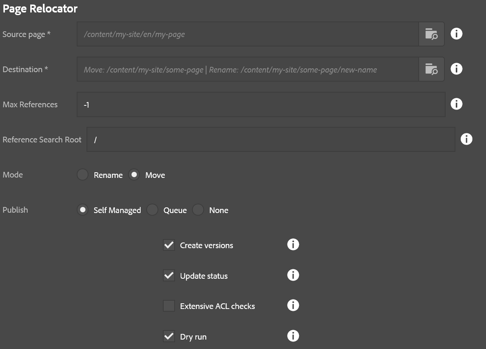

## Note: As of 3.19.0 this is replaced by the Renovator.

Page relocator assists the author in moving a tree of assets to a new location or renaming a page.  All references are updated to reflect the changed page structure following this activity.  Publish options are also presented.  This process generates a report listing all affected pages, their new locations, number of references, and durations of move, unpublish, republish times (in milliseconds.)

* **Source page**: The page being moved or renamed
* **Destination**: If moving, this is the parent that will contain the page being moved.  If renaming this is the full path that source page should have at the end of the operation, including its new name.  The parent of this page must exist first!
* **Max references**: The maximum number of references to evaluate per page.  -1 defaults to all (recommended)
* **Reference search root**: The starting path of references to search for when looking for page references.  Recommended is to leave the default value `/` as-is.
* **Mode**: Rename or Move (as described above)
* **Create versions**: If checked a page being republished will create a new version.
* **Update status**: If checked, a page's metadata for last published will be updated when published.
* **Extensive ACL Checks**: If checked, every child node is evaluated during step 1 (this can get very expensive for large trees!).  If unchecked, only pages are evaluated.  Recommended: Leave it unchecked.
* **Dry Run**: If checked, no page moves or publish operations happen but the report is generated, and ACL checks are performed.  This lets you see what will be affected by this operation.

The steps of this operation are:

1. Validate ACLs.  If the user does not have the ability to update a given page in this operation then the process will terminate at this step and the report will show what pages were missing the required ACLs.
2. Move pages.  This moves each page to its new location, updates references, and captures a list of all affected pages that require re-publishing as a result of this operation.
3. Unpublish.  This unpublishes pages that were removed or changed.
4. Publish.  This publishes pages that were moved or changed as a result of these operations.
