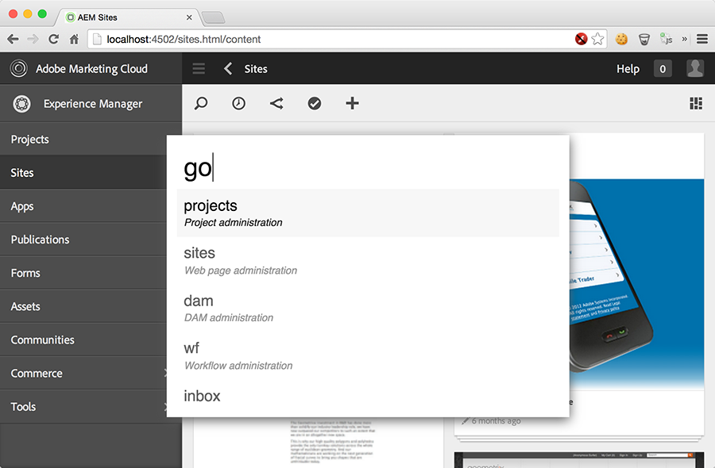
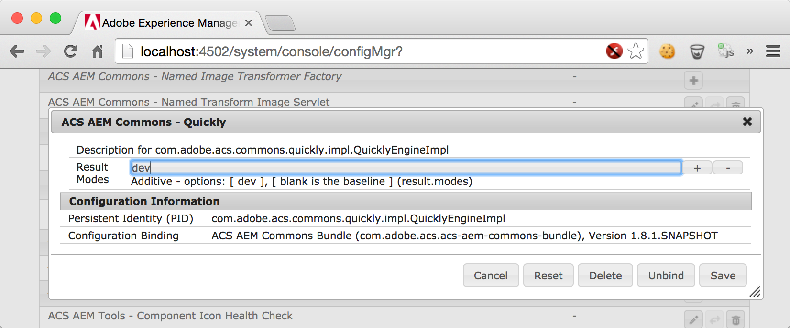
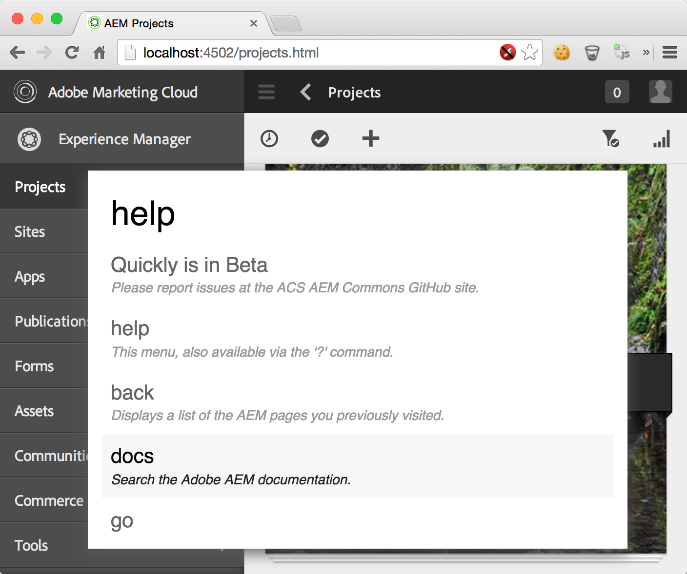
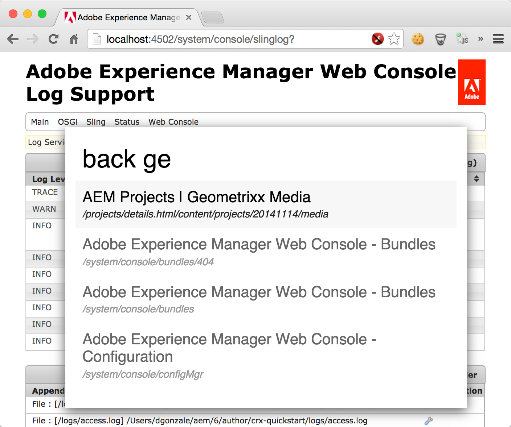
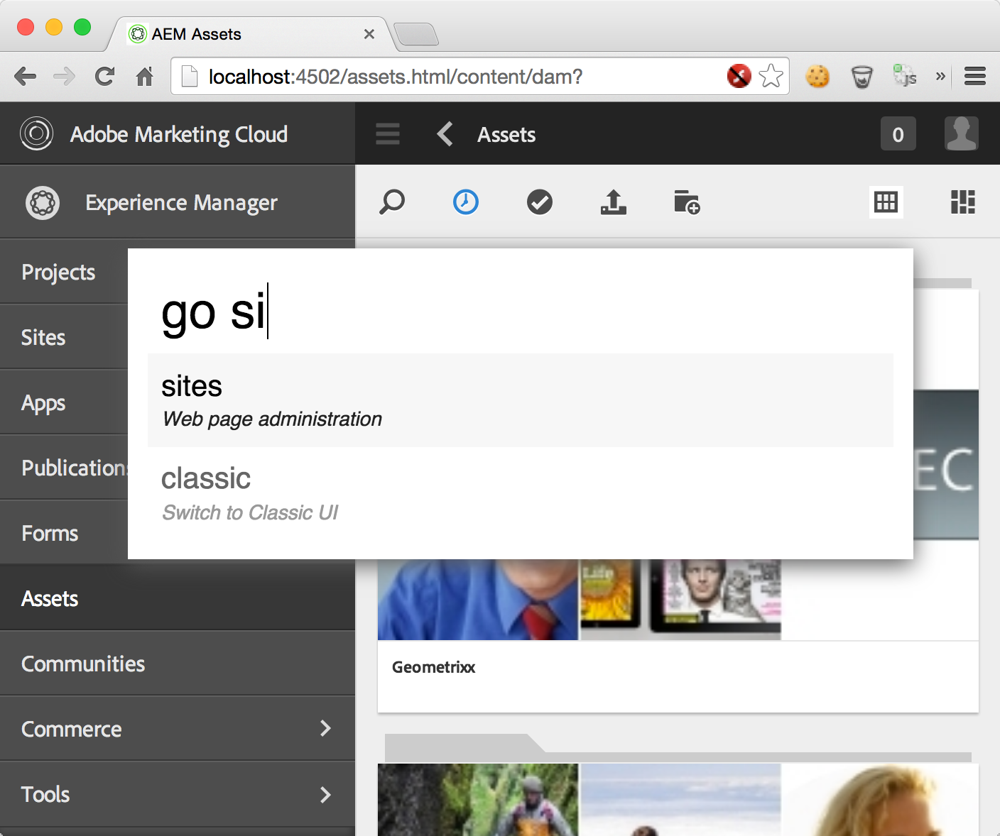
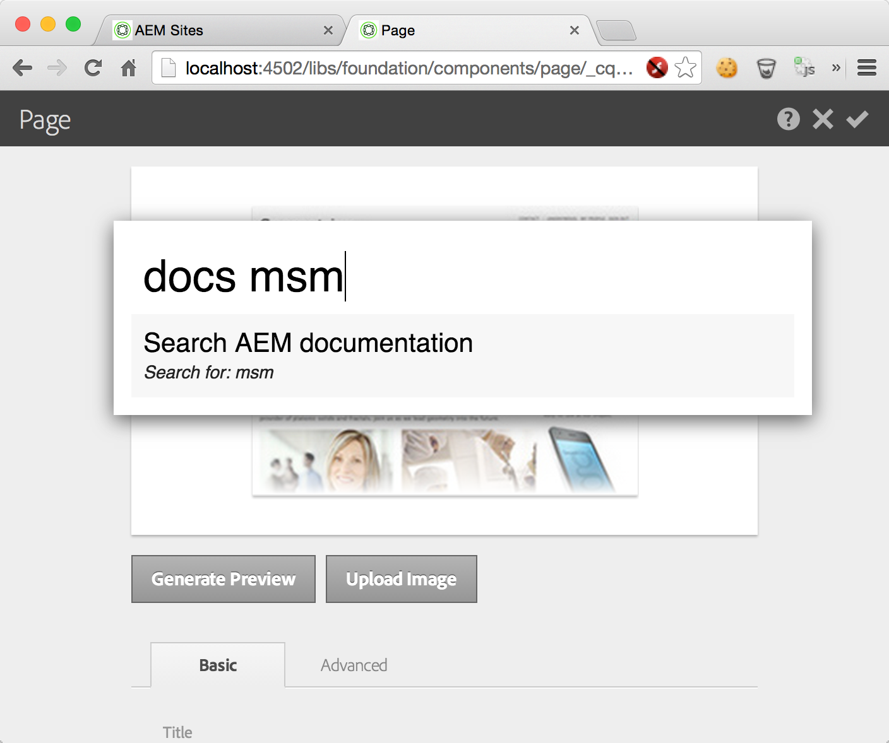
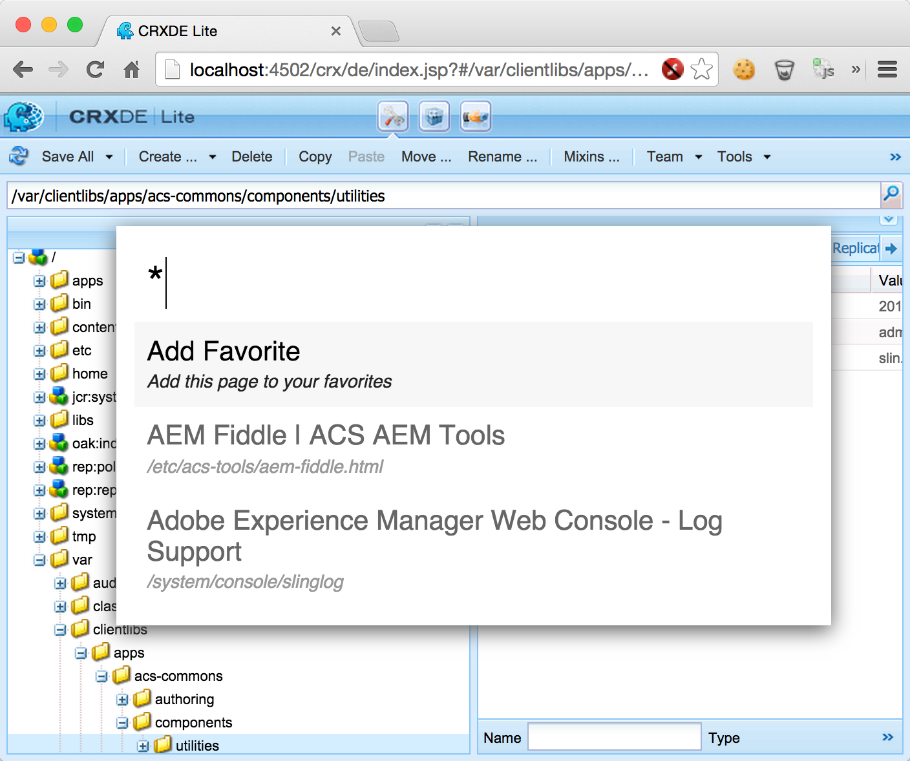

## Beta

Quickly is in Beta.

Full cross-browser support is not yet available. Chrome, Safari and FireFox are known to work on Windows and OSX. Internet Explorer 9 and above may work, but have not been tested.

Quickly injects itself into pages immediately before the closing body tag. Please report any conflicts between Quickly and AEM (or your application) to the [ACS AEM Commons GitHub Issues site](https://github.com/Adobe-Consulting-Services/acs-aem-commons/issues)

## Purpose

Quickly's goal is to speed up navigation throughout AEM using a HUD console that facilitates navigating AEM from the keyboard.

## How to Use

* Remember that Quickly is in Beta!

* Quickly works across AEM Web consoles: AEM's WebUIs, CRX Web UIs and even Felix Web consoles.

* Define a `sling:OsgiConfig` to enable the Quickly engine for AEM Authors Only.

`/apps/mysite/config.author/com.adobe.acs.commons.quickly.impl.QuicklyEngineImpl.xml`


<?xml version="1.0" encoding="UTF-8"?>
<jcr:root xmlns:sling="http://sling.apache.org/jcr/sling/1.0" xmlns:cq="http://www.day.com/jcr/cq/1.0" xmlns:jcr="http://www.jcp.org/jcr/1.0" xmlns:nt="http://www.jcp.org/jcr/nt/1.0"
    jcr:primaryType="sling:OsgiConfig"
    results.mode="[dev]"/>


* Set `results.mode` to blank for authoring oriented results
* Set `results.mode` to `dev` for developer oriented results in the console (like CRXDE Lite). This includes all the "authoring" Web UIs.

Or you can set it directly on your local via the [Adobe Web Console](http://localhost:4502/system/console/configMgr)

### Open Quickly

* OS X Chrome/Safari ~> `Ctrl-Space`
* OS X FireFox ~> `Shift-Ctrl-Space`
* Windows Chrome/Safari ~> `Ctrl-Space`
* Windows FireFox ~> `Shift-Ctrl-Space`
* Internet Explorer has not been tested

### Close Quickly

* `Esc`

## Operations

Most operations support "type ahead" allowing filtering of results typing character sequences you are looking for. Select a result and press "enter" to go to the result.

<h3>Help</h3>

Displays the help menu of all the available Operations

<ul>
    <li>Command: <code>help</code></li>
</ul>

<h3>Back</h3>

List of last 25 accessed URIs in AEM by the user. Values are stored in local storage in the user's Web browser.

<ul>
    <li>Command: <code>back</code> 
</li></ul>

<h3>Go</h3>

Go to a list of pre-defined Web UIs.

<ul>
    <li>Command: <code>go</code></li>
    <li>Command: <code>go!</code> opens Web UI in a new browser tab</li>
</ul>

Go support two "special" instructions that switch the current AEM Authoring mode. Selecting these will appear to do nothing, but it will update the AEM Authoring mode cookie resulting in future Quickly navigation to take you to the Touch/Classic version of the Web UIs.

<ul>
    <li><code>go classic</code></li>
    <li><code>go touch</code></li>
</ul>

<h3>Docs</h3>

Access Adobe's AEM documentation

<ul>
    <li>Command: <code>docs</code></li>
    <li>Command: <code>docs [search-term]</code></li>
    <li>Searches for term on Adobe docs site using DuckDuckGo.com 
</li></ul>

<h3>Lastmod</h3>

Find the last modified CQ Pages by user and date.

<ul>
    <li>Command: <code>lastmod</code></li>
    <li>Command: <code>lastmod [userId] [ 1s | 2m | 3h | 4d | 5w | 6M | 7y ]</code></li>
    <li>Defaults to: lastmod [current user] 1d 
</li></ul>

<h3>Favorites</h3>

List of last 25 accessed URIs in AEM by the user. Values are stored in local storage in the user's Web browser; different browsers means different favorite lists.

<ul>
    <li>Command: <code>*</code></li>
    <li>Command: <code>* rm</code></li>
    <li>Removes the selected Favorite from the list 
</li></ul>
