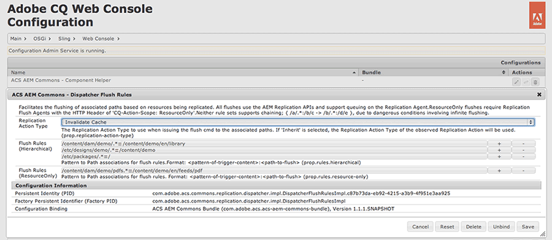
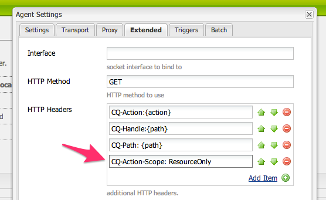
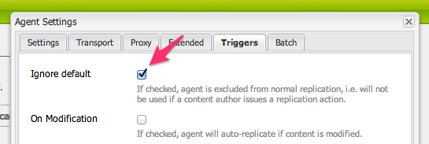
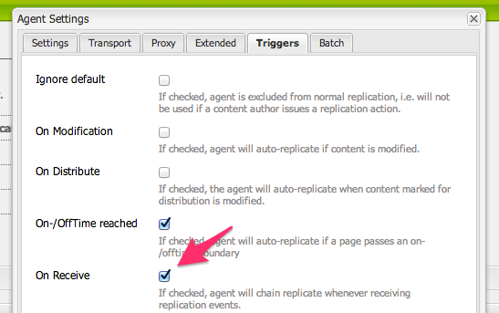

## Purpose

Define simple, yet powerful, rules for targetted flushing of files cached by Dispatcher.

## How to Use

Dispatcher Flush Rules are intended to be deployed and executed on AEM Publish, which should have  On Trigger Flush Agents set up. Running Dispatcher Flush Rules on AEM Author that flush Dispatchers for AEM Publish can result in race-conditions, where the Dispatcher cache invalidation (and re-caching of content) can occur prior to the new replicated content being persisted on AEM Publish. See the "Flushing from AEM 5.6+ Publish Servers" section below for how to set up On Trigger Flush Agents.

Create a new `sling:OsgiConfig` node for each logical flush rule set. A good practice is to create a "global" configuration and separate configurations per "site".

    /apps/myapp/config.publish/com.adobe.acs.commons.replication.dispatcher.impl.DispatcherFlushRulesImpl-MySite

### OSGi Config Properties

### prop.replication-action-type

Defines the ReplicationActionType to use when issuing the chained replications.

* `INHERIT`: Use the action type of the origin replication
* `ACTIVATE`: Invalidates the cached files opposed to deleting
* `DELETE`: Deletes the cached files opposed to invalidating
 
### prop.rules.hierarchical

Defines the flush mappings in the format (the delimiter is `=`).

	regex-of-replicating-resource=absolute-path-flush

Introduced in 1.5.0, regex groups can be used to further dynamic behavior.

    /content/geometrixx/([^/]+)/([^/]+)=/content/$1/geometrixx/$2

To flush all pages under `/content/mysite` when an new DAM `png` or `jpg` is replicated use

	prop.rules.hierarchical=[
		"/content/dam/.*\.(png|jpg)=/content/mysite"
	]

or using the new regex grouping (v1.5.0) to flush site pages based on activations to corresponding site dam folders

    prop.rules.hierarchical=[
        "/content/dam/([^/]+)/.*\.(png|jpg)=/content/$1"
    ]

In this case the following activations would triggers the follow flushes: 

    `/content/dam/mysite/animals/dog.jpg` would flush `/content/mysite`
    `/content/dam/yoursite/animals/cat.jpg` would flush `/content/yoursite`

### prop.rules.resource-only

Defines the flush mappings in the (same as hierarchical) format

	regex-of-replicating-resource=absolute-path-flush

used to initiate "ResourceOnly" dispatcher flush requests.

***Note: To use ResourceOnly mappings, a second set of Dispatcher Flush Agents must be created with the exact HTTP Header `CQ-Action-Scope: ResourceOnly`. ***

These Flush Agents should also be configured as `Ignore Default`


<?xml version="1.0" encoding="UTF-8"?>
<jcr:root xmlns:sling="http://sling.apache.org/jcr/sling/1.0" xmlns:cq="http://www.day.com/jcr/cq/1.0"
    xmlns:jcr="http://www.jcp.org/jcr/1.0" xmlns:nt="http://www.jcp.org/jcr/nt/1.0"
    jcr:primaryType="sling:OsgiConfig"
    prop.replication-action-type="INHERIT|ACTIVATE|DELETE"
    prop.rules.hierarchical="[regex=/abs/path,regex2=/abs/path2]"
    prop.rules.resource-only="[]"
	/>
  

## One-to-Many Patterns-to-Flush Paths (Available in v1.9.2+)

Added in 1.9.2 (not 1.9.0), multiple flush paths can be assigned to a replication pattern. Each absolute path to flush is delimited by `&`.


    prop.rules.hierarchical="[regex=/abs/path/A&/abs/path/B,regex2=/abs/path/X]"
    prop.rules.resource-only="[regex=/abs/path/C&/abs/path/D,regex2=/abs/path/Y]"
  

## Flushing from AEM 5.6+ Publish Servers

Dispatcher Flush Rules work from AEM 5.6 Publish Servers as well. Simple configure your Dispatcher Flush Agents on Publish to issue "On Trigger". (It is likely this has been previously configured if you are already using Publish-side flushing).

## Global Config Example

Delete the entire cache when a new package is activated.  

    /apps/myapp/config.publish/com.adobe.acs.commons.replication.dispatcher.impl.DispatcherFlushRulesImpl-global


<?xml version="1.0" encoding="UTF-8"?>
<jcr:root xmlns:sling="http://sling.apache.org/jcr/sling/1.0" xmlns:cq="http://www.day.com/jcr/cq/1.0"
    xmlns:jcr="http://www.jcp.org/jcr/1.0" xmlns:nt="http://www.jcp.org/jcr/nt/1.0"
    jcr:primaryType="sling:OsgiConfig"
    prop.replication-action-type="DELETE"
    prop.rules.hierarchical="[/etc/packages/.*\.zip=/]"
    prop.rules.resource-only="[]"
    />
     

## Service User

On AEM 6.2 or above, this service uses a Service User for repository access. This user is configured with
the expected permissions required, but additional permissions may be required if your repository design
deviates from the expected structure.

User name: `acs-commons-dispatcher-flush-service`

ACLs:

* `jcr:read`, `crx:replicate`, `rep:removeNode` on `/`
