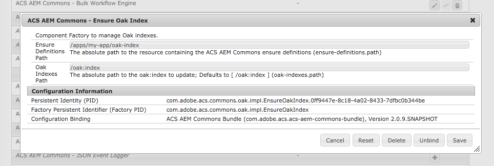

## Purpose

The Oak repository used by AEM 6, allows from fine tuning of search performance via the definition of [Oak Index definitions](https://jackrabbit.apache.org/oak/docs/query/lucene.html). The index definition nodes, usually stored under `/oak:index`, define the index and also store the index data (in a node structure invisible to the AEM tooling).

Ideally the Oak Index definitions used by an application could be stored with in the application's content package, however, it is possible (and even likely) that upon deployment the content packages index definition may wipe out the actual index data (again, invisible via AEM tooling) when updating the node, necessitating a reindex, which depending on the repository size and index configuration can be costly (and generally unnecessary).

Ensure Oak Index is tooling that allows Oak Index Definitions (referred to in this document as Ensure Definitions) to be defined in a content package, and then safely translated to real Oak Indexes.

## How to Use

As of v2.2.0, the management of Oak Indexes has been moved to an async Sling Job to ensure the work does not block bundle activation.

### Define the Ensure Definitions

In your AEM Content project, create a `sling:Folder` under your application's `/apps` folder.

Example: `/apps/mysite/oak-index@jcr:primaryType=sling:Folder`

Under this folder, create Ensure Definitions for each Oak Index you want to ensure is created/updated. Ensure Definitions are identical to `oak:QueryIndexDefinition` nodes, except they MUST be of type `oak:Unstructured`.

See details on defining Ensure Definitions below.

### Create the Ensure Oak Index OSGi Configuration

Once all the Ensure Definitions are defined, create a `sling:OsgiConfig` factory config instructing EnsureOakIndex where to find the Ensure Definitions and then where to ensure they are created/updated/deleted.

`/apps/mysite/config/com.adobe.acs.commons.oak.impl.EnsureOakIndex-mysite.xml`


<?xml version="1.0" encoding="UTF-8"?>
<jcr:root xmlns:sling="http://sling.apache.org/jcr/sling/1.0" xmlns:cq="http://www.day.com/jcr/cq/1.0"
    xmlns:jcr="http://www.jcp.org/jcr/1.0" xmlns:nt="http://www.jcp.org/jcr/nt/1.0"
    jcr:primaryType="sling:OsgiConfig"
    ensure-definitions.path="/apps/mysite/oak-index"
    oak-indexes.path="/oak:index"
    />
     

### Provide Additional Ignore Properties (Since v2.6.4/3.2.4)

If additional properties on the root ensure definition/oak index node need to be ignored, you can specify them via OSGi configuration. These additional properties will be joined w the mandatory ignore properties list and will NOT be considered when 1) evaluating if there is a change between the ensure definition and oak index 2) when removing properties from the oak index during and update operation.

> Since version 4.0.0, EnsureOakIndex excludes property `seed`, and sub-tree `[oak:QueryIndexDefinition]/facets/jcr:content`.

Create a `sling:OsgiConfig` at `/apps/mysite/config/com.adobe.acs.commons.oak.impl.EnsureOakIndexManagerImpl.xml`


<?xml version="1.0" encoding="UTF-8"?>
<jcr:root xmlns:sling="http://sling.apache.org/jcr/sling/1.0" xmlns:cq="http://www.day.com/jcr/cq/1.0"
    xmlns:jcr="http://www.jcp.org/jcr/1.0" xmlns:nt="http://www.jcp.org/jcr/nt/1.0"
    jcr:primaryType="sling:OsgiConfig"
    properties.ignore="[myDescription,ignoreMe]"
    />
     

### Deployment

Now, deploy the package containing the Ensure Definitions and the OSGi Configuration. Set logging to *INFO* on `com.adobe.acs.commons.oak.impl` to see what Oak Indexes are managed.

## Ensure Definitions

* Place Ensure Definitions in a `sling:Folder`, the `sling:Folder` can be named anything but convention named it `oak-index`
* Ensure Definition nodes must be `oak:Unstructured`
* Ensure Definition nodes can be multi-levels deep, supporting Lucene Property Index definitions.
* Define the Ensure Definition exactly as you would the Oak Index you wish to create/update (with the exception of the `jcr:primaryType` as noted above)

### Ignored Properties

The following properties are always ignored (hard-coded into the [EnsureOakIndexJobHandler.java](https://github.com/Adobe-Consulting-Services/acs-aem-commons/blob/master/bundle/src/main/java/com/adobe/acs/commons/oak/impl/EnsureOakIndexJobHandler.java)) when determining if there is a change between the Oak index and the Ensure Oak index:

#### Shared ignored properties

+ `jcr:primaryType`
+ `jcr:lastModified`
+ `jcr:lastModifiedBy`
+ `jcr:mixinTypes`
+ `jcr:created`
+ `jcr:createdBy`

#### Ignored Ensure oak index definition properties

+ `recreateOnUpdate`
+ `forceReindex`
+ `delete`
+ `ignore`
+ `disable`

#### Ignored Oak index definition properties

+ `reindex`
+ `reindexCount`
+ `seed`

#### Ignored sub-trees

These entire sub-trees are ignored from determining a delta.

+ `[oak:QueryIndexDefinition]/facets/jcr:content` (for Oak index)
+ `[oak:Unstructured]/facets/jcr:content` (for Ensure oak index)

Other properties can be ignored as needed (for example, if AEM/Oak changes their implementation and adds other "transient value" properties) using thise `

#### Custom ignored properties

Custom ignored properties can be added by creating an OSGi configuration for `com.adobe.acs.commons.oak.impl.EnsureOakIndexManagerImpl.cfg.json`

```json
{
    "properties.ignore": [ "anotherPropertyToIgnore", "andAnotherPropertyToIgnore" ]
}
```

### Special Properties

Ensure Oak Index supports special properties on the Ensure Definition nodes.

### Ignore

Property Name: `ignore`

An Ensure Definition can be ignored completely by setting `@ignore=true`.

* `/apps/mysite/oak-index/ignore-this-index@ignore=true`

### Disabled (as of v.2.2.0)

Property Name: `disable`

An Ensure Definition can mark an Oak Index as disabled (but NOT deleted) by setting `@disable=true`.

* `/apps/mysite/oak-index/disable-this-index@disable=true`

### Delete

Property Name: `delete`

To delete an existing Oak Index, create an Ensure Definition with the same node name as the Oak Index to delete, and add the property `@delete=true`. If no index can be found to delete, this will note it in the log and continue.

* `/apps/mysite/oak-index/legacy-index@delete=true`


### Force reindex

Property Name: `forceReindex`

On create or update, the Oak Index can be marked to be immediately re-indexed by setting @forceReindex=true`. 

* `/apps/mysite/oak-index/always-reindex-this-index@forceReindex=true`

### Recreate on Update

Property Name: @recreateOnUpdate`

The default behavior for updating Oak Index properties is to perform an in place update to avoid deleting the actual indexed data (invisible to AEM). To force the Oak Index to be be fully deleted and then recreated on an update, set `@recreateOnUpdate=true`

> Note this should be used sparingly. It is almost always better to use the forceReindex option

* `/apps/mysite/oak-index/index-with-junk-data@recreateOnUpdate=true`

## Example Ensure Definition

* `/apps/mysite/oak-index/uuid`


<?xml version="1.0" encoding="UTF-8"?>
<jcr:root xmlns:sling="http://sling.apache.org/jcr/sling/1.0" xmlns:cq="http://www.day.com/jcr/cq/1.0"
    xmlns:jcr="http://www.jcp.org/jcr/1.0" xmlns:nt="http://www.jcp.org/jcr/nt/1.0"
    jcr:primaryType="oak:Unstructured"
    type="property"
    propertyNames="[uuid]"
    entryCount="{Long}1"
    recreateOnUpdate="{Boolean}true"
    forceIndex="{Boolean}true"
    />


## Service User

On AEM 6.2 or above, this service uses a Service User for repository access. This user is configured with
the expected permissions required, but additional permissions may be required if your repository design
deviates from the expected structure.

User name: `acs-commons-ensure-oak-index-service`

ACLs:

* `jcr:read` on `/apps`
* `jcr:read`, `rep:write`, `rep:indexDefinitionManagement` on `*/oak:index/*`
