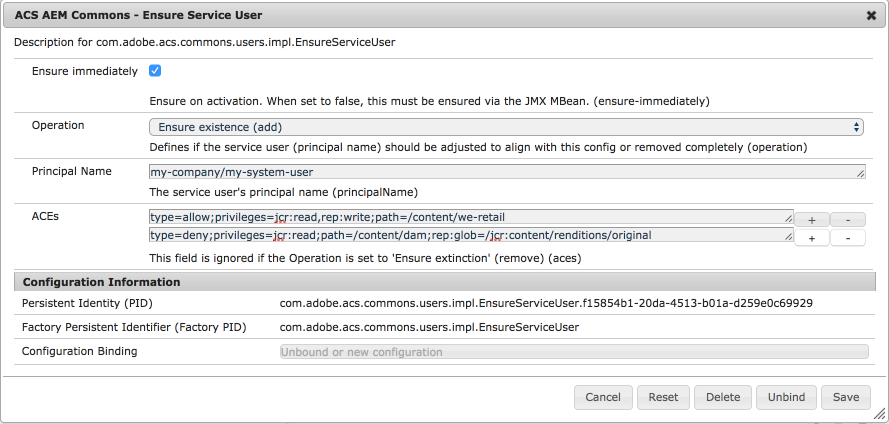
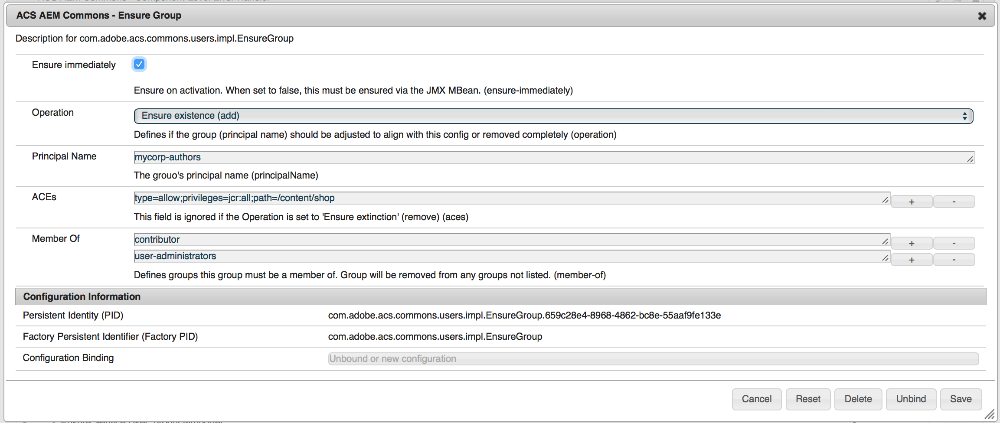
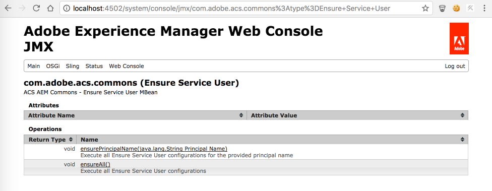

AEM 6.3 and greater should migrate to [Sling Repo Init scripts](https://sling.apache.org/documentation/bundles/repository-initialization.html) to ensure Authorizables and ACLS.

Sling Repo Init supports creation of Users, Service Users and Groups, as well as the application of ACLs. It is generally recommended to prefer principal-based ACLs over resource-based ACLs when using Repo Init.

    

## Purpose

Since AEM 6.2, service users are used to access the JCR instead of using the administrative resource resolver. Service users require ACLs applied to provide only enough access for the service user to perform its function.

Because of this, projects often require the definition of many service users and ACLs, which traditionally are managed in manually in a discrete permissions package. The management of the service users can be confusing and error-prone.

The Ensure Service User facilitates defining service users and their ACLs in OSGi configurations, and will intelligently ensure they exist on the target AEM instances.

Ensure Group builds on top of ensure service user to allow easily creating and maintaining group hierarchies across many AEM environments.

## Configuration

Create an OSGi configuration for each service user or group with the corresponding PID and unique identifier, eg.:

    /apps/my-app/config/com.adobe.acs.commons.users.impl.EnsureServiceUser-myServiceUser


<?xml version="1.0" encoding="UTF-8"?>
<jcr:root xmlns:sling="http://sling.apache.org/jcr/sling/1.0" xmlns:cq="http://www.day.com/jcr/cq/1.0"
    xmlns:jcr="http://www.jcp.org/jcr/1.0" xmlns:nt="http://www.jcp.org/jcr/nt/1.0"
    jcr:primaryType="sling:OsgiConfig"
    principalName="my-service-user"
    operation="add"
    ensure-immediately="{Boolean}true"
    aces="[type=allow;privileges=jcr:read\,rep:write;path=/content/foo;rep:glob=/jcr:content/*]"/>


For Ensure Group, the PID is _com.adobe.acs.commons.users.impl.EnsureGroup_, with the only additional property being member-of.

### OSGi Config Properties

**Ensure Service User**

**Ensure Group**

`principalName`

* The service user or group name
* Can be just the principal name, a relative path, or the absolute path where the user should be stored in the JCR. Remember, service users may ONLY exist under `/home/users/system`.
    * `my-service-user`
      * Creates `/home/users/system/my-service-user`
    * `my-company/my-service-user` or  or `./my-company/my-service-user` or `/my-company/my-service-user`
      * Creates `/home/users/system/my-company/my-service-user`
    * `/home/users/system/my-company/my-service-user`
      * Creates `/home/users/system/my-company/my-service-user`
* Note: If a system user exists with the same principal name at a DIFFERENT location, this tool assumes that service user is correct and not attempt to move it to the specified location in this configuration. 
* Note: If a principal name is specified for an AEM or ACS AEM Commons provided system user, the ensure user process will fail. This list may not always be exhaustive and up to date, and meant to help protect against collisions. 
`type`

* Options: `add` OR `remove`
  * `add` ensures the existence of the service user and ACLs
  * `remove` ensures that the service user and any ACLs are removed
  * Defaults to `add`

`ensure-immediately`

* Options: `true` OR `false`
* When set to true, the ensurance is performed whenever this bundle is loaded.
* Defaults to true

`aces`

* Array of ACE definitions to ensure for the principal
* Format: `type=allow;privileges=jcr:read,rep:write;path=/content/foo;rep:glob=/jcr:content/*`
  * `type: allow OR deny` 
    * Required
  * `privileges`: comma delimited list of valid JCR privileges
    * Required
  * `path`: absolute content path which the ACE will be applied
    * Required
  * `rep:glob=<single glob-pattern>`
    * Optional
    * Example: `rep:glob=*/jcr:content/renditions/original`
  * `rep:prefixes=<comma-delimited list of prefixes>`
    * List of namespace prefixes
    * Optional
    * Example: `rep:prefixes=cq,dam`
  * `rep:ntNames=&lt;comma-delimited list of ntNames&gt;`
    * Optional
    * Example: `rep:ntNames=cq:Page,cq:PageContent`
  * `rep:itemNames=<comma-delimited list of itemNames>`
    * List of namespace prefixes
    * Optional
    * Example: `rep:itemNames=cq:lastModifiedBy,jcr:lastModifiedBy`
    
For more information on `rep:glob`, `rep:ntNames`, `rep:itemNames` and `rep:prefixes` [http://jackrabbit.apache.org/oak/docs/security/authorization/restriction.html](Apache Oak Restrictions documentation)

`member-of`

* Applies only to Ensure Group 
* An Array of groups that the group must belong to

### JMX MBean

[http://localhost:4502/system/console/jmx/com.adobe.acs.commons%3Atype%3DEnsure+Service+User](http://localhost:4502/system/console/jmx/com.adobe.acs.commons%3Atype%3DEnsure+Service+User)

A JMX MBean is also provided that allows for the ensurance of Service Users and Groups. 

This can be invoked on a per-authorizable basis or on all service users and groups.

When invoking on a per-authorizable basis, ONLY the principal name is to be provided; for example, if `principalName = my-company/my-servicer-user` the parameter to the JMX Mbean method would be `my-servicer-user`. 

This is most commonly leveraged when `ensure-immediately` is set to `false`, and the service user or group is ensured manually at a specific point in time. 
