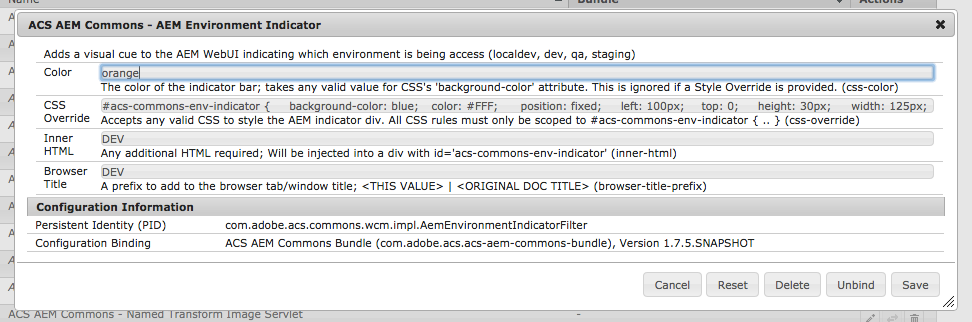
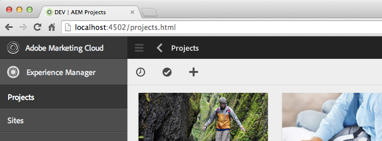
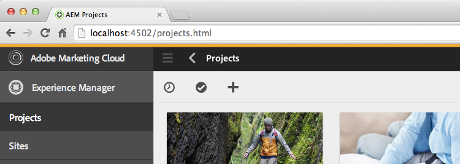
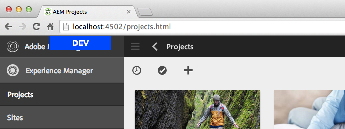

## AEM 6.5 only

AEM as a Cloud Service now supports [exposing the environment in its Unified Shell](https://experienceleague.adobe.com/docs/experience-manager-cloud-service/content/overview/aem-cloud-service-on-unified-shell.html?lang=en#identify-aemaacs-environment). 

Therefore using this in AEMaaCS is no longer necessary and redundant (although it still works).

## Purpose

When working with AEM it's common be accessing multiple environments in the same browser, making it confusing as to which environment changes are being made to.

## How to Use

Define an OSGi config, typically scoped to the AEM Author env.

`/apps/example/osgiconfig/config.author/com.adobe.acs.commons.wcm.impl.AemEnvironmentIndicatorFilter.cfg.json`


{
    "css-color": "orange",
    "css-override": "#acs-commons-env-indicator { .. }",
    "inner-html": "..",
    "browser-title-prefix": "Dev"
}


* css-color: The color of the indicator bar; Accepts any valid value for the CSS `background-color` attribute. Ignored if `css-override is` set.
* css-override: CSS to style the indicator div. All styles should be scoped to `#acs-commons-env-indicator { }`
* inner-html: Any valid HTML (or text) that will be added inside the indicator div.
* browser-title-prefix: The value to prefix the browser title with.

### AEM as a Cloud Service OSGi parameters

As noted above it is recommneded that Adobe supported environment badge in Unified Shell is used to distinguish environments on AEM as a Cloud Service.

However, if you would like to use this feature to distinguish between multiple AEM as a Cloud Service Development, this can be done using [AEM as a Cloud Serviec OSGi environment variables](https://experienceleague.adobe.com/en/docs/experience-manager-cloud-service/content/implementing/deploying/configuring-osgi#when-to-use-non-secret-environment-specific-configuration-values) and managing their values per environment via [Cloud Manager's Environment variables UI](https://experienceleague.adobe.com/en/docs/experience-manager-cloud-service/content/implementing/using-cloud-manager/environment-variables).

For example:


{
    "css-color": "$[env:ACS_COMMONS_ENV_INDICATOR_CSS_COLOR;default=orange]",
    "css-override": "$[env:ACS_COMMONS_ENV_INDICATOR_CSS_OVERRIDE;default=#acs-commons-env-indicator { .., }]",
    "inner-html": "$[env:ACS_COMMONS_ENV_INDICATOR_INNER_HTML;default=
DEV 1
]",
    "browser-title-prefix": "$[env:ACS_COMMONS_ENV_INDICATOR_BROWSER_TITLE_PREFIX;default=Dev 1]"
}


Note: any default values including double quoutes (`"`) must escape them, to avoid malformed JSON.

## Indicators

### Browser Title

Set a value in the browser tab using the `browser-title-prefix` sling:OsgiConfig property. This value will display in the browser title in the format `<browser-title-prefix> | <original-browser-title>` for example: `DEV | AEM Projects`

Browser titles can be used in conjunction with visual indicators (bars, tabs or other custom)

### AEM Indicator Bar

The bar is a default visual indicator. This indicator can be configured using the `css-color` property. Accepts any valid value for the CSS `background-color` attribute.

### Custom AEM Indicator

Custom indicators can be added using the `css-override` and `inner-html` properties.

> Remember to escape the value of `inner-html` and `css-override` as needed using [escapehtmlforxml.com](http://www.escapehtmlforxml.com)

* `css-override` selectors should always be scoped w `#acs-commons-env-indicator`
* The base indicator div is injected at the end of the document like so  `... 

</body>` and thus should be positioned using fixed or absolute positioning.
   * fixed positioning is usually better so the indicator is not lost when scrolling the page
* The z-index for `#acs-commons-env-indicator` should be very high as to not be hidden by overlapping elements.
* Image stylings should be added as data URIs. ([Data URI Maker](http://dataurl.net/#dataurlmaker))

### System Properties in inner-html (Since v2.2.0)

Since v2.2.0, [System Properties](http://docs.oracle.com/javase/6/docs/api/java/lang/System.html?is-external=true#getProperties()) can be injected into a templatized `inner-html`.

Example: `inner-html="
${os.name} - ${os.version}$
"` would inject the OS Name and Version.

Note: HTML escaping considerations still need to be followed as noted above.

### Custom Example: AEM Indicator Tab

This is an example of a custom indicator that renders the environment name in a fixed "tab" in the upper left corner of the browser window.

Set `css-override` to with adjusted color and background colors per environment.


#acs-commons-env-indicator {     
background-color: #800080;      
color: #FFF;  

position: fixed;
top: 0;
left: 50%;
width: 126px;
margin-left: -63px;
height: 30px;      
font: bold 18px/29px sans-serif;
text-align: center;          
border: solid 1px black;
border-top-width: 0;
z-index: 100000000000000;
}


Set `inner-html` to be the text to display; Ex. "Local", "Dev", "QA" or "Staging"

You can even add JS to the `inner-html` make the Tab move away from your mouse


Local


