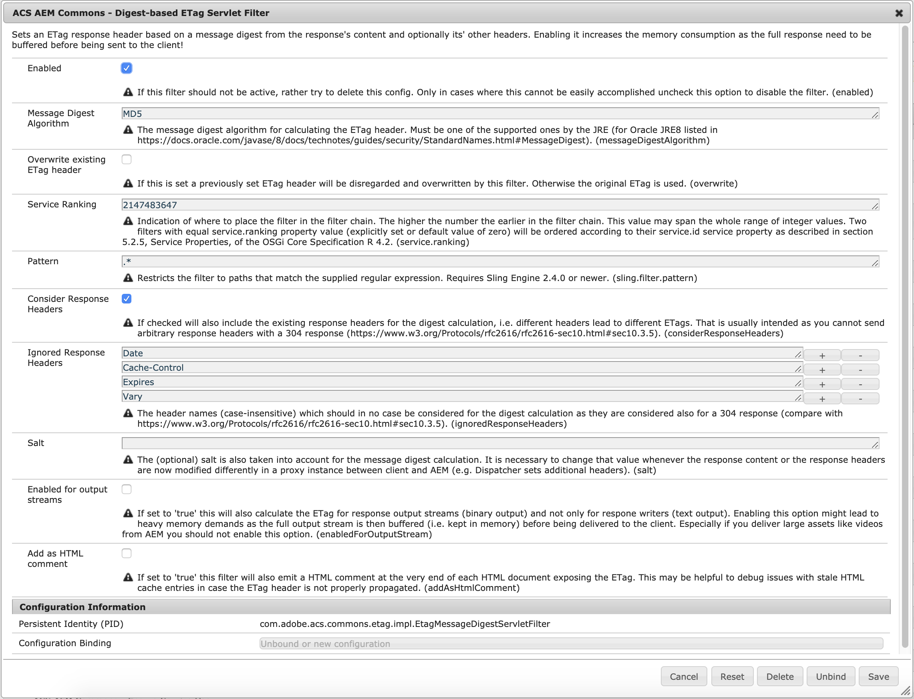

## Purpose

Sets an Entity Tag (ETag) response header as defined by [RFC-7232](https://tools.ietf.org/html/rfc7232) based on the message digest (usually MD5) of the response body and its headers to support Conditional Requests. Also evaluates the according `If-None-Match` request header to return a 304 status code (without a body) in case the ETag has not changed.

ETag calculation as being offered by [Apache HTTPD](https://httpd.apache.org/docs/2.4/mod/core.html#fileetag) is often not enough because the ETag must not be different between the different publish servers of a server farm and all criteria being offered by Apache HTTPD are in fact server specific.

ETags are a useful measure to reduce traffic for resources which are rarely modified and also helps search engine crawlers to perform better.
For further information refer to [Optimizing AEM Site Caches](https://helpx.adobe.com/experience-manager/kb/optimizing-aem-site-caches.html).

## How to Use

Create an OSGi configuration for PID `com.adobe.acs.commons.etag.impl.EtagMessageDigestServletFilter` to activate the according servlet filter and tweak the configuration according to your needs.

In addition you need to adjust your Dispatcher configuration to
1. cache the `ETag` response header via the according [Dispatcher configuration](https://docs.adobe.com/content/help/en/experience-manager-dispatcher/using/configuring/dispatcher-configuration.html#caching-http-response-headers) and to
1. disable ETag calculation in Apache HTTPD via the [directive `FileETag none`](https://httpd.apache.org/docs/2.4/mod/core.html#fileetag)

Also you should make sure to set reasonable `Cache-Control` headers for all responses (to reduce the amount of revalidation/conditional requests). You can use either the [Dispatcher TTL feature](../dispatcher-ttl/) or set the headers in the Apache HTTPD config manually.

## Memory/Performance Considerations

By default the ETag servlet filter is only active for responses which leverage `ServletResponse.getWriter()` (usually all script-based responses which emit text) but not for responses
which are written via `ServletResponse.getOutputStream()` (binary responses). The reason for that is that the servlet filter needs to buffer the whole response in memory to be able
to send the response header after the message digest has been calculated.

With activating this filter you might therefore see
* increased memory consumption during request processing (spooling is effectively being disabled)
* increased time to first byte for responses which are not yet delivered from the Dispatcher (or some other) cache
* some processing overhead to calculate the message digest (should be neglectable in most cases, though)

## Other Approaches for Supporting Conditional Requests

The `ETag` (or alternatively the `Last-Modified`) header could also be calculated based on a last modification date (extracted from some repository property) but for more complex implementations it is often impossible to tell which resources all have an influence on the actual response (i.e. which modification date to consider). The following resources all might have an impact:
* All script/servlet resources belonging to one page
* All content resources which hold the actual authored content (this must also include remote content like for e.g. Experience Fragments, Context-Aware Configurations, inherited page properties).
