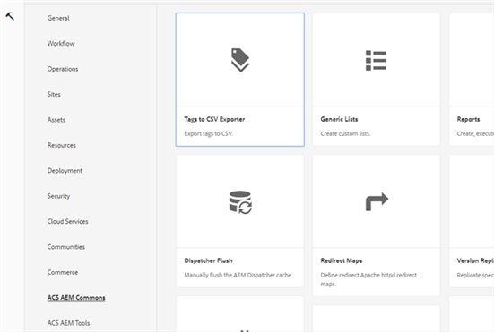
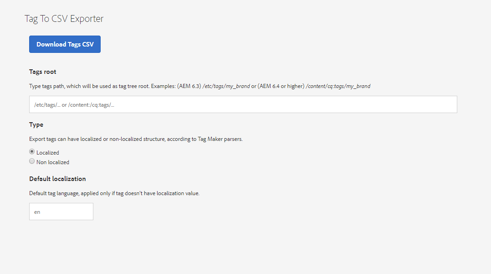

## Tags to CSV Exporter

Tags to CSV Exporter gives possibility to export Tags as CSV in one of two formats supported by Tag Maker tool from ACS Tools.
Navigate to **Tools -> ACS AEM Commons -> Tags to CSV Exporter**

Or just simple click on link: [http://localhost:4502/etc/acs-commons/exporters/tag-to-csv-exporter.html](http://localhost:4502/etc/acs-commons/exporters/tag-to-csv-exporter.html)

1. Define path to Your tag root, where You want to start exporting
    * Examples: `/etc/tags/my_brand` (AEM 6.3), `/etc/cq:tags/my_brand` (AEM 6.4 and higher)
2. Choose type:
    * **Localized:** Tag structure including tag titles in different languages (if applicable), or default language
    * **Non localized:** Tag structure including only one, main, tag title without data about language
3. Default localization:
    * If You export tags as localized, You can specify here default language (used if tag does not contain ane language explicite)

4. Click **Download Tags CSV** to download the CSV with tags, which can be easily imported via Tag Maker from ACS Tools

