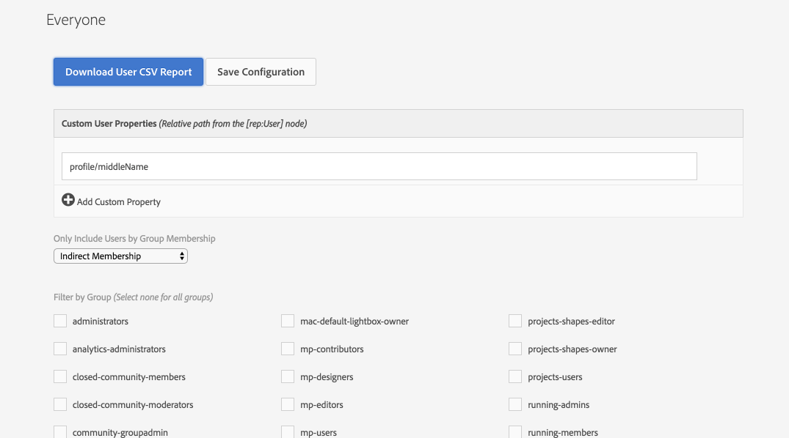

## Users to CSV Exporter

Navigate to [http://localhost:4502/miscadmin#/etc/acs-commons/exporters](http://localhost:4502/miscadmin#/etc/acs-commons/exporters) and create a new **Users to CSV Export** page.

Name the page appropriately as the page's report configuration can be saved and run again later.

1. Define any custom properties to add to the report. These are relative property paths off the user node (`[rep:User]`)
    * Examples: `profile/middleName`, `preferences/somePref`
2. Group Membership type:
    * **Direct:** Only include users who are have been explicitly added to a group selected below.
    * **Indirect:** Only include users who are members through group inheritance of a group selected below.
    * **Direct and Indirect:** Any group membership.
3. Groups:
    * Select any number of groups that will be used to filter in users to the report by the group membership type selected above.
    
4. Optionally, click **Save Configuration** at the top to save this configuration to this page. Multiple User to CSV Exporter pages with different configurations can be created.

5. Click **Download User CSV Report** to download the CSV Report of the user for easy import into Excel.
    * Note groups are delimited in the CSV with `|`
    * [View Sample Export](users.export.csv)

