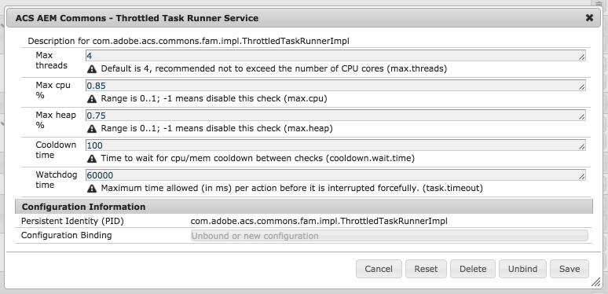
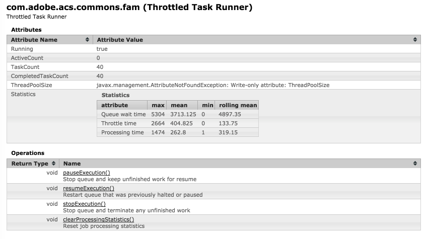
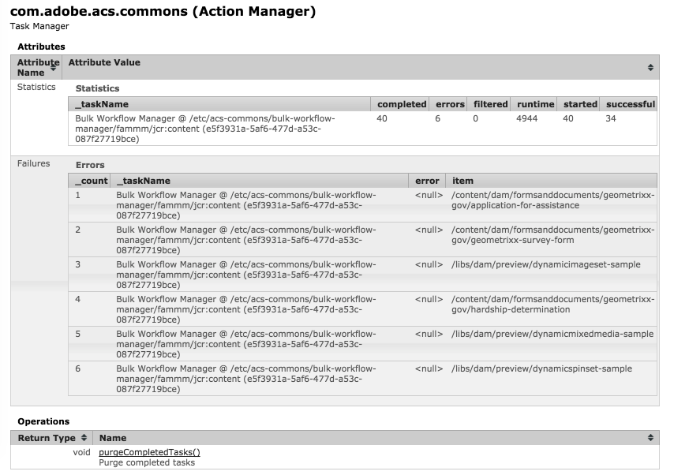

## Version notice

> [Legacy FAM for 6.0/6.1](old/aem_60_61.html)

In order to better support Java 8 language features, FAM will only be maintained from ACS Commons versions 3.9.0 to support AEM 6.2+ on Java 8 or newer.  Older AEM instances running on earlier versions may use the older version of FAM but will not inherit any of the more recent bug fixes or improvements.

## Purpose

Fast Action Manager is a easy-to-use API that allows for parallelized and (intelligently) throttled execution of Synthetic Workflow, Replication, or anything else you want!

## How to Use

> [Fast Action Manager JavaDocs](http://adobe-consulting-services.github.io/acs-aem-commons/apidocs/com/adobe/acs/commons/fam/package-summary.html)

> [Deep dive recording: Fast Action Manager and a folder move tool built using it](https://my.adobeconnect.com/p85l0mfo4fwx/?OWASP_CSRFTOKEN=25de769380f7bf27844802e3e716d3a26f892048c3350d6a74a4f1381525016d)

The Action Manager is built on top of the Throttled Task Runner (a managed thread pool) and provides a convenient way to run many AEM-specific activities in bulk.  Set up your own work using `deferredWithResolver` which is the simplest call to schedule work to run at some future point.  Your action is passed in as a lambda or function reference such that it is invoked with a ready-to-use resource resolver.  There's no need to catch errors!  If your action generates an error it is logged for you.  If you want to catch the error for retry purposes, there are also several types of retry facilities provided (see "If at first you don't succeed" below.)

Generally speaking the ActionManager is used to perform the same action against many target resources in the JCR, though that's not necessarily a requirement for using it.  Two ways to identify which resources to operate on are the following:
- For working on a tree, or to walk a tree looking for nodes to process, use a visitor pattern.  See the "Lambda Visitors" section below for examples.
- To run the same action(s) against query results you use `withQueryResults` instead.  See the query examples at the bottom of this page for samples.

*Note:* Since version 3.9.0, cleanup of internally-generated resource resolvers is completely automatic.  You must remember to close your original resource resolver which you use to create the ActionManager, but any additional resource resolves it creates internally are closed when it is finished.  The way that the action manager handles JCR sessions is that it clones the resource resolver provided at the time of creation.  The original resource resolver can be closed at any point without affecting the scheduled work.

Once work is scheduled to run, you can check on the status using the provided JMX MBeans.  The `ThrottledTaskRunner` bean lets you get current running stats of the actual work being done.  The Action Manager Factory bean lets you get an overview of all action managers that have been created and how much work they have pending, if any, as well as total run-time and any errors that have occurred.

You can programatically track down ActionManager instances via the `ActionManagerFactory` service as well.

### Lambda Visitors
> [SimpleFilteringResourceVisitor JavaDocs](https://adobe-consulting-services.github.io/acs-aem-commons/apidocs/com/adobe/acs/commons/util/visitors/SimpleFilteringResourceVisitor.html)

If your target nodes are exactly an entire subtree of nodes, maybe with a light amount of programmatic filtering, then using a query is likely not always the best idea.  The new updated FAM also includes visitors that allow simple lambda expressions for the following:

* Determine what nodes should be traversed (setTraversalFilter) -- Default is all
* Determine what properties should be visited (setPropertyFilter) -- Default is all
* Provide visitor for traversed resources
   * Note: Visitors are expected to be BiFunctions which are provided the Resource and the node level (integer)
   * Even if you don't need the level parameter you still have to accept it.  This is shown in the example below.
* Provide visitor for leaf nodes, which are the nodes which are the first level of nodes not traversed
* Provide visitor for properties, which is given a Map.Entry<String, Object> and the node level

For traversing folder structures and working with folder contents, there is a TreeFilteringResourceVisitor which allows you to specify the node types of nodes which should be traversed.  Everything else is treated as a leaf node.  This is extremely useful for travering tree structures of folders with assets.  Both visitors allow you to decide if they should work as depth-first (which is default) or breadth-first, which works better in some cases like creating tree structures.


    /*
     This example assumes there is some method "buildDestinationFolder" 
     which creates a folder as a clone of a current folder. The 
     implementation of that method isn't necessarily important for 
     this example, we're just showing how the visitor part works here.
    */
    ActionManager manager = amf.createTaskManager("Copy folder structure", resourceResolver, 1);
    TreeFilteringResourceVisitor folderVisitor = new TreeFilteringResourceVisitor();
    folderVisitor.setBreadthFirstMode();
    folderVisitor.setResourceVisitor((res, level) -> {
        String path = res.getPath();
        manager.deferredWithResolver(Actions.retry(5, 100,
            rr -> buildDestinationFolder(rr, path)));
    });
    folderVisitor.accept(rr.getResource(sourcePath));


### If at first you don't succeed...

There are many cases where retry logic is necessary to ensure that work is completed even though there are race conditions which might cause occasional issues.  This happens a lot, for example, when building recursive tree structures.  There are two main flavors of retry logic provided.

#### Retrying a single action
If the activity performed does not benefit from batch processing the `Actions.retry` method is the best choice.  Some examples of why you would use this instead are:

* Read-only actions where no commit occurs, such as performing ACL or other validation checks
* Creating items individually where batch processing is more problematic, such as creating tree structures
* Other solitary actions which take a considerable amount of time like Synthetic Workflow or asset ingestion


manager.deferredWithResolver(Actions.retry(5, 100, 
    rr -> buildDestinationFolder(rr, path)
));


Likewise you can wrap actions using `Actions.retryAll` in conjunction with the `withQueryResults` method to add retry support to query-based actions.

#### Retrying a stack of actions
If the activity is designed to commit content changes, then ActionBatch is a more convenient option.  The difference is that all actions are executed sequentially and if any of them fail, the resolver is refreshed and all actions within that batch are retied again in order.  It is preferred to commit content changes in batches, say 10 at a time, rather than individually as it can be much faster overall.  Note: There is currently no support for "withQueryResults" to use ActionBatch internally, so you have to use other iterator patterns such as visitor or simple for-loops -- or use the withQueryResults to build ActionBatches instead of processing results right away.  Once the iterator or visitor is completed defining all the work, the commitBatch() method must be called to schedule the final batch of work.


    ActionManager manager = amf.createTaskManager("Copy folder structure", resourceResolver, 1);
    // Content is saved in batches of 10
    ActionBatch batch = new ActionBatch(manager, 10);  
    TreeFilteringResourceVisitor folderVisitor = new TreeFilteringResourceVisitor();
    folderVisitor.setBreadthFirstMode();
    // Note there is no resource visitor bc. we don't care about folders here.
    folderVisitor.setLeafVisitor((res, level) -> {
        String path = res.getPath();
        if (!path.endsWith("jcr:content")) {
            // moveItem relocates the node somewhere, not covered here...
            batch.add(rr -> moveItem(rr, path));  
        }
    });
    folderVisitor.accept(rr.getResource(sourcePath));
    // Note: VERY IMPORTANT!  Must always commit the batch at the end.
    batch.commitBatch(); 


## Developing with the Fast Action Manager APIs

To use Fast Action Manager write a small code harness that identifies the resources to process and then defines how those items should be processed using one or more functions.  There are some additional considerations worth noting in addition to the examples already provided.  Some of the following will sound totally contrary to good-practice for AEM but that's because the stuff you normally have to do is already done for you.

### Don't catch errors

Unless you want to do something specific with an error, it is actually more ideal to let errors be caught and reported by the ActionManager directly.  That way at the end you can get a summary of which items failed to process.  If you want retry logic, then use the appropriate retry handler, but let it throw errors if retries were unsuccessful.  Otherwise FAM does the error handling and reporting for you but it only works if your code thows unhandled exceptions.

A final note on this is that standard Java 8 functions do not allow throwing unchecked exceptions whereas the variations defined in `com.adobe.acs.commons.function.*` allow unchecked exceptions.  This was necessary to allow FAM to handle exceptions automatically and get all that bulky try/catch mess out of your code so you can focus on more important things.

### Don't close resolvers

Your action functions should NEVER close the resolver passed into it.  Resolvers are maintained (and reused) by the action manager so closing them can actually mess things up.  Don't close them.  That is automatic.  You must remember to close your original resource resolver which you use to create the ActionManager, but any additional resource resolves it creates internally are closed when it is finished.

### Don't pass resources into your lambda functions

When using `deferredWithResolver` it is important that your lambda function only reference a resource by path.  That is because a resource obtained in the main thread is tied to the resource resolver that obtained it.  If you try to use a resource in a thread that didn't obtain it, bad things happen.  Instead you can put the path of the resource in a variable and then reference that path from the lambda expression.  For example:


    folderVisitor.setLeafVisitor((res, level) -> {
        String path = res.getPath();
        if (!path.endsWith("jcr:content")) {
            batch.add(rr -> moveItem(rr, path));
        }
    });


Notice in the above that the visitor is provided a resource, but the `ActionBatch` is provided a function which refers to the path, not the resource itself.  Yes the worker function has to re-obtain the resource.  Yes that is okay.  In fact, it's really the only option you have.

### Fear of commitment?

Most of the time you don't need to commit in your actions unless you're doing something really specific and need to be 100% sure.  There are a number of features which cause commit to happen automatically, and a few places it does not.

* The constructor for Action Manager lets you specify how many times a resolver is reused before it attempts to auto-commit any changes.  Generally you can set this to 1 but remember if you aren't using ActionBatch then failures mean that other actions might not get retried when the commit fails.  In fact, the auto-commit performed in Action Manager only records errors, there is no retry when failure occurs at this level.
* ActionBatch will automatically commit and refresh the resource resolver at the end of each batch and will retry all actions if the commit fails.  In case you are doing mass-updates this is the most likely candidate for managing this work.  If a batch passes the commit operation without exhausting available retries then no errors are recorded, but they do show in the log file.
* Action.retry and Action.retryAll do NOT commit automatically because not every use of these generates repository changes.  Because of that, you explicitly have to commit at the end of your function if making changes.  In case of failure, these methods do a revert and refresh on the resource resolver so that the action can be attempted again.

### Chain reaction

One of the major additions to FAM is the addition of `onSuccess`, `onFailure`, and `onFinish` functions on ActionManager.  With these it is possible to have an ActionManager trigger another set of actions when it is finished

* *Success:* All activities have finished and no errors were recorded.  This can be used to kick off another ActionManager-based worker process if building a complex multi-step utility.
* *Failure:* All activities have finished but one or more resulted in error.  This is a handy mechanism for adding a rollback or abort kind of feature.
* *Finish:* All activities have finished, success and failue events have already been processed.  Also, all resource resolvers have already been closed as well.

These features were necessary to support the chaining of action managers for building larger, more complex processes.  This feature is further utilized in other more advanced ACS Commons features.

### How to know what item failed

There is some trickery under the hood which allows your error reporting to note which node was being processed when an error occurred.  If you're using `withQueryResults` it will set the path automatically.  This following trick is more useful if you are scheduling work via a visitor or other kind of loop.  In order for this to work you can either use the functions provided in `Actions` or other similar utility classes that already implement this, or you can pass along this information yourself like so: 


    Actions.setCurrentItem(path);


This way, your function makes a note of the current item being processed and should an error occur your error list will note the path correctly.

## Examples

### Query Example: Starting Synthetic Workflow on DAM Update assets

This sample code executes the OOTB DAM Asset Update Workflow Model on all assets under a designated path using a query.



<%@include file="/libs/foundation/global.jsp"%>
<%@page session="false"
        contentType="text/html; charset=utf-8"
        pageEncoding="UTF-8"
        import="com.adobe.acs.commons.workflow.synthetic.*,
                com.adobe.acs.commons.fam.*,
                com.adobe.acs.commons.fam.actions.*"%><%

    SyntheticWorkflowRunner swr = sling.getService(SyntheticWorkflowRunner.class);
    ActionManagerFactory trf = sling.getService(ActionManagerFactory.class);
    DeferredActions actions = sling.getService(DeferredActions.class);
    SyntheticWorkflowModel model = swr.getSyntheticWorkflowModel(
        resourceResolver, "/etc/workflow/models/dam/update_asset", true
    );

    TaskManager manager = trf.createTaskManager("Fiddle", resourceResolver, 1);
    int numberOfAssets = manager.withQueryResults(
        "SELECT * FROM [dam:Asset] as a WHERE ISDESCENDANTNODE(a,'/content/dam/my-asset-folder')",
        "JCR-SQL2",
        Actions.startSyntheticWorkflows(model, swr)
    );
%>
Finished adding <%=numberOfAssets%> items.



### Query Example: Replicating assets

This sample code replicates all DAM assets under the designated path using a query.


<%@include file="/libs/foundation/global.jsp"%>
<%@page session="false"
        contentType="text/html; charset=utf-8"
        pageEncoding="UTF-8"
        import="com.adobe.acs.commons.fam.*,
               com.adobe.acs.commons.fam.actions.*,
               com.day.cq.replication.*"%><%

    ActionManagerFactory amf = sling.getService(ActionManagerFactory.class);
    Replicator replicator = sling.getService(Replicator.class);
    String agentId = "AGENT_ID";
    ReplicationOptions publishOptions = new ReplicationOptions();
    publishOptions.setFilter(new AgentIdFilter(agentId));
    ActionManager manager = amf.createTaskManager("Activate to "+agentId, resourceResolver, 1);

    int numberOfAssets = manager.withQueryResults(
        "SELECT * FROM [dam:Asset] as a WHERE ISDESCENDANTNODE(a,'/content/dam/my-asset-folder')",
        "JCR-SQL2",
        ReplicationActions.activateAllWithOptions(replicator, publishOptions)
    );
%>

Finished adding <%=numberOfAssets%> items to the activation queue <%=agentId%>.



### Advanced Function Example: Chaining actions

Because FAM uses functions you are able to use `.andThen(...)` operator to call one function after another.  If the first function fails then the second function is not called.


// This can be provided to withQueryResults to run synthetic workflow and replicate assets afterwards
Actions.startSyntheticWorkflows(model, swr).andThen(
   ReplicationActions.activateAllWithOptions(replicator, publishOptions)
)
// This is the same except for using deferredWithResolver, ActionBatch, etc.
Actions.startSyntheticWorkflow(model, path, swr).andThen(
   ReplicationActions.activateWithOptions(replicator, path, publishOptions)
)


### OSGi Configuration

The Throttled Task Runner is OSGi configurable, but please note that changing configuration while work is being processed results in resetting the worker pool and can lose active work.

* Max threads: Recommended not to exceed the number of CPU cores. Default 4.
* Max CPU %: Used to throttle activity when CPU exceeds this amount. Range is 0..1; -1 means disable this check.
* Max Heap %: Used to throttle activity when heap usage exceeds this amount. Range is 0..1; -1 means disable this check.
* Cooldown time: Time to wait for cpu/mem cooldown between throttle checks (in milliseconds)
* Watchdog time: Maximum time allowed (in ms) per action before it is interrupted forcefully.

### JMX MBeans

#### Throttled Task Runner MBean 

This is the core worker pool. All action managers share the same task runner pool, at least in the current implementation.  The task runner can be paused or halted entirely, throwing out any unfinished work.

#### Action Manager MBean 

The action manager bean provides basic information about each running action manager and also lists any errors encountered.  Other operations allow purging completed work, which is necessary if using this facility often.

