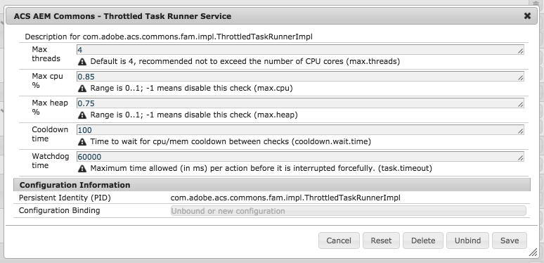

## Version notice

In order to better support Java 8 language features, FAM will only be maintained from ACS Commons version 3.9.0 onward to support AEM 6.2 or later.  Older AEM instances running on earlier versions may use the older version of FAM but will not inherit any of the more recent bug fixes or improvements.

## Purpose

Fast Action Manager is a easy-to-use API that allows for parallelized and (intelligently) throttled execution of Synthetic Workflow, Replication and anything you can code!

## How to Use

> [Fast Action Manager JavaDocs](http://adobe-consulting-services.github.io/acs-aem-commons/apidocs/com/adobe/acs/commons/fam/package-summary.html)

The Action Manager is built on top of the Throttled Task Runner providing a convenient way to run many of AEM-specific activities.  Set up your own work using `deferredWithResolver` which is the simplest call to schedule work to run at some future point.  To run the same action(s) against query results you can do like the examples (below) and use `withQueryResults` instead.

At the end of scheduling work, it is important to add cleanup tasks.  These close all opened resolvers so that there are no JCR session leaks.

The way that the action manager handles JCR sessions is that it clones the resource resolver provided at the time of creation.  The original resource resolver can be closed at any point without affecting the scheduled work.

Once work is scheduled to run, you can check on the status using the provided JMX MBeans.  The `ThrottledTaskRunner` bean lets you get current running stats of the actual work being done.  The Action Manager Factory bean lets you get an overview of all action managers that have been created and how much work they have pending, if any, as well as total run-time and any errors that have occurred.

### OSGi Configuration

The Throttled Task Runner is OSGi configurable.

* Max threads: Recommended not to exceed the number of CPU cores. Default 4.
* Max CPU %: Used to throttle activity when CPU exceeds this amount. Range is 0..1; -1 means disable this check.
* Max Heap %: Used to throttle activity when heap usage exceeds this amount. Range is 0..1; -1 means disable this check.
* Cooldown time: Time to wait for cpu/mem cooldown between throttle checks (in milliseconds)
* Watchdog time: Maximum time allowed (in ms) per action before it is interrupted forcefully.

### JMX MBeans

#### Throttled Task Runner MBean 

#### Action Manager MBean 

### Developing with the Fast Action Manager APIs

To use Fast Action Manager (FAM) write a small code harness that collects the resources to process along w/ the desired processing.

### Example Code: Fast Action Manager calling Synthetic Workflow on DAM Update assets

This sample code executes the OOTB DAM Asset Update Workflow Model on all assets under a designated path.



<%@include file="/libs/foundation/global.jsp"%>
<%@page session="false"
        contentType="text/html; charset=utf-8"
        pageEncoding="UTF-8"
        import="com.adobe.acs.commons.workflow.synthetic.*,      
                com.adobe.acs.commons.fam.*"%><%

    SyntheticWorkflowRunner swr = sling.getService(SyntheticWorkflowRunner.class);
    ActionManagerFactory trf = sling.getService(ActionManagerFactory.class);
    DeferredActions actions = sling.getService(DeferredActions.class);
    SyntheticWorkflowModel model = swr.getSyntheticWorkflowModel(
        resourceResolver, "/etc/workflow/models/dam/update_asset", true
    );

    TaskManager manager = trf.createTaskManager("Fiddle", resourceResolver, 10);
    int numberOfAssets = manager.withQueryResults(
        "SELECT * FROM [dam:Asset] as a WHERE ISDESCENDANTNODE(a,'/content/dam/my-asset-folder')",
        "JCR-SQL2",
        actions.startSyntheticWorkflows(model)
    );
    manager.addCleanupTask();
%>
Finished adding <%=numberOfAssets%> items.



### Example Code: Fast Action Manager replicating assets

This sample code replicates all DAM assets under the designated path.


<%@include file="/libs/foundation/global.jsp"%>
<%@page session="false"
        contentType="text/html; charset=utf-8"
        pageEncoding="UTF-8"
        import="com.adobe.acs.commons.fam.*,
               com.day.cq.replication.*"%><%

    ActionManagerFactory amf = sling.getService(ActionManagerFactory.class);
    DeferredActions actions = sling.getService(DeferredActions.class);
    String agentId = "AGENT_ID";
    ReplicationOptions publishOptions = new ReplicationOptions();
    publishOptions.setFilter(new AgentIdFilter(agentId));
    ActionManager manager = amf.createTaskManager("Activate to "+agentId, resourceResolver, 10);

    int numberOfAssets = manager.withQueryResults(
        "SELECT * FROM [dam:Asset] as a WHERE ISDESCENDANTNODE(a,'/content/dam/my-asset-folder')",
        "JCR-SQL2",
        actions.activateAllWithOptions(publishOptions)
    );
    manager.addCleanupTask();
%>

Finished adding <%=numberOfAssets%> items to the activation queue <%=agentId%>.



### Example Code: Chain Fast Action Manager actions

...
actions.startSyntheticWorkflows(model).andThen(
   actions.activateAllWithOptions(publishOptions)
)
...
