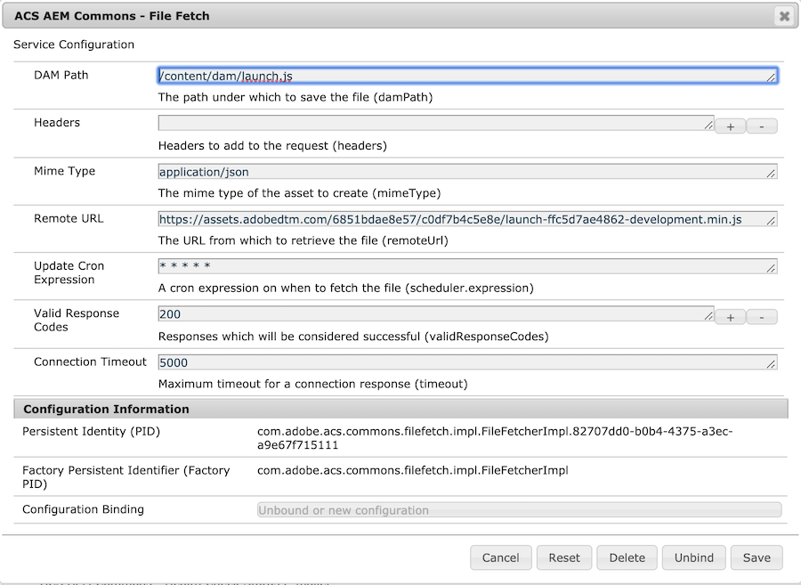

## Introduction

This feature allows administrators to automatically retrieve files from a remote source and load them into the AEM repository. It will fetch a file from a URL, load the file into the AEM DAM as a `dam:Asset` and then replicate the asset. It uses the HTTP responses status and will not perform any updates if a [304 status code](https://developer.mozilla.org/en-US/docs/Web/HTTP/Status/304) is returned.

A common use case for this is hosting the Adobe Launch script on a 1st party instead of 3rd party domain to bypass ad blockers which may block the \*.adobedtm.com domain.

## Usage

File Fetcher configurations can be created manually via the [OSGi Configuration Console](http://localhost:4502/system/console/configMgr):

The File Fetcher configuration supports the following attributes:

- *DAM Path* (_damPath_) - (required) The path under which to save the file, should start with /content/dam
- *Headers* (_headers_) - (optional) Headers to add to the request
- *Mime Type* (_mimeType_) - (required) The [mime type](https://developer.mozilla.org/en-US/docs/Web/HTTP/Basics_of_HTTP/MIME_types/Complete_list_of_MIME_types) of the asset to create
-	*Remote URL* (_remoteUrl_) - (required) The URL from which to retrieve the file
- *Update Cron Expression* (_scheduler.expression_) - (required) - A [cron expression](https://freeformatter.com/cron-expression-generator-quartz.html) on when to fetch the file
- *Valid Response Codes* (_validResponseCodes_) - (optional) - A list of response codes which are considered successful, 200 is default
- *Connection Timeout* (_connectionTimeout_) - (optional) - Maximum timeout for a connection response, 5000 is default

The recommended approach would be to create an OSGi configuration to include in your project. This would be created at: `/apps/[app-name]/config/com.adobe.acs.commons.filefetch.impl.FileFetcherImpl.[id].config` with similar contents:

        # Configuration created by Apache Sling JCR Installer
        remoteUrl="https://assets.adobedtm.com/6851bdae8e57/c0df7b4c5e8e/launch-ffc5d7ae4862-development.min.js"
        scheduler.expression="*\ *\ *\ *\ *"
        timeout=I"5000"
        validResponseCodes=i["200"]
        headers=[""]
        mimeType="application/json"
        damPath="/content/dam/launch.js"
