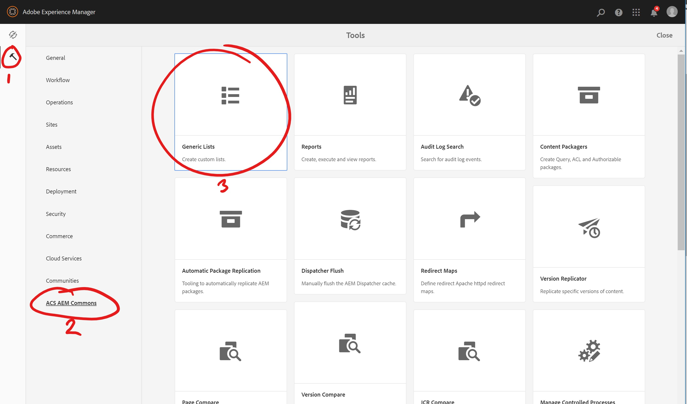
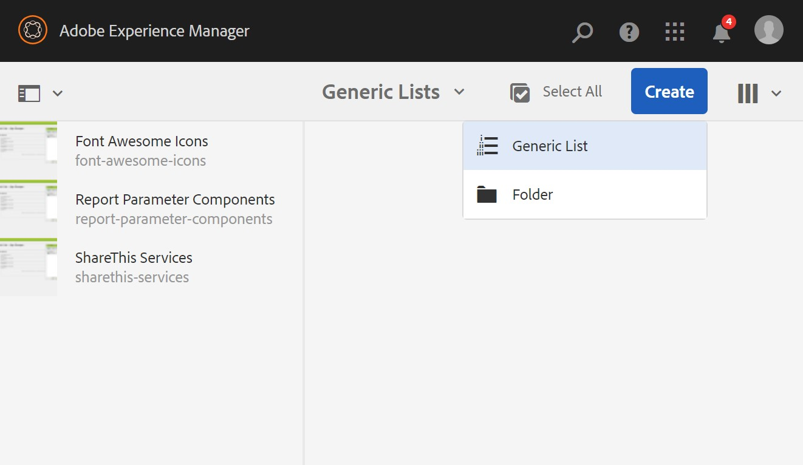
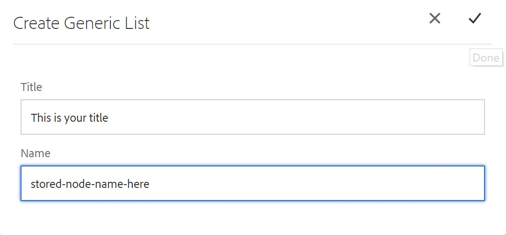
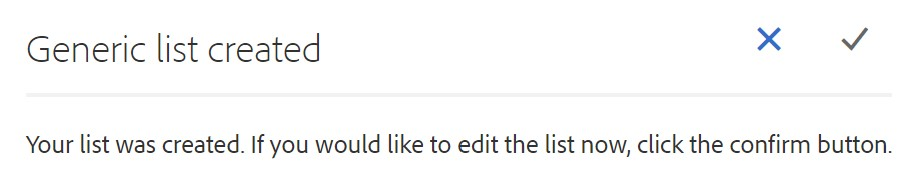
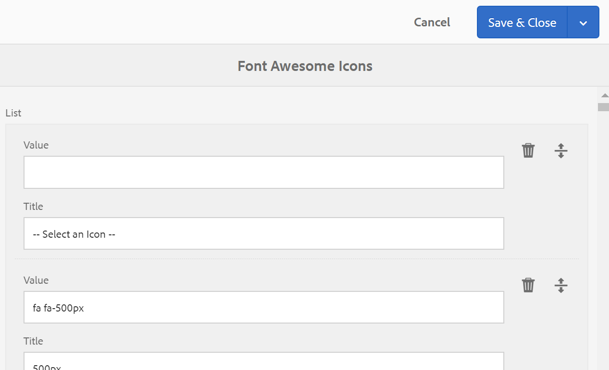
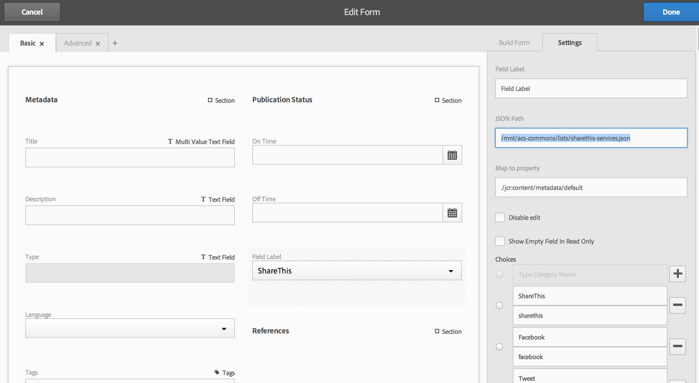
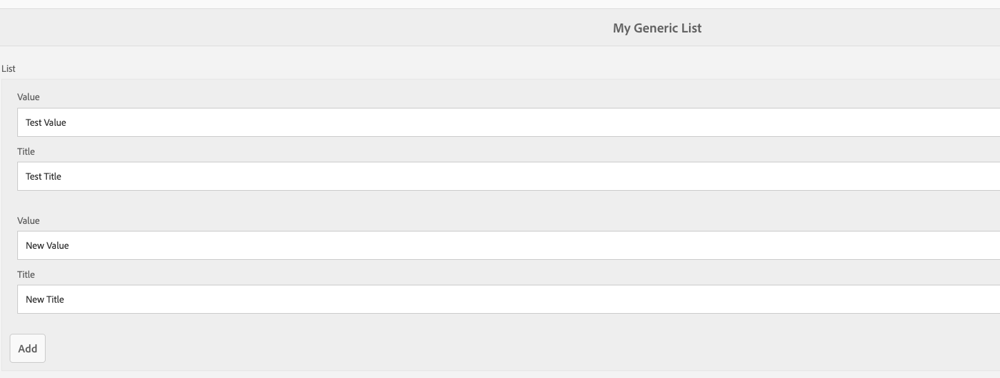
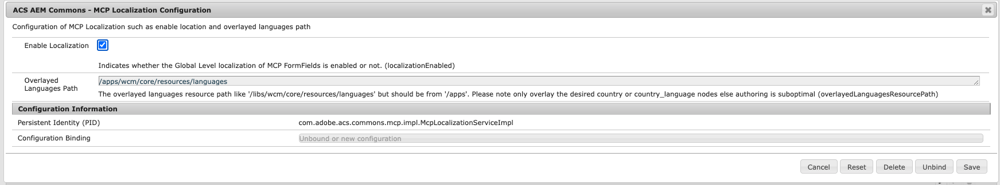
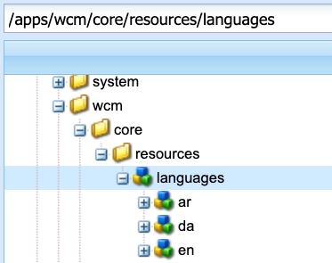
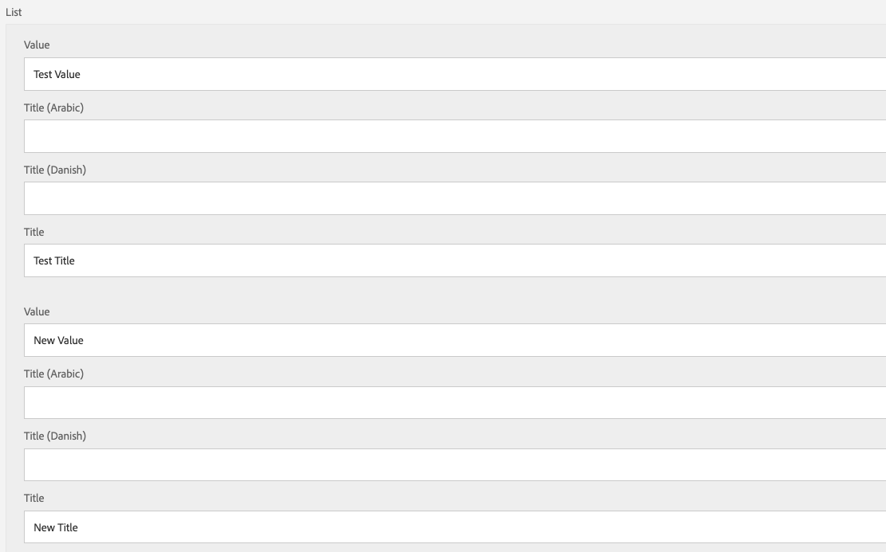

## Purpose

Generic Lists are a feature allowing easy creation and management of lists of title/value pairs.

## How to Use

### Accessing the Generic List browser

To view or edit lists, click on Tools (Icon) > ACS Commons > Generic Lists:



### Creating Lists

Generic Lists are represented as CQ Pages under `/etc/acs-commons/lists`, e.g. `/etc/acs-commons/lists/age-ranges`.  

The generic list browser is based on the same console used for sites and assets, only limited to creating only folders and generic lists via the Create button.  



When creating a new list, provide its visible title as well as the node name (note: no spaces are allowed in node names) and press the check mark to create the new list.



Once the list is created you have the option to edit it and add values.  Press the check mark to edit the new list or click the X or outside the dialog to go back to the shell.



Editing a list is simple.  Click Add to add items to the list, use the drag handles to re-order items.   When ready to save, click on Save in the upper right.



### Using Lists in Classic UI Dialogs

One of the primary purposes of Generic Lists is to populate a selection widget in a component (or page) dialog. To do this, set the `options` configuration property to the list path *plus* `/jcr:content.list.json`. For example:


<jcr:root xmlns:cq="http://www.day.com/jcr/cq/1.0" xmlns:jcr="http://www.jcp.org/jcr/1.0"
    jcr:primaryType="cq:Widget"
    fieldLabel="Target"
    name="./target"
    options="/etc/acs-commons/lists/age-ranges/_jcr_content.list.json"
    type="select"
    xtype="selection"/>


This can also be used in multifield scenarios.

In both cases, the JCR property will be set to the *value* of the list item.

### Using Lists in Touch UI Dialogs (since 1.8.0)

In a Touch UI dialog, a generic concept called a _datasource_ is used to populate select-style components. For this, you can use a Generic Lists-specific data source:


<jcr:root xmlns:cq="http://www.day.com/jcr/cq/1.0" xmlns:jcr="http://www.jcp.org/jcr/1.0"
    jcr:primaryType="nt:unstructured"
    sling:resourceType="granite/ui/components/foundation/form/select"
    fieldLabel="Social Service"
    name="./social">
    <datasource
        jcr:primaryType="nt:unstructured"
        sling:resourceType="acs-commons/components/utilities/genericlist/datasource"
        path="/etc/acs-commons/lists/sharethis-services" />
</jcr:root>



### Using Lists in Touch UI Asset Metadata Editor (since 1.8.0)

In the Touch UI Asset Metadata Editor, you can provide the name to the list *prefixed* with _/mnt/acs-commons/lists_ (e.g. _/mnt/acs-commons/lists/sharethis-services_ for _/etc/acs-commons/lists/sharethis-services_) as the JSON Path for a Dropdown list. You may optionally include the _json_ extension.



> One quirk of the Metadata Asset Editor is that the JSON support is not dynamic. You must update the editor when the list changes.

## Localization (since v5.2.0)

Localization was added in a non-backwards compatible manner (localization appeared for all users regardless if it was desired) and updated to be opt-in in v5.2.0.

1. By default localization of Generic List dialogs is disabled, so Generic List authoring using a single language.
   
1. To enable localized Generic List dialogs can enable at Global Level via OSGi config. 

  

  `com.adobe.acs.commons.mcp.impl.McpLocalizationServiceImpl.cfg.json`
  
  ```json
  {
    "localizationEnabled": true
  }
  ```  
1.  Create an overlay of the languages JCR structure found in `/libs/wcm/core/resources/languages` to `/apps/wcm/core/resources/languages` including the languages you require for localization.
  
1. Then Localized Generic List authoring will look like:
  

## API

You will frequently need to do two things with lists:

1. Get all the items in the list.
2. Lookup the title of a particular value from the list.

To do this, first obtain the `com.day.cq.wcm.api.Page` object for the list page:


    PageManager pageManager = resourceResolver.adaptTo(PageManager.class);
    Page listPage = pageManager.getPage("/etc/acs-commons/lists/targets");

    
Then adapt the `Page` object to a `com.adobe.acs.commons.genericlists.GenericList` object:


    GenericList list = listPage.adaptTo(GenericList.class);


The `GenericList` interface has two methods:

* `getItems()` - returns a `java.util.List` of the items in the list.
* `lookupTitle(String)` - return the title of a particular value from the list.

## Generic Lists access on AEM as a Cloud Service Publish

Generic Lists are not accessible to everyone by default on AEM as a Cloud Service Publish service. To make generic lists available on AEM Publish, set the appropriate `jcr:read` ACLs on either the `/etc/acs-commons/list` node, on specific list pages under `/etc/acs-commons/lists`.

For example, the following [Sling RepoInit](https://sling.apache.org/documentation/bundles/repository-initialization.html) script allows everyone to have read access to all Generic Lists.

`ui.config/src/main/content/jcr_root/apps/my-app/osgiconfig/config.publish/org.apache.sling.jcr.repoinit.RepositoryInitializer-acs-commons-generic-lists-publish.config`

```
create path /etc/acs-commons(sling:OrderedFolder)/lists(sling:OrderedFolder)
set ACL for everyone
    allow jcr:read on /etc/acs-commons/lists
end
```

Similar to RepoInit, access can be granted to Generic Lists through traditional read ACL `rep:policy` nodes added to `/etc/acs-commons/lists` or explicit list pages -- ReppInit simply scripts the creation of `rep:policy` nodes and is the preferred method.

If lists should not be directly accessed via HTTP on AEM Publish, then create deny filter rules in AEM Dispatcher config, blocking HTTP GET access to `/etc/acs-commons/lists`.

