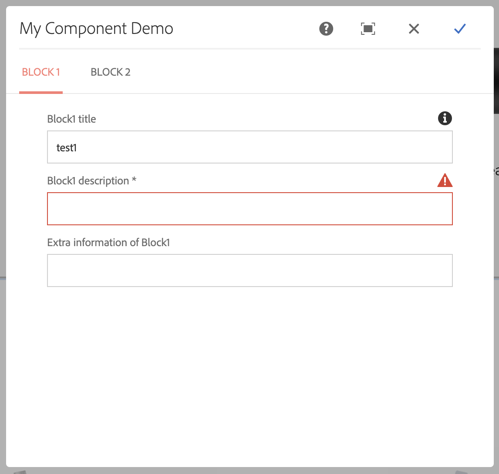
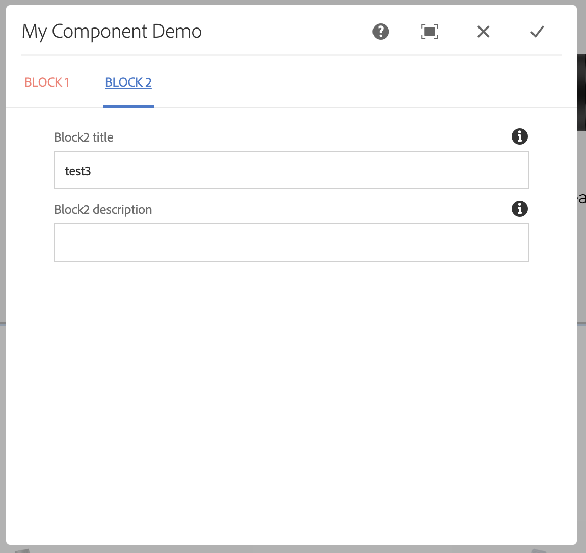
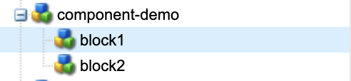
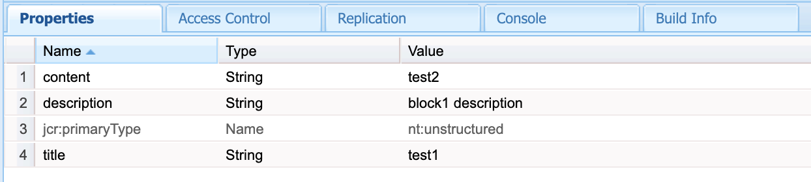

[<< back to Parameterized Namespace Granite Include index](../index.html)

## Parameters Example

Using the parameters mechanism in our include component, you can write snippets that can be reused by multiple components that could not be used before.

It allows you to customize various values per include, such as a fieldLabel, fieldDescription, whether to show or hide a field or not, to give it default values etc. 

### Syntax 

The way it works is that in a property value (not a property key!) in the dialog XML  you put the following expression:


<figure class="highlight"><pre><code class="language-xml" data-lang="xml">${{(OptionalTypeCast)parameterKey(:OptionalDefaultValue}}</code></pre></figure>


So at minimum you will need:


<figure class="highlight"><pre><code class="language-xml" data-lang="xml">${{parameterKey}}</code></pre></figure>


When you want to typecast that value to a Boolean:


<figure class="highlight"><pre><code class="language-xml" data-lang="xml">${{(Boolean)parameterKey}}</code></pre></figure>


And if you also would live to give it a default value of true:


<figure class="highlight"><pre><code class="language-xml" data-lang="xml">${{(Boolean)parameterKey:true}}</code></pre></figure>


### The example

Enough talk, now for the actual example. 
We will define 1 dialog snippet. The snippet will have a simple title and description.
But some stuff will be customize-able on a include basis.
The snippet will be created under: /apps/path/to/block.xml



<figure class="highlight"><pre><code class="language-xml" data-lang="xml">&lt;?xml version="1.0" encoding="UTF-8"?&gt;
&lt;jcr:root xmlns:sling="http://sling.apache.org/jcr/sling/1.0"
          xmlns:jcr="http://www.jcp.org/jcr/1.0" xmlns:nt="http://www.jcp.org/jcr/nt/1.0"
          jcr:primaryType="nt:unstructured"
          sling:resourceType="granite/ui/components/foundation/section"&gt;
    &lt;layout
            jcr:primaryType="nt:unstructured"
            sling:resourceType="granite/ui/components/foundation/layouts/fixedcolumns"
            margin="{Boolean}false"/&gt;
    &lt;items jcr:primaryType="nt:unstructured"&gt;
        &lt;column
                jcr:primaryType="nt:unstructured"
                sling:resourceType="granite/ui/components/foundation/container"&gt;
            &lt;items jcr:primaryType="nt:unstructured"&gt;
                &lt;title
                        jcr:primaryType="nt:unstructured"
                        sling:resourceType="granite/ui/components/coral/foundation/form/textfield"
                        fieldLabel="${{blockTitle}} title"
                        fieldDescription="The title of ${{blockTitle}}"
                        name="./title"/&gt;
                &lt;description
                        jcr:primaryType="nt:unstructured"
                        sling:resourceType="granite/ui/components/coral/foundation/form/textfield"
                        name="./description"
                        fieldLabel="${{blockTitle}} description"
                        fieldDescription="The description of ${{blockTitle}}"
                        maxlength="${{(Long)descriptionMaxLength}}"
                        required="${{(Boolean)descriptionIsRequired:false}}"
                /&gt;
                &lt;extra
                        jcr:primaryType="nt:unstructured"
                        sling:resourceType="granite/ui/components/coral/foundation/form/textfield"
                        name="./extraInformation"
                        hide="${{hideExtra:false}}"
                        fieldLabel="Extra information of ${{blockTitle}}"
                /&gt;
            &lt;/items&gt;
        &lt;/column&gt;
    &lt;/items&gt;

&lt;/jcr:root&gt;</code></pre></figure>



Then we will define the actual dialog that will include the main snippet:


<?xml version="1.0" encoding="UTF-8"?>
<jcr:root xmlns:sling="http://sling.apache.org/jcr/sling/1.0" xmlns:jcr="http://www.jcp.org/jcr/1.0"
          xmlns:nt="http://www.jcp.org/jcr/nt/1.0"
          jcr:primaryType="nt:unstructured"
          jcr:title="My Component Demo"
          sling:resourceType="cq/gui/components/authoring/dialog">
    <content
            jcr:primaryType="nt:unstructured"
            sling:resourceType="granite/ui/components/foundation/container">
        <layout
                jcr:primaryType="nt:unstructured"
                sling:resourceType="granite/ui/components/foundation/layouts/tabs"
                type="nav"/>
        <items jcr:primaryType="nt:unstructured">
            <block1
                    jcr:primaryType="nt:unstructured"
                    jcr:title="Block 1"
                    sling:resourceType="acs-commons/granite/ui/components/include"
                    path="/apps/path/to/block"
                    namespace="block1"
                    margin="{Boolean}true">
                <parameters
                        jcr:primaryType="nt:unstructured"
                        blockTitle="Block1"
                        descriptionIsRequired="{Boolean}true"
                />
            </block1>
            <block2
                    jcr:primaryType="nt:unstructured"
                    jcr:title="Block 2"
                    sling:resourceType="acs-commons/granite/ui/components/include"
                    path="/apps/path/to/block"
                    namespace="block2"
                    margin="{Boolean}true">
                <parameters
                        jcr:primaryType="nt:unstructured"
                        blockTitle="Block2"
                        hideExtra="{Boolean}true"
                        descriptionMaxLength="{Long}15"
                />
            </block2>
        </items>
    </content>
</jcr:root>
 

The result is the following dialog:

First tab (block1)

As you can see, the titles / descriptions adjust according to the parameters.

Second tab (block2)

As you can see the extra field is hidden here.

If you save the dialog this is the result in CRX:

## Possible Typecasts 

Currently the possible typecasts are : Boolean, Long, Double, String.

The input here is case insensitive. 

More typecasts may be added in the future.