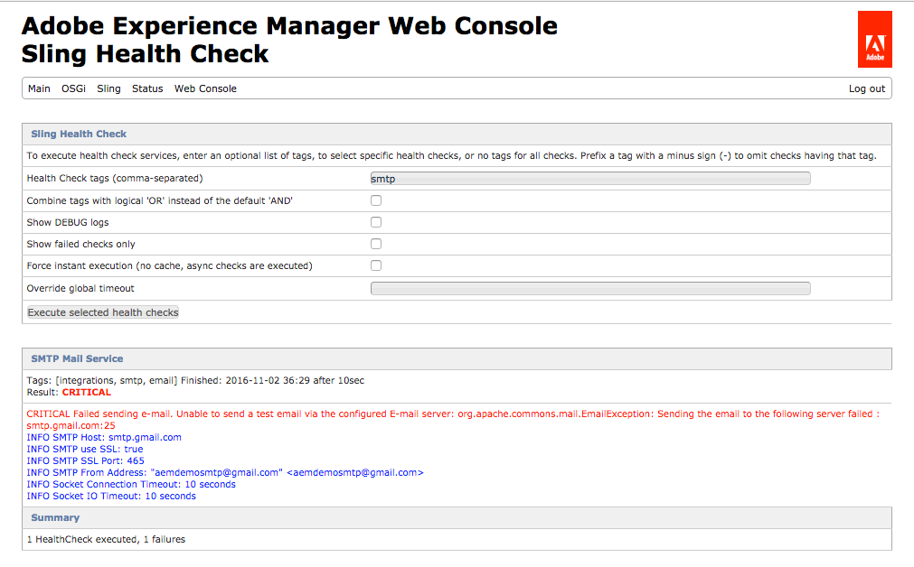

> [Add health checks to your Granite WebUI](https://docs.adobe.com/docs/en/aem/6-3/administer/operations/operations-dashboard.html#Health Reports). 
> Please note that the `sling:configCollectionInherit` MUST be used as shown in [this sample](https://github.com/heervisscher/htl-examples/blob/master/ui.apps/src/main/content/jcr_root/apps/settings/granite/operations/hc/.content.xml).

## SMTP E-mail Service Health Check

This health check attempts to connect to the SMTP server defined in the [Day CQ Mail Service OSGi Configuration](http://localhost:4502/system/console/configMgr/com.day.cq.mailer.DefaultMailService) and send a test e-mail to an OSGi configured e-mail address (see sample OSGi configuration below).

> Note, this health check can take some time to fail if the timeout. 

### How to use

Enable the STMP Health check by creating an OSGi Configuration under `/apps/myapp/config/com.adobe.acs.commons.hc.impl.SMTPMailServiceHealthCheck`


<?xml version="1.0" encoding="UTF-8"?>
<jcr:root xmlns:sling="http://sling.apache.org/jcr/sling/1.0" xmlns:cq="http://www.day.com/jcr/cq/1.0" xmlns:jcr="http://www.jcp.org/jcr/1.0" xmlns:nt="http://www.jcp.org/jcr/nt/1.0"
    jcr:primaryType="sling:OsgiConfig"
    email="address-to-send-test-email-to@myco.com"/>


#### Health Check Tags

* smtp
* email
* integrations

