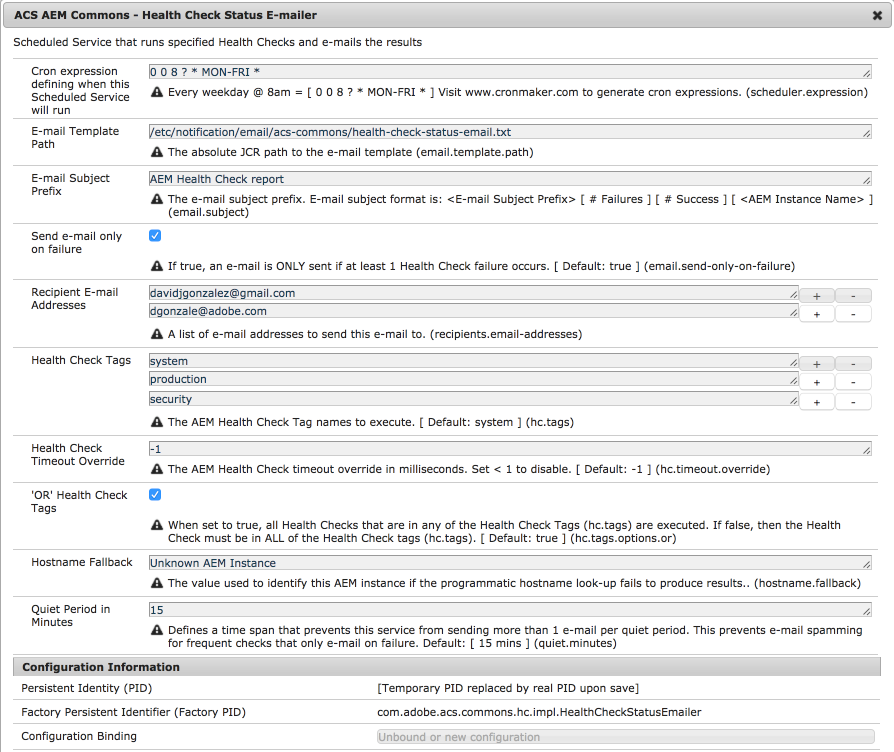

## Purpose

[Health Checks](https://docs.adobe.com/docs/en/aem/6-3/administer/operations/operations-dashboard.html#Health%20Checks) are awesome. Everyone should look at them, and everyone should be writing them for their own services.

... but, Health Checks are only good if you know their status, and this can be challenging across multiple AEM Author and Publish instances, much less across all environments.

The ACS Commons Health Check Status E-mailer is a very simple scheduler that runs specified health checks at a defined interval, and e-mails the results to a list of people, so they know if/when Health Checks are failing!
 
## Recommended minimal configuration

The recommended minimal configuration is to create (at least) 2 instances of the Status E-mailer:

* One that runs every minute
    * The health checks in this set must be VERY fast and low (computational) cost to execute.
    * Checks all critical health checks.
    * Configured to ONLY send e-mails in the event of a failure.
* One that runs weekly 
    * The health check set can be larger and more computationally heavy (making calls out to integration points, etc.) as its run infrequently.
    * Configure to send e-mails even if NO failures are present.
     
   
### How to use

#### Enable e-mail from all AEM instances that will report status

Provide your SMTP service information to [Day CQ Mail Service OSGi Configuration](http://localhost:4502/system/console/configMgr/com.day.cq.mailer.DefaultMailService)

    `/apps/myapp/config/com.day.cq.mailer.DefaultMailService.xml`


<?xml version="1.0" encoding="UTF-8"?>
<jcr:root xmlns:sling="http://sling.apache.org/jcr/sling/1.0" xmlns:jcr="http://www.jcp.org/jcr/1.0" xmlns:nt="http://www.jcp.org/jcr/nt/1.0"
          jcr:primaryType="sling:OsgiConfig"
          debug.email="{Boolean}false"
          from.address="noreply@example.com"
          smtp.host="smtp.example.com"
          smtp.password="password123"
          smtp.port="465"
          smtp.ssl="{Boolean}true"
          smtp.user="smtpuser@example.com"/>


> Note that this Health Check Status E-mailer requires a functional Mail Service and SMTP server. If the SMTP connection breaks, then NO status e-mails will be sent, ever.

#### Configure the Day CQ Mail Service in all AEM instances that will report status

Create Health Check Status E-mailers by defining OSGi factory configurations at 

    `/apps/myapp/config/com.adobe.acs.commons.hc.impl.HealthCheckStatusEmailer-weekly.xml`


<?xml version="1.0" encoding="UTF-8"?>
<jcr:root xmlns:sling="http://sling.apache.org/jcr/sling/1.0" xmlns:cq="http://www.day.com/jcr/cq/1.0" xmlns:jcr="http://www.jcp.org/jcr/1.0" xmlns:nt="http://www.jcp.org/jcr/nt/1.0"
    jcr:primaryType="sling:OsgiConfig"
    scheduler.expression="0 0 8 ? * WED *"
    email.template.path="/etc/notification/email/acs-commons/health-check-status-email.txt"
    email.subject="AEM Health Check report"
    email.send-only-on-failure="{Boolean}true"
    recipients.email-addresses="[dg@example.com,tb@example.com,je@example.com]"
    hc.tags="[production]"
    hc.timeout.override="{Long}60000"
    hc.tags.options.or="{Boolean}true"
    quiet.minutes="{Long}15"
    hostname.fallback="Unknown AEM Instance"/>


#### OSGi configuration factory properties

* `scheduler.expression` 
    * Cron expression defining when this Status E-mail instance should run. Use [www.cronmaker.com](www.cronmaker.com) to generate expressions.
    * Every minute: `0 0/1 * 1/1 * ? *`
    * Every Wednesday at 8am: `0 0 8 ? * WED *` 
* `email.template.path`
    * Absolute path in the repository to the E-mail template. Currently only plain-text e-mail is supported.
    * Review the default mail template for all the e-mail parameters; it's straight forward.
    * Defaults to: /etc/notification/email/acs-commons/health-check-status-email.txt
*  `email.subject`
    * E-mail Subject line prefix
    * Subject line fully renders as: <This value> [ # Failures ] [ # Success ] [ <AEM Instance Name> ] 
    * Defaults to: AEM Health Check report
 * `email.send-only-on-failure`
   * Flag specifying if e-mail is only sent in the event of at least one failing health check. 
   * Defaults to: true="{Boolean}true"  
 * `recipients.email-addresses`
    * An array of e-mail address to send the status e-mails to
    * Required
* `hc.tags`
    * An array of health check tags to execute. 
    * Note, this can accept Composite Health Check tags as well.
* `hc.timeout.override`
    * Health Check timeout override in milliseconds.
    * Only use this for the infrequent digests, if those health checks are known to a long time to run.
    * Set to -1 to disable override and use Sling default timeout.
    * Defaults to: -1
* `hc.tags.options.or`
    * Used to specify if the Health Checks tags specified via `hc.tags` should be OR'd or AND'd to select the Health Checks to to run.
        * For example: if `hc.tags=[system,production]` and `hc.tags.options.or="{Boolean}false"` then ONLY Health Checks that have BOTH tags `system` and `production` will be executed.
    * Defaults to: true
* `quiet.minutes`
    * The number of minutes to NOT send an e-mail after an e-mail has been sent. 
      This is particularly relevant when executing the status e-mailer on a tight interval (ex. every minute) as it's unlikely the problem will be remedied within minutes, which would otherwise result in spamming of recipient (hopefully) trying to resolve the issue.
    * Defaults to: 15
  `hostname.fallback`
    * Since this is ideally running on many AEM instances (all AEM Publish and Authors, and potentially across Environments) 
    there must be a good way to identify WHICH AEM instance is the e-mail corresponds to. 
    The Status E-mailer intelligently attempts to lookup the AEM instance hostname, but if it cannot resolve this for some reason, the value provided here is used instead.
    * Defaults to: Unknown AEM Instance

### Example e-mail with successful and failing Health Checks

> Ironically the ACS AEM Commons SMTP Health Check does not/should not be executed as part of this, since if SMTP server is unavailable, then no e-mail will be sent regardless (since there is nothing to send it through!). 
