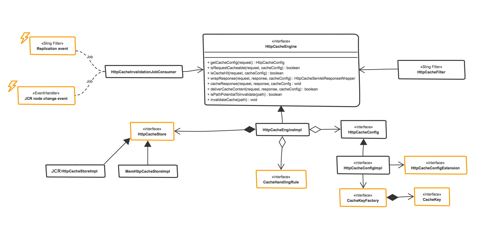
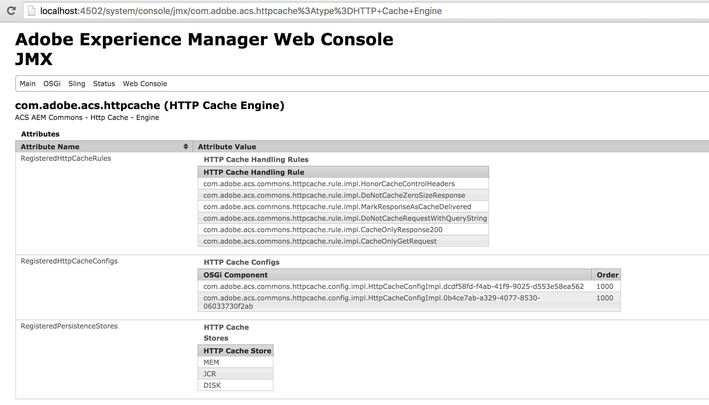
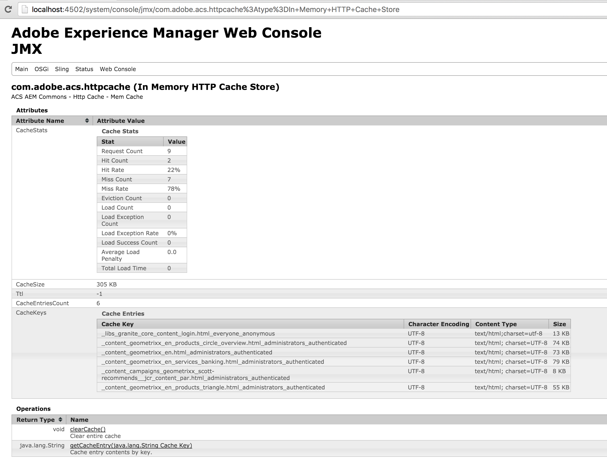
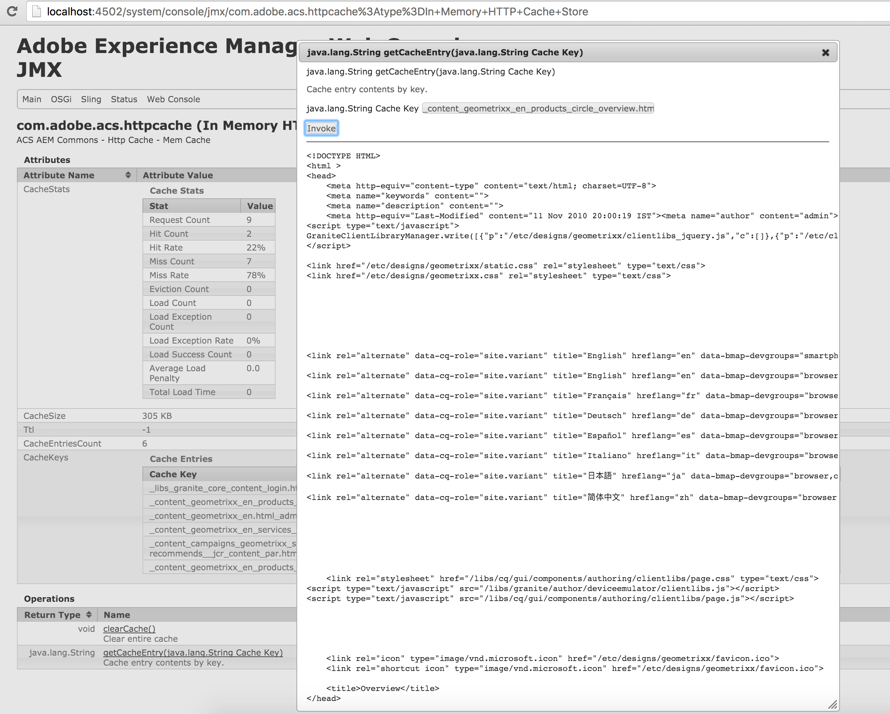
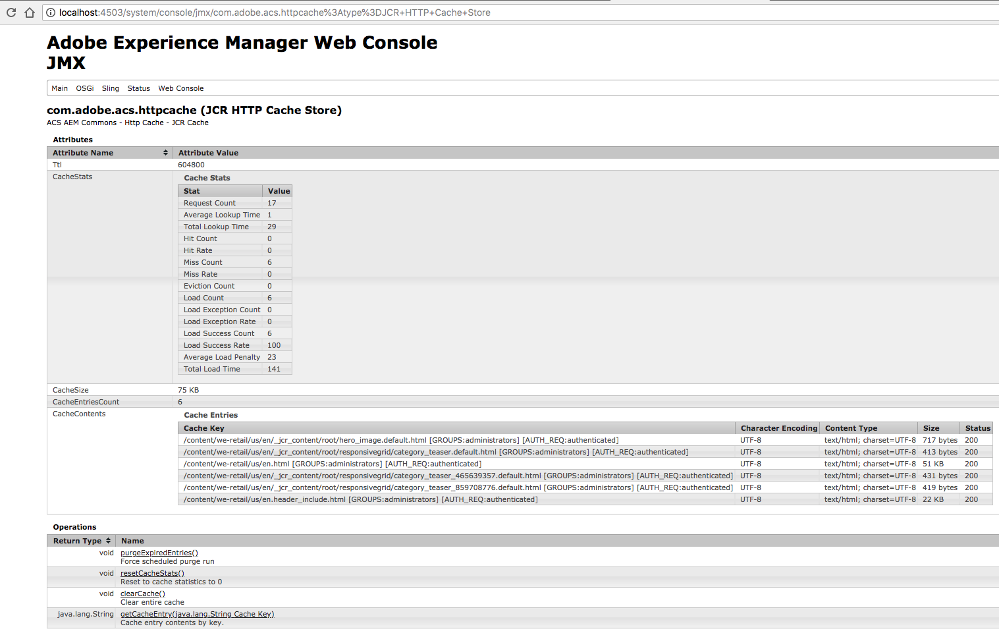
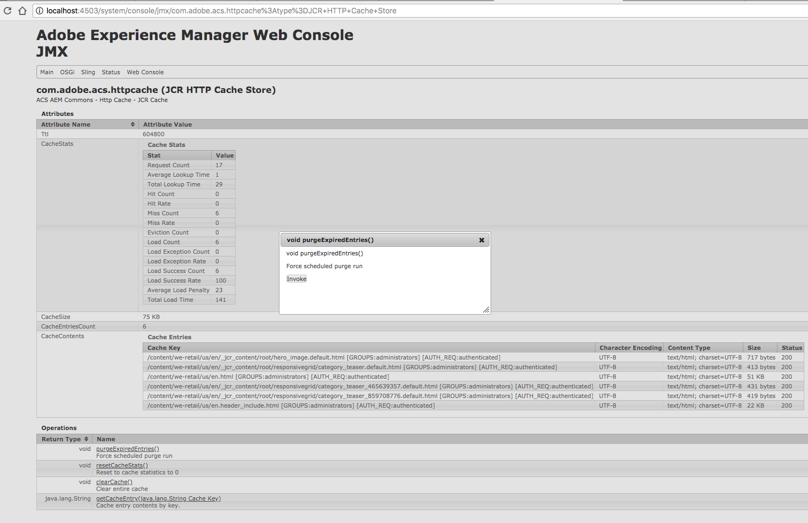

> Since AEM 6.0, AEM provides an OOTB in-memory HTTP cache for anonymous requests with a 60sec TTL. Please evaluate if this simple cache is sufficient before using this HTTP cache. This HTTP Cache was designed explicitly for more complex use-cases the OOTB AEM HTTP Cache does not cover. Also ensure that AEM Dispatcher caching is insufficient for your use case.

## Purpose
HttpCache provides an effective way to improve performance of an application by caching the full output of a http request and then bypassing the request processing entirely on each subsequent requests. It's ideal for meeting performance requirements for cacheable http requests which costs high compute time. HttpCache works irrespective of run-modes.

### Features
* Caches anonymous and authenticated requests.
* Supports caching personalized requests.
	* Group based caching provided OOTB.
	* Mechanism exposed to plugin custom logic for handling personalized requests.
* Super flexible cache configs tied to URIs supported.
	* Allows extending cache configs.
	* Allows multiple cache configs.
* Developer hook exposed to plugin custom rules on key cache handling events such as
	* On request receive.
	* On response cache
	* On response deliver
	* On cache invalidate
* Provides mechanism to plugin custom cache keys.
* Pluggable cache persistence model.
	* In-memory & JCR implementation provided OOTB
	* Allows multiple cache stores to co-exist.
* Invalidation mechanism based on JCR paths and Sling jobs.
	* Sample JCR change event handler based invalidation supplied.
	In-memory cache store supports TTL.
* Provides powerful instrumentation based on JMX MBean.
* Since v2.6.0/3.2.0 HTTP Cache now supports caching that the Sling Include level (as well as the original Sling Request level)
* Since 4.0.0 HTTP Cache supports per config based TTL (overrides global) for JCR store and Caffeine store (requires caffeine bundle).

### What to use: In-Mem store or JCR store?
In general, the In-Memory store (default) is recommended for the obvious reason that it's the fastest. 
However, if you have cache entries that are that big or many that they cannot be stored in the RAM memory, the JCR storages provides a solution.
Also, the JCR storage means that the cache won't be flushed on a server restart as it's persisted while the In-Mem storage is lost if the AEM process is stopped for any reason.

*Since 4.0.0:
The caffeine store is added, but only activated if the caffeine 3rd party bundle is active. 
This store is a MEM store that allows for per config specified TTL, but is a little heavier then the standard MEM store.

## How to configure

#### Configuring cache config (HttpCacheConfig)

Modeled as OSGi configuration factory and hence multiple configurations allowed.

For each configuration, define a `sling:OsgiConfig`  

`/apps/mysite/config/com.adobe.acs.commons.httpcache.config.impl.HttpCacheConfigImpl-uniquename.xml`


<?xml version="1.0" encoding="UTF-8"?>
<jcr:root xmlns:sling="http://sling.apache.org/jcr/sling/1.0" xmlns:cq="http://www.day.com/jcr/cq/1.0"
    xmlns:jcr="http://www.jcp.org/jcr/1.0" xmlns:nt="http://www.jcp.org/jcr/nt/1.0"
    jcr:primaryType="sling:OsgiConfig"
    httpcache.config.order="1000"
    httpcache.config.requesturi.patterns="[/content/my-site/(.*).html, /content/my-site/products(.*).json]"
    httpcache.config.requesturi.patterns.blacklisted="[/content/my-site(.*)no-cache(.*)]"
    httpcache.config.request.authentication="authenticated"
    httpcache.config.invalidation.oak.paths="[/content/my-site/(.*)]"
    httpcache.config.expiry.on.create="{Long}50000"
    cacheConfigExtension.target="(&(service.factoryPid=com.adobe.acs.commons.httpcache.config.impl.GroupHttpCacheConfigExtension)(config.name=unique-confg-name-of-extension))"
    cacheKeyFactory.target="(&(service.factoryPid=com.adobe.acs.commons.httpcache.config.impl.GroupHttpCacheConfigExtension)(config.name=unique-confg-name-of-extension))"
    httpcache.config.cache.handling.rules.pid="[pid-of-rule1, pid-of-rule2]"
 />
      

* `httpcache.config.order` Default value is 1000. Evaluated in ascending order. Determines the ordering of cache config while selecting config for the given HTTP request. If 2 cache config with the same order matches, caching is abandoned as it's a conflict.
* `httpcache.config.requesturi.patterns` Set of whitelisted request URI applicable for this config. Expressed in REGEX.
* `httpcache.config.requesturi.patterns.blacklisted` Set of blacklisted request URI. Expressed in REGEX. This is applied post applying `httpcache.config.requesturi.patterns` and hence has an overriding effect.
* `httpcache.config.request.authentication` Authentication requirement for this cache config.
  * Allowed values: `anonynous`, `authenticated` or `both`.
* `httpcache.config.invalidation.oak.paths` Set of JCR paths for which all the cache entries derived from this config will be invalidated on receiving an cache invalidation job.
* `cacheConfigExtension.target` Service pid of the `CacheConfigExtension` custom implementation. Expressed in LDAP syntax. This could also be a combination of `service.factoryPid` and `config.name`.
* `cacheKeyFactory.target` Service pid of the `CacheKeyFactory` custom implementation. Expressed in LDAP syntax. This could also be a combination of `service.factoryPid` and `config.name`.
* `httpcache.config.cache-handling-rules.pid` Service pid of cache handling rules applied for this config. Note that this is cache config specific rule while the global set of rules set at cache engine are applied to all cache configs.
* `httpcache.config.filter-scope` specifies if the HTTP Cache config should be evaluated at the Sling Request or Include level. Valid values are `REQUEST` or `INCLUDE`. Available since v2.6.0/3.2.0 - prior all caching occurred at the REQUEST level which is the default.

Since 4.0.0 and not supported by default MEM cache store (use JCR or Caffeine)
* `httpcache.config.expiry.on.create ` Sets a expiry time in milliseconds that is specific to cache entries that belong to this configuration. 
* `httpcache.config.expiry.on.update` Refresh expiry time on update, specific to cache entries that belong to this configuration.
* `httpcache.config.expiry.on.read` Refresh expiry time on read, specific to cache entries that belong to this configuration.
    * If above are not specified, per store TTL will be used. If specified, overrides store TTL (for entries that belong to configuration)
    * These options have `-1L` (disabled) as default.

#### Configuring cache config extension (GroupHttpCacheConfigExtension)

User group based cache config extension and associated cache key creation. Modeled as OSGi configuration factory. Multiple configurations allowed.

For each configuration, define a `sling:OsgiConfig`  
`/apps/mysite/config/com.adobe.acs.commons.httpcache.config.impl.GroupHttpCacheConfigExtension-uniquename.xml`


<?xml version="1.0" encoding="UTF-8"?>
<jcr:root xmlns:sling="http://sling.apache.org/jcr/sling/1.0" xmlns:cq="http://www.day.com/jcr/cq/1.0"
    xmlns:jcr="http://www.jcp.org/jcr/1.0" xmlns:nt="http://www.jcp.org/jcr/nt/1.0"
    jcr:primaryType="sling:OsgiConfig"
	config.name="unique-name"
	httpcache.config.extension.user.groups.allowed="[group1, group2]"
 />
      

- `config.name` Name to be used to refer this configuration in `HttpCacheConfig`.
- `httpcache.config.extension.user-groups.allowed` Set of AEM user group names. At least one of these groups has to be present in the HTTP request user's group to have the request cacheable.

#### Configuring cache engine (HttpCacheEngineImpl)

Central controlling unit for http cache.  

Define a `sling:OsgiConfig` `/apps/mysite/config/com.adobe.acs.commons.httpcache.engine.impl.HttpCacheEngineImpl.xml`


<?xml version="1.0" encoding="UTF-8"?>
<jcr:root xmlns:sling="http://sling.apache.org/jcr/sling/1.0" xmlns:cq="http://www.day.com/jcr/cq/1.0"
    xmlns:jcr="http://www.jcp.org/jcr/1.0" xmlns:nt="http://www.jcp.org/jcr/nt/1.0"
    jcr:primaryType="sling:OsgiConfig"
    httpcache.engine.cache.handling.rules.global="[pid1, pid2, pid3]"
 />


- `httpcache.engine.cache-handling-rules.global` Set of service pid of global cache handling rules. These rules are applied to all cache configs and hence all cache-able requests.

#### Configuring In-mem cache store (MemHttpCacheStoreImpl)

In-memory store for caching http responses.

Define a `sling:OsgiConfig` `/apps/mysite/config/com.adobe.acs.commons.httpcache.store.mem.impl.MemHttpCacheStoreImpl.xml`


<?xml version="1.0" encoding="UTF-8"?>
<jcr:root xmlns:sling="http://sling.apache.org/jcr/sling/1.0" xmlns:cq="http://www.day.com/jcr/cq/1.0"
    xmlns:jcr="http://www.jcp.org/jcr/1.0" xmlns:nt="http://www.jcp.org/jcr/nt/1.0"
    jcr:primaryType="sling:OsgiConfig"
    httpcache.cachestore.memcache.ttl="-1"
    httpcache.cachestore.memcache.maxsize="10"
 />


- `httpcache.cachestore.memcache.ttl` Time To Live (TTL) of cached items in seconds. Value of '-1' disables the TTL behavior.
- `httpcache.cachestore.memcache.maxsize` Max size of the cache store in MB.  Once the store reaches the set size, least recently used entry would be evicted.

#### Configuring JCR cache store (JCRHttpCacheStoreImpl)

JCR store for caching http responses.

Define a `sling:OsgiConfig` `/apps/mysite/config/com.adobe.acs.commons.httpcache.store.mem.impl.JCRHttpCacheStoreImpl.xml`


<?xml version="1.0" encoding="UTF-8"?>
<jcr:root xmlns:sling="http://sling.apache.org/jcr/sling/1.0" xmlns:cq="http://www.day.com/jcr/cq/1.0"
    xmlns:jcr="http://www.jcp.org/jcr/1.0" xmlns:nt="http://www.jcp.org/jcr/nt/1.0"
    jcr:primaryType="sling:OsgiConfig"
    scheduler.expression="0 0 12 1/1 * ? *"
	httpcache.config.jcr.rootpath="/var/acs-commons/httpcache"
	httpcache.config.jcr.bucketdepth="10"
	httpcache.config.jcr.savedelta="500"
	httpcache.config.jcr.expiretimeinseconds="-1"
 />


- `scheduler.expression` The cron expression on which to run clean-up checks
- `httpcache.config.jcr.rootpath` Points to the location of the cache root parent node in the JCR repository
- `httpcache.config.jcr.bucketdepth` The depth the bucket tree goes. Minimum value is 1. This value can be used for tweaking performance
- `httpcache.config.jcr.savedelta` The threshold to perform session.save() on add,remove and modify actions when handling the cache
- `httpcache.config.jcr.expiretimeinseconds` Expiry time of a cache entry in seconds. If on the scheduled cleanup the node has expired, it will be evicted. (-1 for no expiry)

#### Configuring JCR Node change invalidator (JCRNodeChangeEventHandler) Since v2.5.0/3.14.0

Sample cache invalidation job creator. Watches for changes in JCR nodes and creates sling jobs for cache invalidation.  

Define a `sling:OsgiConfig` `/apps/mysite/config/com.adobe.acs.commons.httpcache.store.mem.impl.JCRNodeChangeEventHandler.xml`


<?xml version="1.0" encoding="UTF-8"?>
<jcr:root xmlns:sling="http://sling.apache.org/jcr/sling/1.0" xmlns:cq="http://www.day.com/jcr/cq/1.0"
    xmlns:jcr="http://www.jcp.org/jcr/1.0" xmlns:nt="http://www.jcp.org/jcr/nt/1.0"
    jcr:primaryType="sling:OsgiConfig"
    event.filter="(|(path=/content*)(path=/etc*))"
 />


- `event.filter` JCR paths to be watched for changes. Expressed in LDAP syntax.

#### Configuring Reference-based invalidations (HttpCacheInvalidationJobConsumer). Since v2.5.0/3.1.0

Invalidate resources that reference the change resource.

Define a `sling:OsgiConfig` `/apps/mysite/config/com.adobe.acs.commons.httpcache.invalidator.HttpCacheInvalidationJobConsumer.xml`


<?xml version="1.0" encoding="UTF-8"?>
<jcr:root xmlns:sling="http://sling.apache.org/jcr/sling/1.0" xmlns:cq="http://www.day.com/jcr/cq/1.0"
    xmlns:jcr="http://www.jcp.org/jcr/1.0" xmlns:nt="http://www.jcp.org/jcr/nt/1.0"
    jcr:primaryType="sling:OsgiConfig" httpcache.config.invalidation.references="{Boolean}true" />


## How to extend

HttpCache provides number of developer hooks to alter or extend its behavior. Here goes the static view of http cache framework. Highlighted units in amber are the extension touchpoints.

### Creating new global cache handling rule

Cache handling rules provide touch-points to plug in custom logic on key cache handling events. They are modeled as OSGi services implementing `com.adobe.acs.commons.httpcache.rule.HttpCacheHandlingRule`. The contract is that the current cache action will be continued only if the methods implementing the interface returns true. A convenient abstract class  `com.adobe.acs.commons.httpcache.rule.AbstractHttpCacheHandlingRule` has been provided facilitating the sub classes to override just the intended methods. The best practice is to have a rule overriding just one method.

Event  | Method | OOTB rules
------------- | ------------- | -------------
On qualifying http requests | onRequestReceive | `com.adobe.acs.commons.httpcache.rule.impl.CacheOnlyGetRequest`, `com.adobe.acs.commons.httpcache.rule.impl.DoNotCacheRequestWithQueryString`
On caching the response | onResponseCache | `com.adobe.acs.commons.httpcache.rule.impl.CacheOnlyResponse200`, `com.adobe.acs.commons.httpcache.rule.impl.DoNotCacheZeroSizeResponse`, `com.adobe.acs.commons.httpcache.rule.impl.HonorCacheControlHeaders`
On delivering from cache | onCacheDeliver | `com.adobe.acs.commons.httpcache.rule.impl.MarkResponseAsCacheDelivered`
On invalidating the cache  | onCacheInvalidate |

Rules which are configured to `httpcache.engine.cache-handling-rules.global` of `com.adobe.acs.commons.httpcache.engine.impl.HttpCacheEngineImpl` are applicable for all cache configs (hence, all cache-able requests) and called global cache handling rules.

### Creating new config specific cache handling rule

Any cache handling rule explained above applied only to specific cache config via `httpcache.config.cache-handling-rules.pid` of `com.adobe.acs.commons.httpcache.config.impl.HttpCacheConfigImpl` is called cache config specific rule.

### Extending cache config

Cache config (`com.adobe.acs.commons.httpcache.config.HttpCacheConfig`) can be extended through implementation of config extension (`com.adobe.acs.commons.httpcache.config.HttpCacheConfigExtension`). A typical developer use-case (but not limited to) for this is to achieve caching of personalized requests. User group based implementation of cache config extension (`com.adobe.acs.commons.httpcache.config.impl.GroupHttpCacheConfigExtension`) has been provided OOTB to achieve support of group level personalization. Relation between `HttpCacheConfig` and `HttpCacheConfigExtension` established through OSGi reference target filter `cacheConfigExtension.target` at `com.adobe.acs.commons.httpcache.config.impl.HttpCacheConfigImpl`.

### Custom key factory and custom cache keys

CacheKeyFactory (`com.adobe.acs.commons.httpcache.keys.CacheKeyFactory`) is tied to HttpCacheConfig (`com.adobe.acs.commons.httpcache.config.impl.HttpCacheConfigImpl`) via cache config's OSGi property `cacheKeyFactory.target`. CacheKeyFactory builds CacheKeys (`com.adobe.acs.commons.httpcache.keys.CacheKey`). Custom implementation of CacheKeyFactory should provide its own CacheKey. Often these implementations factor in the custom implementation of Cache config extension (`com.adobe.acs.commons.httpcache.config.HttpCacheConfigExtension`). Group based cache key factory, cache key and cache config extension are provided OOTB.

If you want your CacheKey to work in the JCR store, you need to provide an implementation of writeObject / readObject for serialization. 
[writeObject](https://docs.oracle.com/javase/7/docs/platform/serialization/spec/output.html#861) 
[readObject](https://docs.oracle.com/javase/7/docs/platform/serialization/spec/input.html#2971) 

The abstract class com.adobe.acs.commons.httpcache.keys.AbstractCacheKey contains parentReadObject and parentWriteObject as protected methods to provide serialization logic for it's fields.
You will need to serialize your fields accordingly so they may be persisted in the JCR.

### Creating new Cache store

HttpCache framework allows multiple cache stores to co-exist at run time. Choice of cache store to be used can be made while configuring cache configs. Custom cache store should implement HttpCacheStore (com.adobe.acs.commons.httpcache.store.HttpCacheStore) interface. In-memory & JCR cache store provided OOTB.

### Creating custom mechanism for cache invalidation

HttpCache invalidation is based on sling job defined at `com.adobe.acs.commons.httpcache.invalidator.CacheInvalidationJobConstants` for the topic

        com/adobe/acs/commons/httpcache/invalidator/job

Custom cache invalidation events could be sling event handlers for JCR specific events, sling filter to trap replication events, workflow steps, etc. JCR node change invalidation event (`com.adobe.acs.commons.httpcache.invalidator.event.JCRNodeChangeEventHandler`) has been provided OOTB.

## How to instrument

JMX beans exposed to instrument the http cache for the following 3 components.

### Instrumenting HttpCacheEngine

Cache engine is the central controlling unit of http cache. This MBean exposes the details of cache handling rules, cache configs and cache stores bound to the engine.

### Instrumenting In-Mem cache store

MBean for in-memory cache store exposes a set of attributes such as cache stats, current size of the cache, TTL, cache entries count and details of cache entries.

It also allows operations such as clearing the cache and accessing the cache content given a cache key.

### Instrumenting JCR cache store

Same goes for the JCR cache store. Stats are pretty similar to the In-Mem cache store.

It also allows operations such as clearing the cache entirely or to run a purge for expired entries.

