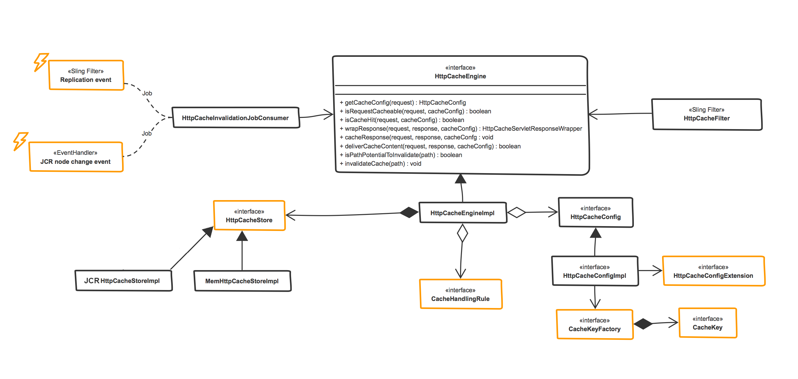

[<< back to HTTP Cache Table of Contents](../index.html)

## Overview

HttpCache provides number of developer hooks to alter or extend its behavior. Here goes the static view of http cache framework. Highlighted units in amber are the extension touchpoints.

## HttpCacheEngine
The heart of the module is the HttpCacheEngine. This service offers the most high-level methods to cache, invalidate and more.
It aggregates HttpCacheStores, HttpCacheConfig, and CacheHandling rules and ties these together in order to provide high level functionality.

### HttpCacheFilter
This is the entry point for caching. It intercepts the requests and delegates logic to the engine. **Will only be activated if there are active HttpCacheConfig instances in the OSGI container**.

### HttpCacheStore 
This is a service that provides persisting functionality. Multiple stores can co-exist at the same time.
You can [create your own cache store](creating-cache-store.html), this will be loaded into the HttpCacheEngine automatically, then refer it in your cache config using the property: `httpcache.config.cachestore="CUSTOMSTORE"`.

### HttpCacheConfig
This is a factory service. In order to enable caching you have to configure a (factory) instance of this service. This contains the most essential information the engine needs to start caching: request URI, which HttpCacheStore to use, INCLUDE or REQUEST filter and more.
This class is provided by ACS commons and cannot be extended. To add config functionality (which in most cases you will need), the HttpCacheConfig includes the HttpCacheConfigExtension and the CacheKeyFactory.
This is achieved with these properties in the OSGI config file: `cacheKeyFactory.target` and `cacheConfigExtension.target`.

### HttpCacheConfigExtension
This is a service that the HttpCacheConfig uses to provide additional configuration logic. OOTB, there are [several](config-extensions.html) implementations provided.
You can also **provide your own implementation here to hook in custom business logic**. This enables you to pretty much cache anything.

### HttpCacheHandlingRule
[This service](handling-rules.html) provides logic to prevent caching in case when its not desirable (for example, response's with error code 500).
These can be toggled on a global or config specific level, and you can implement your own as well. 
