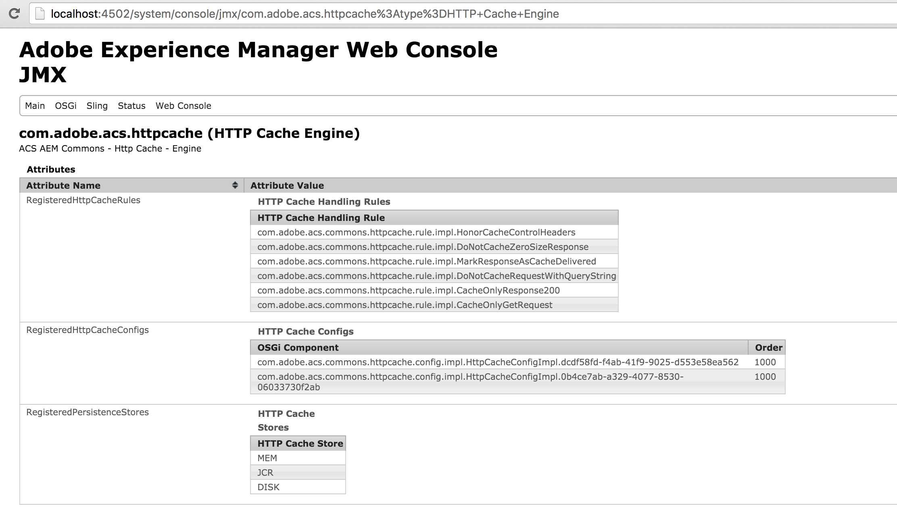
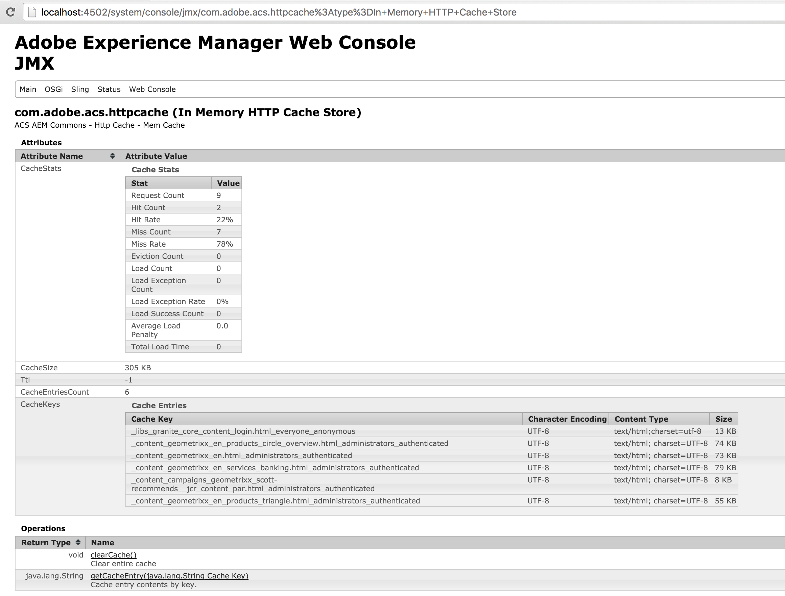
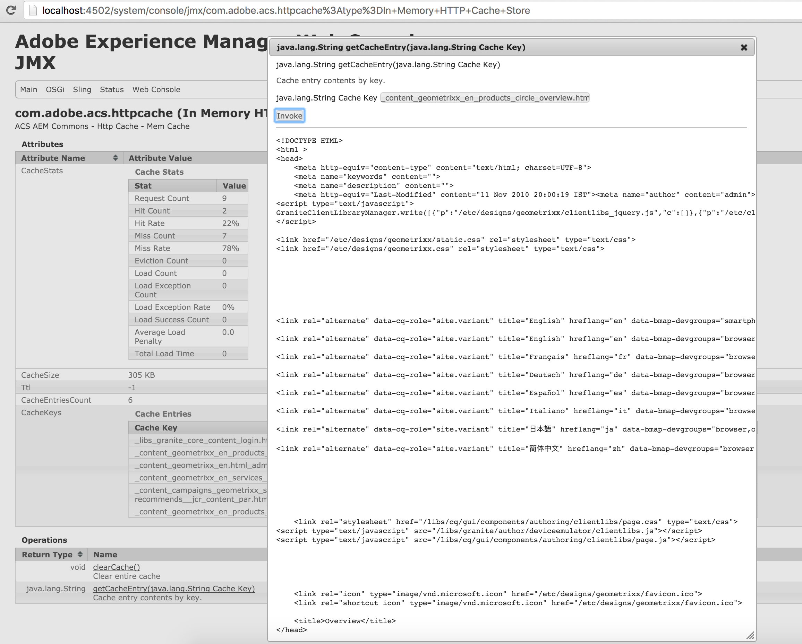
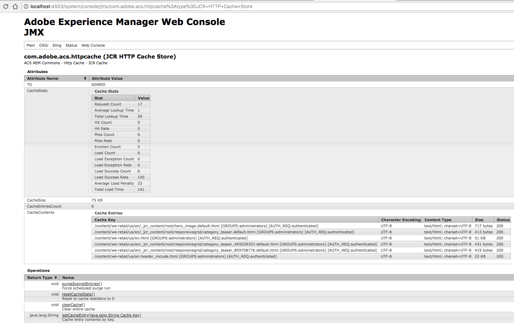
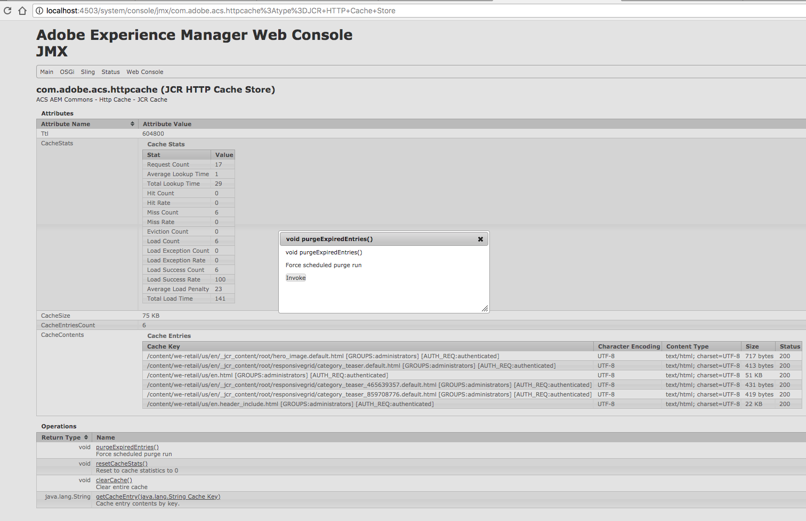

[<< back to HTTP Cache Table of Contents](../index.html)

## Breaking changes in ACS AEM Commons 4.0.0

The following JMX Object Names were corrected. Any systems interacting with these MBean must be updated.

* Was: `com.adobe.acs.httpcache:type=HTTP Cache Engine`, is now: `com.adobe.acs.commons.httpcache:type=HTTP Cache - Engine`
* Was: `com.adobe.acs.httpcache:type=JCR HTTP Cache Store`, is now: `com.adobe.acs.commons.httpcache:type=HTTP Cache - JCR Cache Store`
* Was: `com.adobe.acs.httpcache:type=In Memory HTTP Cache Store`, is now: `com.adobe.acs.commons.httpcache:type=HTTP Cache - In-Memory Cache Store`

## How to instrument

JMX beans exposed to instrument the http cache for the following 3 components.

### Instrumenting HttpCacheEngine

Cache engine is the central controlling unit of http cache. This MBean exposes the details of cache handling rules, cache configs and cache stores bound to the engine.

### Instrumenting In-Mem cache store

MBean for in-memory cache store exposes a set of attributes such as cache stats, current size of the cache, TTL, cache entries count and details of cache entries.

It also allows operations such as clearing the cache and accessing the cache content given a cache key.

### Instrumenting JCR cache store

Same goes for the JCR cache store. Stats are pretty similar to the In-Mem cache store.

It also allows operations such as clearing the cache entirely or to run a purge for expired entries.

