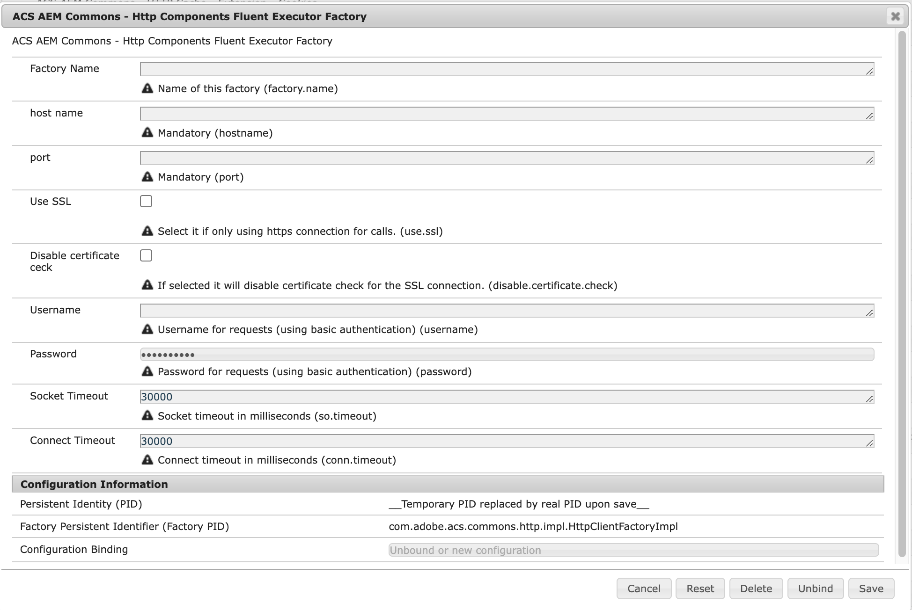
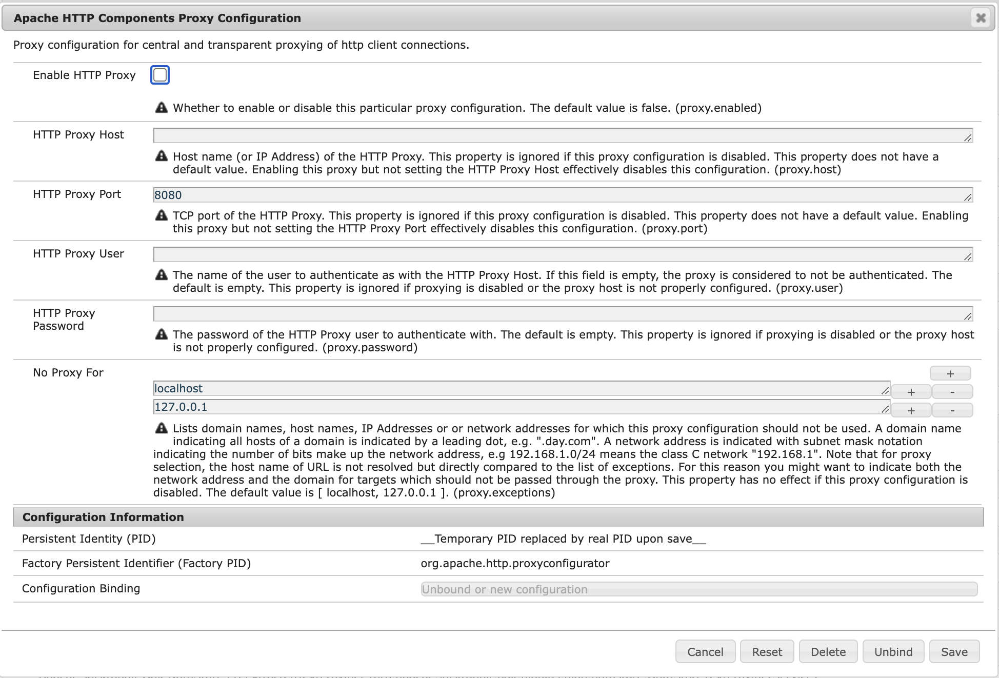

## Purpose

[Apache HttpComponents](https://hc.apache.org/) since version 4.2 contains a [fluent API](https://hc.apache.org/httpcomponents-client-4.5.x/current/tutorial/html/fluent.html) which is often easier to use than the low-level [`CloseableHttpClient` API](https://hc.apache.org/httpcomponents-client-4.5.x/current/tutorial/html/fundamentals.html).

However, there is no direct support for [OSGi configuration admin](https://docs.osgi.org/specification/osgi.cmpn/7.0.0/service.cm.html) for either API which means that HttpClients and Fluent Executors/Requests must be created manually.
Apache HttpComponents only comes with some support for [OSGi configuration of HTTP proxies](https://experienceleague.adobe.com/docs/experience-manager-65/content/implementing/deploying/configuring/osgi-configuration-settings.html?lang=en) via factory PID `org.apache.http.proxyconfigurator`.

The OSGi service `com.adobe.acs.commons.http.HttpClientFactory` manages the lifecycle of fluent HTTP Executors/Requests. There is an instance available per OSGi configuration bound via factory PID `com.adobe.acs.commons.http.impl.HttpClientFactoryImpl` (with name *ACS AEM Commons - Http Components Fluent Executor Factory*).
Each service instance only holds a single HTTP Client/Request/Executor object (despite its class name suffix `Factory`).

The client is only closed once the service is stopped by the OSGi runtime, so be aware of potentially open sockets in the underlying connection manager and release the service once you no longer need it. Also make sure to release the response (and its input streams) once you no longer need it and optionally tweak the TTL for HTTP connections via a custom [`org.apache.http.conn.ConnectionKeepAliveStrategy`](https://hc.apache.org/httpcomponents-client-4.5.x/current/httpclient/apidocs/org/apache/http/conn/ConnectionKeepAliveStrategy.html).

## How to Use

Create one or multiple OSGi configurations for factory PID `com.adobe.acs.commons.http.impl.HttpClientFactoryImpl` to automatically register an OSGi service implementing `com.adobe.acs.commons.http.HttpClientFactory`.



The proxy configurations via the dedicated configuration factory PID `org.apache.http.proxyconfigurator` are considered.



Then access the instance in code like this

```
@Component
public class MyComponent {

    /**
     * Inject specific configuration by targeting its "factory.name"
     */
    @Activate
    public MyComponent(@Reference(target = "(factory.name=pim2)") HttpClientFactory httpClientFactory) {
        Request request = httpClientFactory.get("my/request/path"); // this is appended to the configured "hostname"
        request.execute().handleResponse(new ResponseHandler<Document>() {
           ...
        });
    }
```


## Alternative Approaches

1. One can use the OSGi service [`org.apache.http.osgi.services.HttpClientBuilderFactory`](https://github.com/apache/httpcomponents-client/blob/4.5.x/httpclient-osgi/src/main/java/org/apache/http/osgi/impl/OSGiHttpClientBuilderFactory.java) or [`org.apache.http.osgi.services.CachingHttpClientBuilderFactory`](https://github.com/apache/httpcomponents-client/blob/4.5.x/httpclient-osgi/src/main/java/org/apache/http/osgi/impl/OSGiCachingHttpClientBuilderFactory.java) directly to create (Caching) Http Clients (and Fluent API objects). This service is used under the hood by `com.adobe.acs.commons.http.impl.HttpClientFactoryImpl` as well.
You use them like this

    ```
    @Component
    public class MyComponent {
        @Activate
        public MyComponent(@Reference org.apache.http.osgi.services.HttpClientBuilderFactory httpClientBuilderFactory) {
            try (CloseableHttpClient client = httpClientBuilderFactory.newBuilder().build()) {
                // do something with the client here
            }
        }
    ```

2. Alternatively there is OSGi configuration admin support similar to the one provided by ACS AEM Commons in <https://github.com/code-distillery/httpclient-configuration-support> but with no special support for Fluent API.

3. As [AEM 6.5/AEMaaCS supports Java 11](https://experienceleague.adobe.com/docs/experience-manager-65/content/implementing/deploying/introduction/technical-requirements.html?lang=en#java-virtual-machines) one can also leverage the [Java Http Client](https://openjdk.org/groups/net/httpclient/intro.html), but there is no OSGi configuration support for it.

