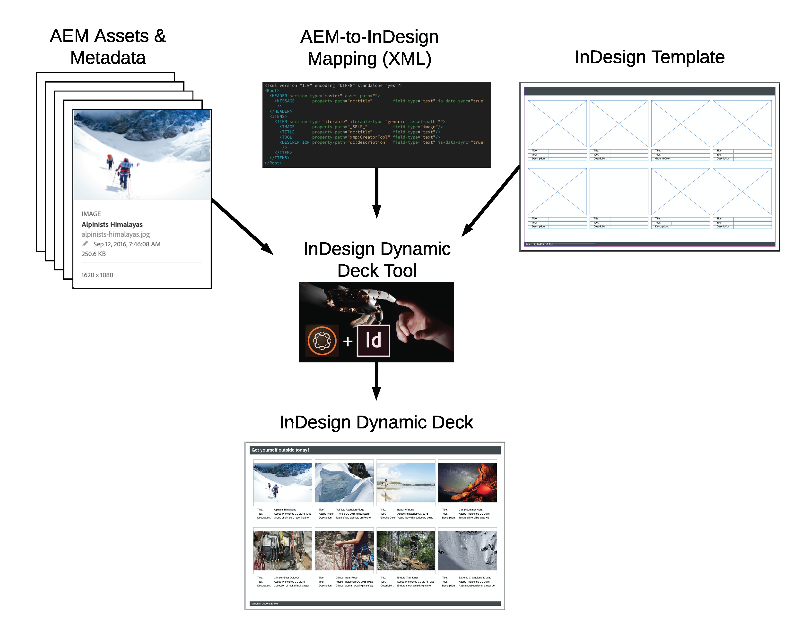
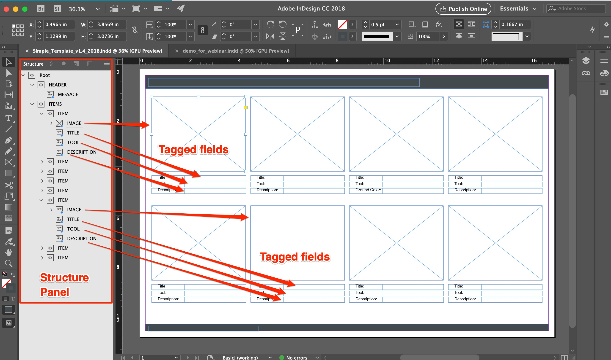
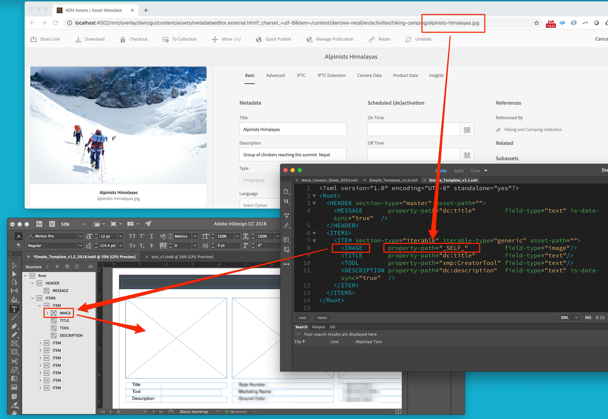
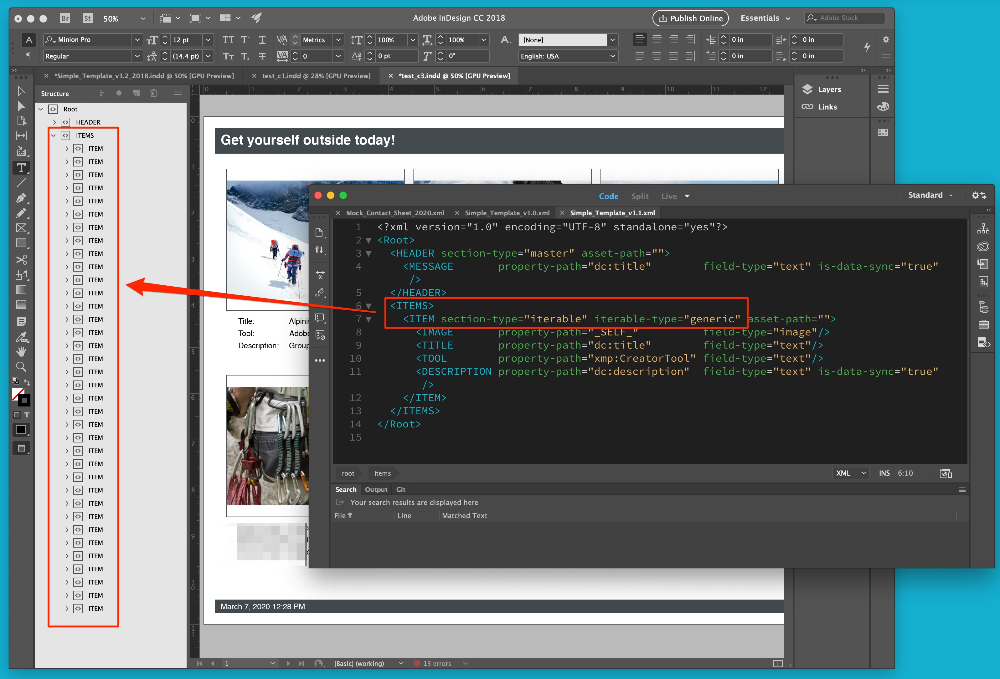
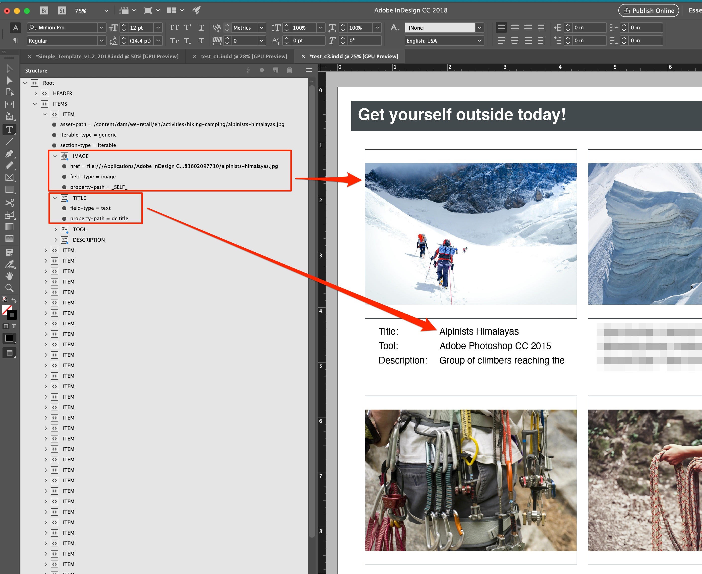
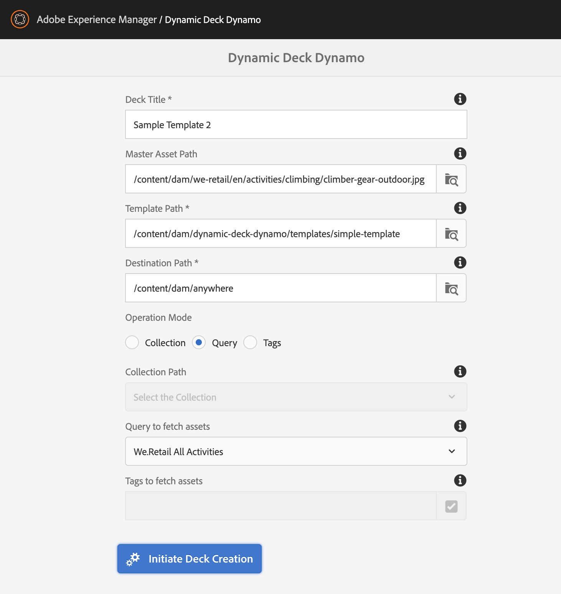
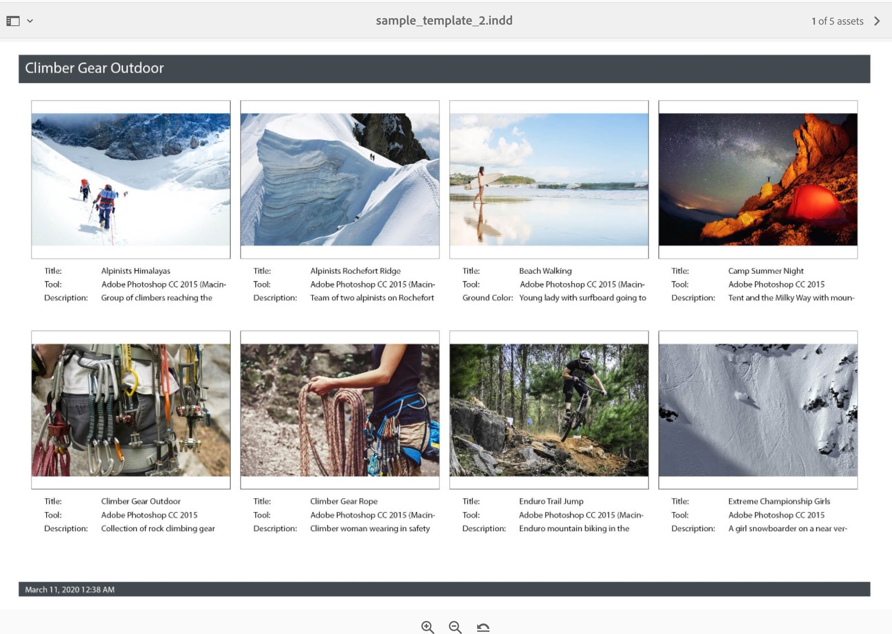
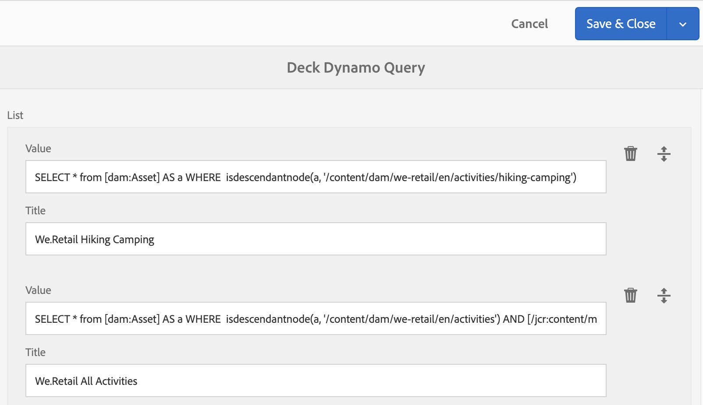

## Purpose
This tool was created to enable automation of business processes that involve InDesign documents.  It gives AEM the ability to generate InDesign documents directly from AEM Assets. End-user updates to generated InDesign documents can be saved back to AEM Assets.  Setting up this automation is straightforward (no code is required) even for highly-customized documents.

Benefits include:
* Greatly reduce labor required to create and maintain InDesign documents.
* Eliminate human error inherent in the manual process.
* Ensure that all data and imagery shown on InDesign documents is always up to date.

## Solution Overview

The tool requires three inputs to generate an InDesign document:
* AEM Assets
* An InDesign document template
* An XML document that specifies AEM-to-InDesign mapping.

### InDesign Template
This tool uses InDesign’s XML import functionality to insert data and imagery from AEM into generated InDesign documents.
The following screen grab shows a template document with Structure Panel open and field tagging highlighted. 
 

### AEM-to-InDesign Mapping (XML)
The “secret sauce” in this solution is the XML file that specifies AEM-to-InDesign mapping.

In the screen grab below, line 9 in the XML specifies that the dc:title metadata property on the AEM Asset should be imported into the field associated with the TITLE element.
 

Line 8 in the XML specifies that the Asset itself, the binary, should be imported into the field associated with the IMAGE element.
 

Line 7 identifies the ITEM element (and implicitly, its children) as iterable, or repeating.  Notice that this generated document has over 30 ITEM elements.  The ITEM XML only needs to be specified once; it will be applied repeatedly.
 

This shows a generated document with Structure Panel open and Tagging highlighted.
 

### Asset Selection
There are three ways to specify what AEM Assets will be imported into the InDesign document:
* AEM Collection
* AEM Tag
* Query (SQL2)

Using the AEM Collections or Tags is most straightforward for end-users.  The Query-driven approach is more flexible and precise.

## Prerequesites For Running the Tool

### InDesign CC Server
This tool requires InDesign CC Server.  Any recent version will work, but your server version must match your desktop version. On localhost, start InDesign server as follows:

./InDesignServer -port 8080


### Template Files
This tool also requires InDesign template and XML mapping file(s) that are not included in the ACS AEM Commons default installation.  

Two examples are available:
* Simple Template.  The package includes INDD and XML only. It is designed to work with We.Retail Assets. InDesign template files are provided for InDesign CC 2018 and 2020.

* More examples are available on request. TODO

## Running the Tool
Do this to generate a deck that uses a query to select all We.Retail activities :
 

You should get this:
 

Note that by default the We.Retail Assets have no Tags applied.  To test deck generation using Tags you must first manually apply Tags.  This can be done quickly as follows:
* In Assets search for "Gloves"
* Select all .jpegs, only .jpegs
* Click Properties
* Apply Tag We.Retail->Apparel->Gloves to all selected Assets and Save
* Generate a deck with the same tag.

Collections works as you would expect.  Try it.

## Advanced Topics

### Queries
The tool in includes a place to configure queries.  It looks like this:
 

### Data Sync
User updates to generated documents can be written back to the source AEM Assets. This requies 1) installation of an optional workflow and 2) setting is-data-sync="true" in the mapping XML for each field that should be synchronized. See lines 4 and 11 in the XML example above.

To install the Data Sync workflow download and install THIS PACKAGE TODO.  Please ask if you need this.

### Tips for creating InDesign document templates

Coming soon.  Please ask if you need this. TODO

