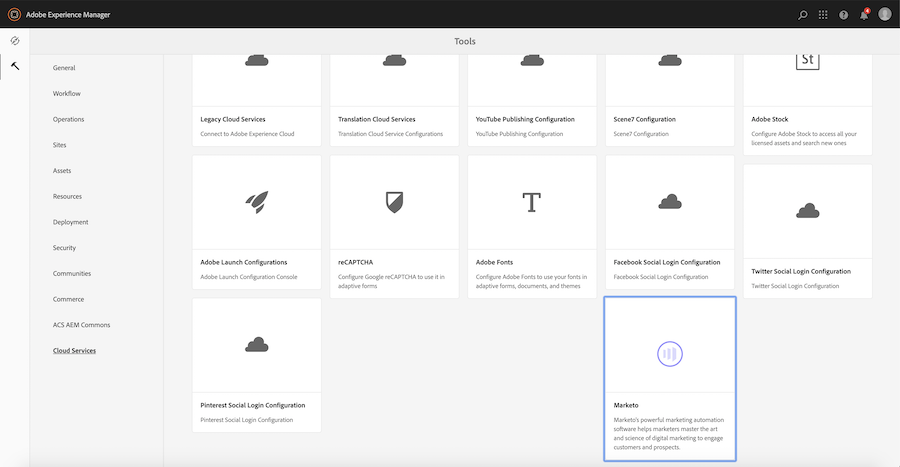
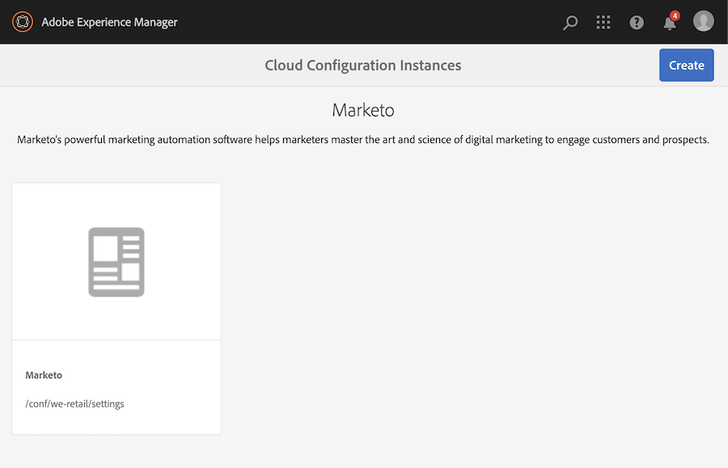
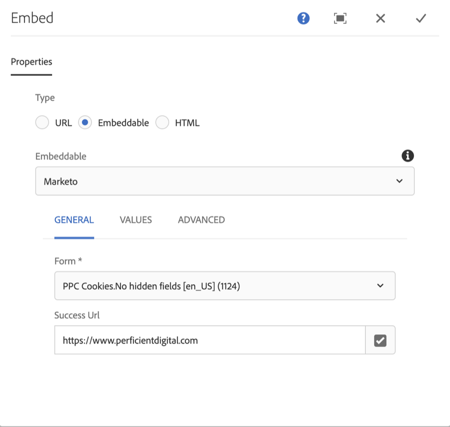
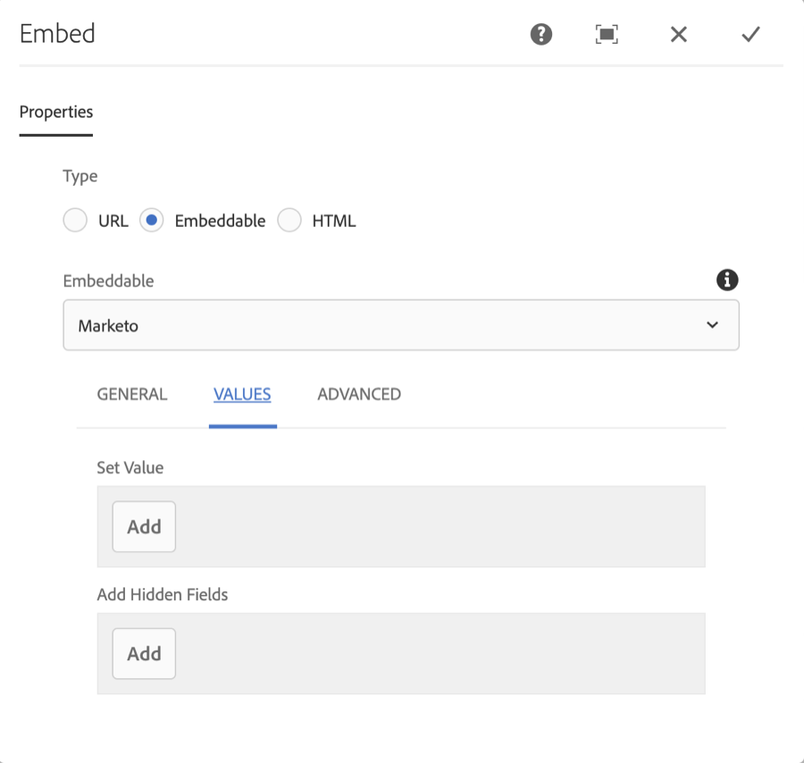
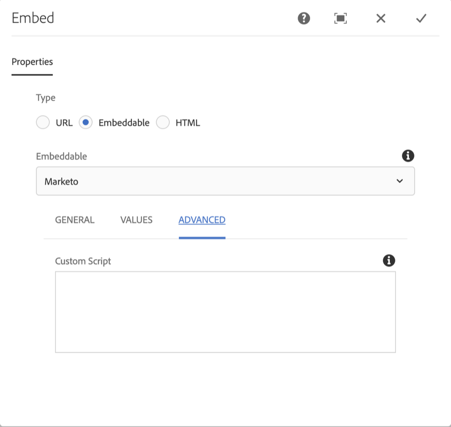

## Purpose

Easily add Marketo forms into Adobe Experience Manager pages.

## Setup

Configure the AEM Marketo Form feature via a Cloud Service Configuration.

1. Navigate to Tools > Cloud Services and Select Marketo
    
2. Add a new cloud service configuration or click on an existing one to open the configuration editor screen
    . Ensure the cloud configuration is created in your site's Conf root
3. Fill out and save the cloud configuration with the account details, including:
    - REST Endpoint Host - found in Marketo under Admin >> Integration >> Web Services, do not include the protocol (e.g. https, or //) or the path e.g. (/rest)
    - Marketo Server Instance - The URL you use to access Marketo, starting with // and without a path
    - Munchkin Account ID - Found in Marketo under Admin >> Integration >> Munchkin, three sets of characters separated by dashes
    - Client ID - Found in Marketo under Admin >> Integration >> LaunchPoint, a UUID
    - Client Secret - Found in Marketo under Admin >> Integration >> LaunchPoint, another UUID
5. Enable the Marketo Form embed as an embeddable

## Using the Component

Once the component is available for use, simply add an embed to the page, select the "Marketo" option and configure the component to your needs.

See the [Marketo JavaScript Forms API](https://developers.marketo.com/javascript-api/forms/) for more details on how to configure the Marketo Forms component.

There are three tabs of configuration for the Marketo Form component:

### General

The general tab has the most basic settings.

 - Form - this is the only required field and allows you to select the form to show from a filterable list of Forms
 - Success URL - a URL or path within AEM to redirect the user to upon Success

### Values

Allows for setting the form values dynamically

 - Set Value - set the value of an existing field on the form
 - Add Hidden Fields - add a new hidden to the field to the form

 Each field is configured with:

 - Field Name - select from the list of valid field names, note that not all fields may be available in the form
 - Value Source - one of:
   - Static - the value you enter in the value field below
   - ContextHub - load the value from the [AEM ContextHub](https://helpx.adobe.com/experience-manager/6-3/sites/developing/using/contexthub.html)
   - JavaScript Variable - load the value from any valid JavaScript expression
   - Request Parameter - load the value from a request parameter / query string
 - Value - usage depends on the selection of Value Source. For Static this should be the value of the field. For ContextHub, this should be the item path, ex: profile/familyName. For JavaScript Variable, this would be a valid JavaScript expression. For Request Parameter, this would be the name of the request parameter to use.

### Advanced

Allows you to write custom JavaScript to configure the form behavior, will have access to a variable 'form'

