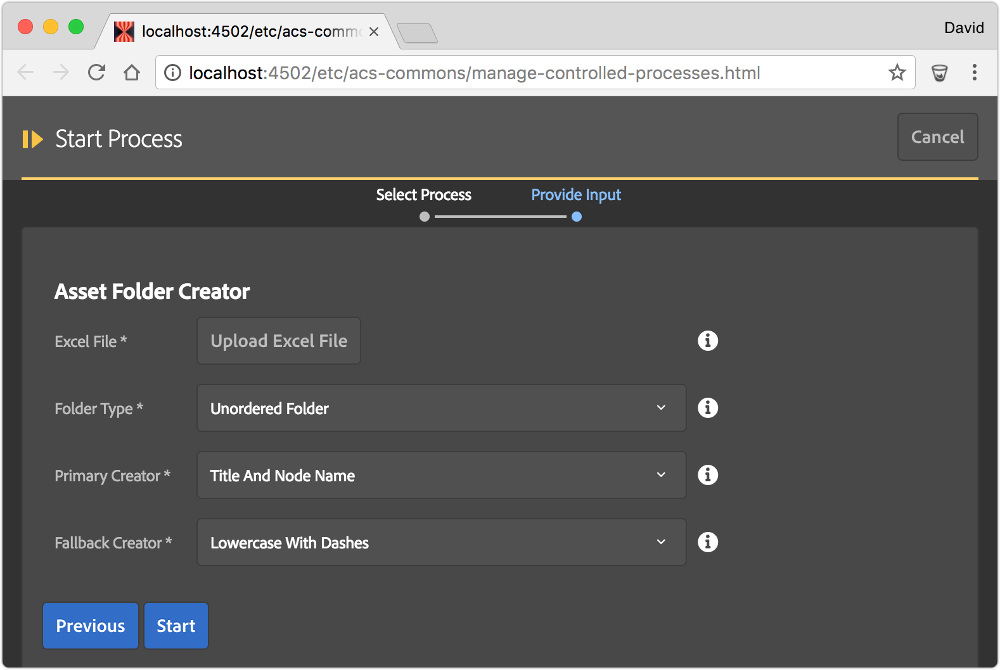

Asset Folder Creator that helps quickly build complex Asset Folder hierarchies in AEM. 

Asset Folder Creator leverages the power and flexibility of Excel, to put the power of Asset Folder architecture definition in the hands of the project's Content Architect. Asset Golder hierarchies can be modeled in Excel, reviewed, and quickly deployed to AEM, removing the need to manually create and name folders by hand in AEM Assets.

* **Excel File**: The Excel (xlsx) file that contains the Asset Folder definitions. *Note this is NOT a CSV file.*
  * [Example Excel file](https://github.com/Adobe-Consulting-Services/acs-aem-commons/blob/master/bundle/src/test/resources/com/adobe/acs/commons/mcp/impl/processes/asset-folder-creator.xlsx?raw=true)
* **Folder Type**: The type of folders to create; Ordered or Unordered Folder
* **Primary Creator**: The Data Converter (see below) to initially parse the Excel cell data with. 
* **Fallback Creator**: The Data Converter (see below) to parse the Excel cell data with if the Primary Creator cannot parse the data. 
	* This is useful when mixing Data Converter types in a single file. For example: 90% of the cells can use "Lowercase with Dashes" but 10% need explicit node names using Title and Node Name. Instead of creating all cells using the "Title and Node Name" format with the `{{"{{"}} ... }}`, only those that need the explicit title can define that format.
	* If all cells can be processed by the Primary Converter then this can be set to None.

## Data Converters

Asset Folder Creator comes w/ three Asset Folder Data Converters. These data converts transform the data in the Excel cells to Tag Titles and Node Names.

Note: The first column is treated as the Tag Namespace.

### Title to Node Name

* Tag title: The cell value as is
* Node name: Transforms the cell value using `JcrUtil.createValidName(..)` and forces the result to lower-case

### Lowercase with Dashes

* Tag title: The cell value as-is
* Node name: Transforms the cell value using the following rules:
 * Removes leading and trailing whitespace
 * Converts to lower-case
 * Replaces all '&' with ' and '
 * Replaces all '/' with ' or '
 * Replaces all '%' with ' percent '
 * Replaces all non-alphanumeric characters with '-'
 * Removes all instances of '-' from the start
 * Removes all instances of '-' form the end

### Title and Node Name

Expects the cell value to be in the following format: `Tag Title {{ "{{ node name "}}}}`

* Tag title: Everything in the cell before first instance of `{{"{{"}}` with leading and trailing white-space removed.
* Node name: Everything between `{{"{{"}}` and `}}` with leading and trailing white-space removed.

