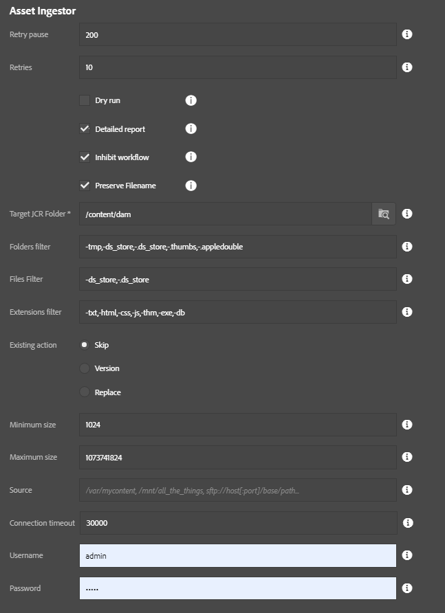

This is an example of a high-speed parallel asset ingestor utility.  You can load a directory of assets into AEM very easily with this tool.  Because of the ability to overload a server with assets, this tool only appears for the "admin" user right now.

* **Retry pause**: Used as retry pause between createFolder, createAsset actions and etc...
* **Retries**: Actions to attempt.
* **Dry run**: If checked, no assets will be imported but a report will be produced.  This is useful for testing out the data file for integrity.
* **Detailed Report**: If checked, a list of all imported assets will be produced.  If unchecked, only a summary will be provided.
* **Inhibit Workflow**: If checked, the process will attempt to bypass DAM Update Asset workflow.  This requires the workflow launcher have the following in the _exclude list_ setting: `event-user-data:changedByWorkflowProcess`.  If using this option. also consider using bulk workflow afterwards to process assets after the import has finished completely.
* **Preserve Filename**: If checked, file name is preserved as asset name.  If unchecked, asset name will support only the following characters: letters, digits, hyphens, underscores, another chars will be replaced with hyphens.
* **Target JCR Folder**: Where to store the assets in AEM
* **Folders filter**: Comma-delimited list of folders to filter, useful for bypassing thumnail folders and such. If you want to exclude folder name add '-' sign before name. If you want to include name, just write folder name or add '+' sign before name.
* **Files filter**: Comma-delimited list of files to filter, also useful for bypassing additional metadata files which might not be useful in a DAM setting. If you want to exclude file name add '-' sign before name. If you want to include name, just write file name or add '+' sign before name.
* **Extensions filter**: Comma-delimited list of file extensions to filter. If you want to exclude extension add '-' sign before name. If you want to include extension, just write extension or add '+' sign before name.
* **Existing action**: Decide what should happen if the DAM contains a target file already, such as if the ingestion is resumed after a previous abort
    * Replace: Replace the asset already in AEM (this can slow things down compared to skip)
    * Skip: Skip the asset
    * Version: Create a version of the asset and upload a fresh copy.  This is the safest, but slowest, option.
* **Minimum size**: The minimum file size (in bytes) that is required for importing a file.  Anything smaller is ignored. (0 = no minimum)
* **Maximum size**: The maximum file size allowed (in bytes); anything larger is skipped. (-1 = no maximum -- NOT RECOMMENDED!)
* **Source**: Source folder for content ingestion which can be a local folder or SFTP url.
* **Connection timeout**: For SFTP urls, this is the connection timeout in milliseconds (default is 30 seconds)
* **Username**: Username for SFTP connection
* **Password**: Password for SFTP connection

This process has two steps:

1. Create folder structure
2. Import assets