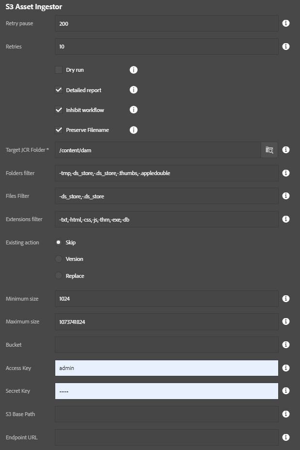

This is essentially the same as the [File Asset Ingestor](../asset-ingestor/index.html), but pulls files from an Amazon S3 bucket instead of the local filesystem.  You can load a directory of assets into AEM very easily with this tool.  Because of the ability to overload a server with assets, this tool only appears for the "admin" user right now.

This process depends upon the presence of the S3 SDK bundle. If you are using the S3 DataStore, this is already present. For other installations (e.g. using the FileDataStore), you should follow the instructions to install the OSGi bundles in the S3 DataStore Feature Pack, but do *not* install the configurations. Instructions for downloading the S3 DataStore Feature Pack can be found at the following links: [for AEM 6.2](https://helpx.adobe.com/experience-manager/6-2/sites/deploying/using/data-store-config.html#AmazonS3DataStore), [for AEM 6.3](https://docs.adobe.com/docs/en/aem/6-3/deploy/platform/data-store-config.html#Amazon%20S3%20Data%20Store)

* **Bucket**: Name of the S3 bucket which contains the files.
* **Access Key**: Amazon Web Services Access Key 
* **Secret Key**: Amazon Web Services Secret Key
* **S3 Base Path**: Optional prefix for files in the S3 bucket.
* **Endpoint URL**: Optional URL if your bucket is in a non-standard location.
* **Target JCR Folder**: Where to store the assets in AEM
* **Ignore folders**: Comma-delimited list of folders to skip, useful for bypassing thumnail folders and such
* **Ignore files**: Comma-delimited list of files to skip, also useful for bypassing additional metadata files which might not be useful in a DAM setting.
* **Ignore extensions**: Comma-delimited list of file extensions to skip.
* **Existing action**: Decide what should happen if the DAM contains a target file already, such as if the ingestion is resumed after a previous abort
    * Replace: Replace the asset already in AEM (this can slow things down compared to skip)
    * Skip: Skip the asset
    * Version: Create a version of the asset and upload a fresh copy.  This is the safest, but slowest, option.
* **Minimum size**: The minimum file size (in bytes) that is required for importing a file.  Anything smaller is ignored. (0 = no minimum)
* **Maximum size**: The maximum file size allowed (in bytes); anything larger is skipped. (-1 = no maximum -- NOT RECOMMENDED!)

This process has two steps:

1. Create folder structure
2. Import assets