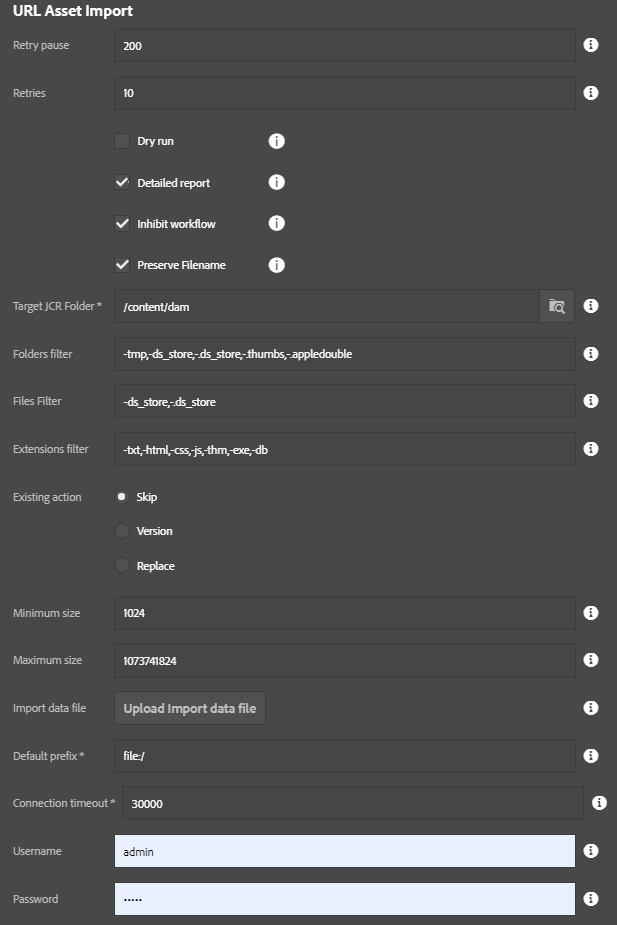

This tool loads assets listed in a spreadsheet and optionally also loading additional asset metadata.

## Overview

The above diagram details the URL Asset Import process.  First a spreadsheet should be prepared that lists all assets to be imported (see Spreadsheet format and the example below).  The user must start the process and provide the spreadsheet, paying careful attention to the process options, detailed in the next section.  During the first phase, all necessary folders are created.  Following that, assets are imported, and all metadata (if any) is applied.  At the end of the process a report is prepared and stored for later retrieval as needed.

## Starting the process

[Click here](/acs-aem-commons/features/mcp/subpages/process-manager.html) to read on how to start a process.  When prompted to  select the process, pick "URL Asset Import."

## Process options

- *Import data file*: Specify the excel data file, making sure it is not currently in use elsewhere (close Excel first)
- *Default prefix*: Added to the source path if the image is not a full URL.  This is useful for loading assets are are all stored in the same place, simplifying the data in the spreadsheet.
- *Connection timeout*: For HTTP/HTTPS urls, this is the connection timeout in milliseconds (default is 30 seconds)
- *Dry run*: If checked, no assets will be imported but a report will be produced.  This is useful for testing out the data file for integrity.
- *Detailed Report*: If checked, a list of all imported assets will be produced.  If unchecked, only a summary will be provided.
- *Inhibit Workflow*: If chekced, the process will attempt to bypass DAM Update Asset workflow.  This requires the workflow launcher have the following in the _exclude list_ setting: `event-user-data:changedByWorkflowProcess`.
- *Target JCR Folder*: This is the folder used if target folder is unspecified.
- *Ignore Folders*: List of folders to be ignored.  Can be helpful if trying to avoid some data in the spreadsheet.
- *Ignore Files*: List of files to be ignored.  Can be helpful if trying to avoid some data in the spreadsheet.
- *Ignore Extensions*: List of file extensions to be ignored.  Can be helpful if trying to avoid some data in the spreadsheet.
- *Existing Action*: Control what happens when assets already exist.  This doesn't apply to importing renditions (which are always imported if included in the spreadsheet.)
    - Replace: The existing asset (original) is replaced
    - Skip: Don't replace the asset
    - Version: Create a new version of the existing asset and replace the original rendition with the new version.
- *Minimum Size*: Any file smaller than this size (in bytes) will be skipped.  The default is 1kb.  -1 disables this check.
- *Maximum Size*: Any file larger than this size (in bytes) will be skipped.  The default size is 1gb.  -1 disables this check.

## Spreadsheet Format

This process requires the input spreadsheet to be in a certain format. [This page](/acs-aem-commons/features/utils-and-apis/data-api/index.html#structure) provides much more detailed information about the excel spreadsheet format as well as how to work with different data types.  It is important to note that if required columns are missing then data will not be processed correctly.

### Example input file

[An example excel file can be downloaded here.](url-asset-import-example.xlsx)  The format requirements are explained below.

### Required columns

These two columns must be present or the import process will skip the row entirely.  If the sheet does not have these two columns, then the whole sheet will be discarded.  When in doubt, use "*dry run*" to confirm that the data is being interpreted correctly.

* *Source* – defies where the file will be downloaded from. Should be full url (can be web or local filesystem URL).  The URL can be relative but this requires the `Default prefix` is specified correctly in the process dialog.  Examples are https://www.somewhere.com/path/to/my-picture.jpg or file:///mnt/uploads/my-picture.jpg
* *Target* – Takes target folder where the asset must be in AEM.  No folder information is used from the source URL so _this must be the exact target folder_.  For example, a target folder of `/content/dam/my-stuff` will load the previous source examples as `/content/dam/my-stuff/my-picture.jpg`.

### Adding additional renditions

It is also possible to load renditions and add them to assets during the same import process.  The caveat is that the original asset must also be listed in this same spreadsheet, because the import process will not go looking in the DAM for it otherwise.  

If you do not plan to use this feature at all, you can omit the "Rendition" and "Original" columns from the spreadsheet entirely.

Source and target must be specified in addition to the addition two columns described below: Rendition and Original.

* *Rendition* – Name of the rendition to be created with this file as its content.

* *Original* – Name of the original asset name which must be imported into the same target folder.  An attempt to fuzzy-match other assets in the target folder will be made if the exact match is not found.  This has useful implications.  This is a case-insensitive match and is immune to most typographical errors.

### Optional metadata columns

Additional columns with “:” in the name will be added as asset metadata.  For example a property like “abc:my-property” (where "abc' is a custom namespace) will be appended to the metadata.  This only happens for original assets, not renditions.  If a row has values filled in for "rendition" or "original" then effectively all metadata fields will be ignored entirely.

More information about metadata [can be found here](https://helpx.adobe.com/experience-manager/6-4/assets/using/metadata.html).

### Note on dc:title and other common metadata

It is possible to import properties such as dc:title but note that during the metadata extraction this can lead to some confusing outcomes.  For example, if the spreadsheet prescribes "Title A" as dc:title but the metadata in the file already indicates "Title B" for the same attribute, then the metadata extraction will store the metadata as an array of strings with both values.  This can be controlled somewhat by blacklisting the metadata property. 

More information about XMP Writeback and blacklist/filtering [can be found here](https://helpx.adobe.com/experience-manager/6-4/assets/using/xmp-writeback.html#FilteringXMPmetadata).

### Ignored columns

A column will be ignored in the following cases:

* The name is not one of the following: source, target, rendition, original
* The name does not have a colon `:` character in it denoting some kind of metadata property.

These columns can be added for convenience or for partial calculation/processing, but ultimately will not serve any functional purpose during import.

## Reporting

After the import has completed, the list of imported paths can be found in the results report, obtained by [these instructions](/acs-aem-commons/features/mcp/subpages/process-manager.html#viewing-a-report).  This report lists all paths which were processed or skipped with some supplemental information about the action taken.

This is an example of a completion report:
