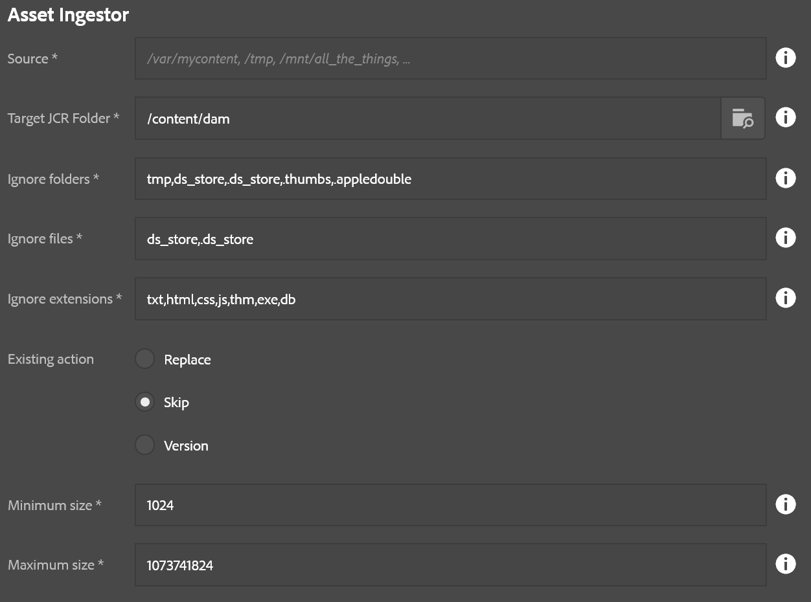

This is an example of a high-speed parallel asset ingestor utility.  You can load a directory of assets into AEM very easily with this tool.  Because of the ability to overload a server with assets, this tool only appears for the "admin" user right now.

* **Source**: Location in the local filesystem.  This can be a mapped/mounted network drive too.
* **Target JCR Folder**: Where to store the assets in AEM
* **Ignore folders**: Comma-delimited list of folders to skip, useful for bypassing thumnail folders and such
* **Ignore files**: Comma-delimited list of files to skip, also useful for bypassing additional metadata files which might not be useful in a DAM setting.
* **Ignore extensions**: Comma-delimited list of file extensions to skip.
* **Existing action**: Decide what should happen if the DAM contains a target file already, such as if the ingestion is resumed after a previous abort
    * Replace: Replace the asset already in AEM (this can slow things down compared to skip)
    * Skip: Skip the asset
    * Version: Create a version of the asset and upload a fresh copy.  This is the safest, but slowest, option.
* **Minimum size**: The minimum file size (in bytes) that is required for importing a file.  Anything smaller is ignored. (0 = no minimum)
* **Maximum size**: The maximum file size allowed (in bytes); anything larger is skipped. (-1 = no maximum -- NOT RECOMMENDED!)

This process has two steps:

1. Create folder structure
2. Import assets