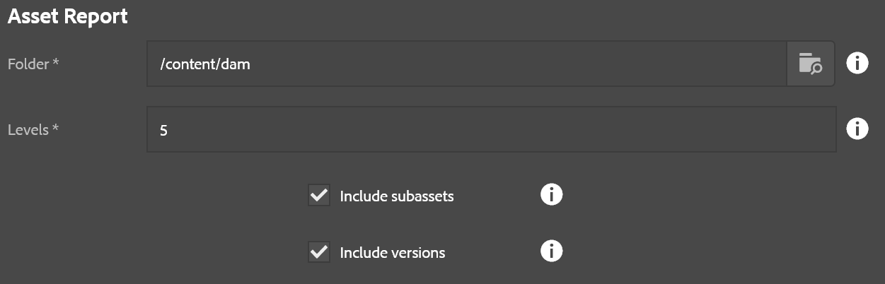

This reporting process identifies how much space is being used in a folder and its subfolders across all assets.

* **Folder**: Base path to start the report from
* **Levels**: Number of levels to report.

It is worth noting that levels only dictates how granular the report will be, but all folders will be scanned regardless.  The report indicates for a folder, how much cumulative space is used by the assets in that folder as well as all subfolders from that level.  So even if it isn't indicated in the report, the roll-up behavior means it should capture everything regardless.
