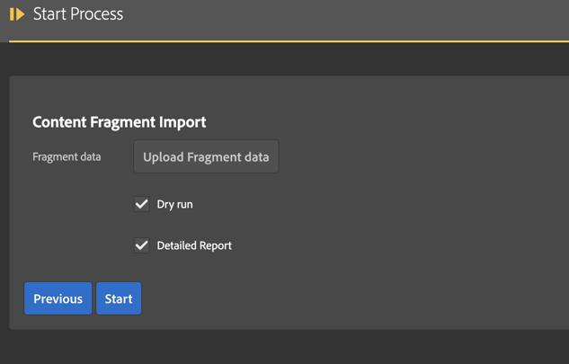
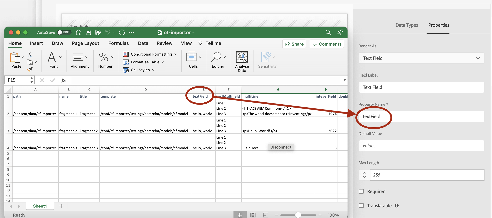

This utility allows you to import content fragments from a spreadsheet into AEM.  [Click here](/acs-aem-commons/features/mcp/subpages/process-manager.html) to read on how to start a process.  When prompted to  select the process, pick "Content Fragment Import".



There are several options to control how data will be brought into AEM with this tool:

* *Excel file*: Provide the input spreadsheet.
* *Dry run*: Only report on what actions would be taken without doing any actual work.
* *Detailed report*: Report on all actions taken, otherwise only brief summary information is provided in the report.

## Input Spreadsheet Requirements

The input spreadsheet must have a header row followed by data rows, e.g.

| path                   | name     | title     | template                                              | field1 | field2 | 
|------------------------|----------|-----------|-------------------------------------------------------|--------|--------|
| /content/dam/cf-import | import-1 | CF Test 1 | /conf/cf-import/settings/dam/cfm/models/cf-test-model | value1 | 2022   |
| /content/dam/cf-import | import-2 | CF Test 2 | /conf/cf-import/settings/dam/cfm/models/cf-test-model | value2 | 0.5    |

This input will create two content fragments in AEM: 
```  
+  /content/dam/cf-import
     +  import-1
        - jcr:title   CF Test 1  
        - cq:model    /conf/cf-import/settings/dam/cfm/models/cf-test-model   
     +  import-2  
        - jcr:title   CF Test 2         
        - cq:model    /conf/cf-import/settings/dam/cfm/models/cf-test-model   
```

Download [sample spreadsheet](./images/cf-importer.xlsx "sample spreadsheet") and 
[CF model](./images/cf-importer-test-model-1.0.zip "CF model") to see all available options.

### Required Columns
The first four columns have fixed names and are required:

| Name       | Sample Value                                          | Description                                   |
|------------|-------------------------------------------------------|-----------------------------------------------|
| `path`     | /content/dam/cf-import                                | The parent path of the fragment to be created |
| `name`     | import-1                                              | The name of the fragment to be created        |
| `title`    | CF Importer Test                                      | The title of the fragment to be created       |
| `template` | /conf/cf-import/settings/dam/cfm/models/cf-test-model | The CF model to be used.                      |

### Content Fragment Data Columns

The data columns map the spreadsheet cells to the fields in the CF model:


| Data Type in CF Model | Cell Type in Excel | Sample Value                                                                              |
|-----------------------|--------------------|-------------------------------------------------------------------------------------------|
| Single line text      | Text               | single value                                                                              |
| Multi line text       | Text               | Multiline text <br /> with line breaks and html tags                                      |
| Number                | Number             | 1974                                                                                      |
| Boolean               | Boolean            | TRUE                                                                                      |
| Date and time         | Date               | 1974-02-16T13:36:00 <br />16-Feb-74 1:36 PM<br />16-Feb-74<br />130253760000 (epoch time) |
| Enumeration           | Text               | enumValue                                                                                 |
| Tags                  | Text               | orientation:landscape                                                                     |
| Content Reference     | Text               | /content/we-retail/page1                                                                  |
| Fragment Reference    | Text               | /content/dam/cf-fragments/fragment-1                                                      |
| JSON Object           | Text               | `{"field": "value"}`                                                                      |

#### Multivalued Fields

To specify multiple values fields enter multiple lines in a single Excel cell by pressing Alt + Enter keys simultaneously while entering text.

### CF Metadata Columns

You can optionally set CF metadata such as tags or description.

| Column Name       | Sample Value                                                  | Description                  |
|-------------------|---------------------------------------------------------------|------------------------------|
| `jcr:description` | Hello, CF Import!                                             | CF Description               |
| `cq:tags@[]`      | properties:orientation/portrait,properties:orientation/square | comma-separated list of tags |


## Process report

After the import has completed, the list of imported paths can be found in the results report, obtained by [these instructions](/acs-aem-commons/features/mcp/subpages/process-manager.html#viewing-a-report).  This report lists all paths which were processed or skipped with some supplemental information about the action taken.
