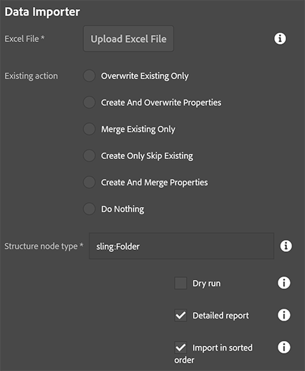

This utility allows you to import data from a spreadsheet into AEM.  [Click here](/acs-aem-commons/features/mcp/subpages/process-manager.html) to read on how to start a process.  When prompted to  select the process, pick "Data Importer."

There are several options to control how data will be brought into AEM with this tool:

* Excel file: Provide the excel file.  In Windows you must ensure the file is not currently open in Excel or you will receive an error.
* Existing action: Decide how data should be managed if the destination nodes alread exist or do not already exist yet.
* Structure node type: If intermediate nodes in the path are missing, this decides what type they should be.
* Dry run: Only report on what actions would be taken without doing any actual work.
* Detailed report: Report on all actions taken, otherwise only brief summary information is provided in the report.
* Import in sorted order: Ignores order in spreadsheet and sorts everything by path before processing.

## Excel data format requirements

[This page](/acs-aem-commons/features/utils-and-apis/data-api/index.html#structure) provides much more detailed information about the excel spreadsheet format as well as how to work with different data types.  It is extremely imporant to note the spreadsheet must have one column named "*path*" which contains the full path of the node to be created/updated.  Other columns are interpreted as properties on that node to be either added, merged, or updated depending on the "Existing action" selection.

## Existing action explained

You have a lot of options of how to control what happens with both existing and missing nodes during the import process.

* *Create and Overwrite Properties* - Create nodes if they don't exist, all properties are updated/overwritten for existing nodes.  This is the most forceful option.
* *Create Only Skip Existing* - Only new nodes are created, existing nodes are skipped.  All properties are imported for new nodes.
* *Create and Merge Properties* - Create new nodes and update existing nodes with missing properties.  Existing properties are left alone.
* *Merge Existing Only* - If node doesn't exist, row is skipped.  Properties are only stored if the node doesn't have those yet.  Existing properties are retained if they already exist.
* *Overwrite Existing Only* - If node doesn't exist, row is skipped.  All properties are updated/overwritten for existing nodes.
* *Do Nothing* - Does absolutely nothing, useful to test if file was read correctly.

## Process report

After the import has completed, the list of imported paths can be found in the results report, obtained by [these instructions](/acs-aem-commons/features/mcp/subpages/process-manager.html#viewing-a-report).  This report lists all paths which were processed or skipped with some supplemental information about the action taken.
