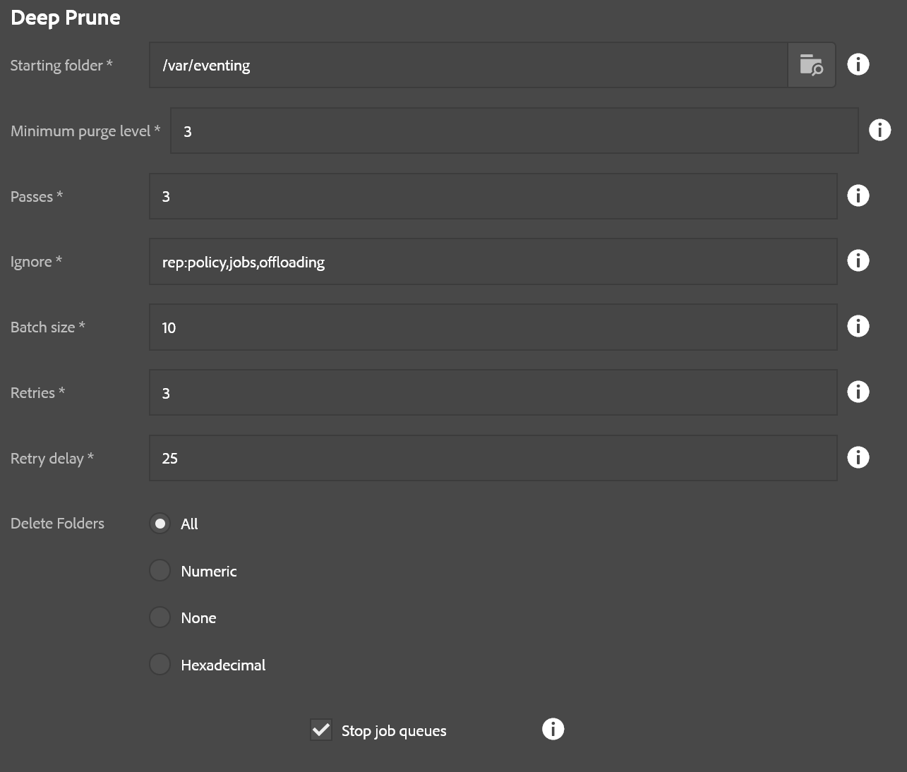

This is a maintenance tool that only appears for the "admin" user.  It allows you to recursively delete things from AEM such as content, workflow instances, running jobs, etc.

* **Starting folder**: Base folder where deletes will occur
* **Minimum purge level**: Only remove things this many levels down from the starting folder.  For example if the starting folder is /content/mySite and the minimum level is 3, then only folders like /content/mySite/page1/page2/page3 will be touched.  A setting of 0 means to delete everything under a folder, including the folder itself.  1 means all the immediate folders under the base folder, etc.
* **Passes**: Number of times to repeat this process.  Some nodes don't like being deleted and errors might occur.  This retries the deletion a specified number of times.
* **Ignore**: If the node has any of these names it is ignored (as well as its children!)
* **Batch size**: Number of items to delete at a time (can speed things up in most cases)
* **Retries**: Number of retries before giving up and going to the next batch of items to delete (this is not the same as passes, this is more granular within each pass)
* **Retry delay**: Number of milliseconds to wait between retries if an error occurs.
* **Delete folders**: Rule for folder deletion
    * All: Deletes all folders under the specified miniumum purge level
    * Numeric: Only deletes folders if the names are purely numeric
    * None: Don't delete any folders, just the non-folder child nodes
    * Hexadecimal: Only deletes folders if the names are hexadecimal.  Useful for purging jobs
* **Stop job queues**: If checked, the sling job queues will be stopped before deleting items and then restarted when done.  This is only necessary if you are deleting stuff under /var/eventing or possibly running workflow instances.  Otherwise it is unnecessary and not recommended to use this option outside of those use cases.

The number of steps varies depending on the passes specified, but otherwise the only other steps are to stop/restart job queues (if that option was checked.)  This tool is otherwise a 1-click headshot to AEM content, so please use it with extreme caution.

**Note about folder types:** Right now this tool only understands the following as folders: `nt:folder`, `sling:Folder`, `sling:OrderedFolder`.  Any other types will be treated as child nodes and not iterated. This means it also doesn't walk `cq:Page` trees right now.