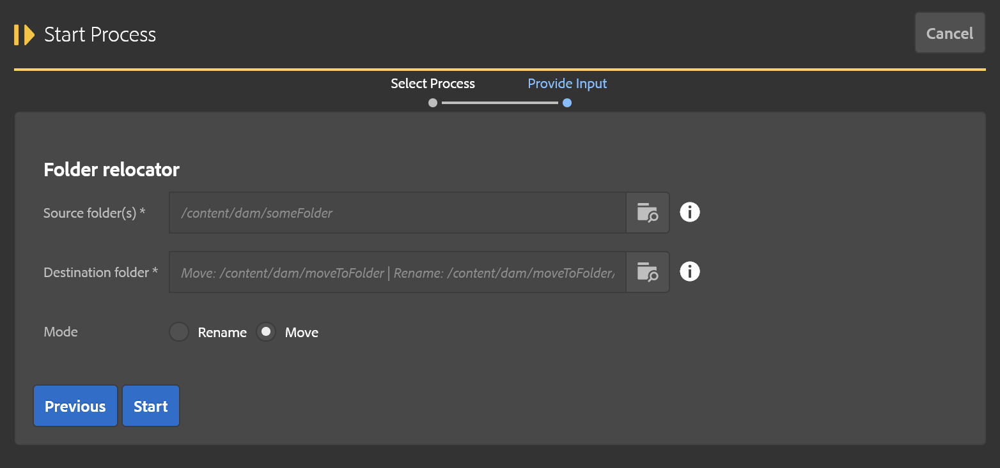

This tool is used to move or rename folders of assets.  

> At the present time, this tool does not update references if pages are affected by these moves.  This was primarily intended for assets customers that do not use Sites.  This is subject to change in the future, or a new tool might be released to address this gap as needed.

* **Source folder**: Folder being moved or renamed.
* **Destination folder**: Parent folder (if moving) or new folder path including new name (if renaming.) The parent path must exist!
* **Mode**: Move/Rename (as described above)

The steps of this operation are:

1. Validate ACLs.  This checks the user has permission to perform all the move operations associated with this process.  If there are any failues they are recorded as errors for debugging purposes.
2. Build target folders.  This duplicates the folder structure of the source folder, copying over metadata as needed.
3. Move assets.  This moves assets in groups from the old locations to the new.
4. Remove old folder.  This removes the old folder structure.  This does not happen if there were any errors during the asset moves, that way no data is inadvertently removed.
