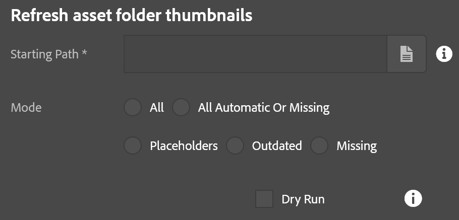

This repairs invalid or missing thumbnails on asset folders (just folders, not assets) which might have become invalid for one reason or another.  [Click here](/acs-aem-commons/features/mcp/subpages/process-manager.html) to read on how to start a process.  When prompted to  select the process, pick "Refresh Folder Thumbnails."

Prior to starting the tool there are three options to provide:

* Starting Path: Base folder to scan.  Everything in that folder (including subfolders, etc) will be scanned.
* Mode: Determines which set of scan rule will be applied.  See the Detection Rules for more details on this option.
* Dry Run: If checked, no changes are made but a report will be generated indicating what folders were detected in the scan.

After the scan has completed, the list of affected folders can be found in the results report, obtained by [these instructions](/acs-aem-commons/features/mcp/subpages/process-manager.html#viewing-a-report).  This report lists all folders which were detected in the scan as well as a summary of folders where were rebuilt.  Where possible, some hint as to why a folder was selected is also provided.

## Detection rules

The mode setting has five options:
* *All* - All thumbnails are rebuilt. †
* *All Automatic or Missing* (aka "Automatic") - Only automatically generated or missing thumbnails are rebuilt.  Manual thumbnails are left alone.
* *Placeholders* - Missing or Automatic thumbnails that look like blank images are replaced, no dates are compared. Manual thumbnails are left alone.
* *Outdated* - Any missing or automatic thumbnail that looks like a placeholder or is older than images used will be rebuilt. Manual thumbnails are left alone.
* *Missing* - If there is no thumbnail at all, it will be created.  Automatic and manual thumbnails are ignored. Manual thumbnails are left alone.

The table below summarizes how each mode handles different cases.  If there is a check it means that folder's thumbnail will be deleted and rebuilt. X means that the folder will be ignored.

Case | Description | Missing | Placeholder | Outdated | Automatic | All
---|---|---|---|---|---|---|---
Missing | The folder has no thumbnail | ✔ | ✔ | ✔ | ✔ | ✔
Placeholder | The folder has a generated thumbnail which is blank | ✘ | ✔ | ✔ | ✔ | ✔
Outdated | The folder has a generated thumbnail which is not blank but is older than the images in it | ✘ | ✘ | ✔ | ✔ | ✔
Updated | The folder has a generated thumbnail which is not blank and is up-to-date | ✘ | ✘ | ✘ | ✔ | ✔
Manual | The folder has a manual thumbnail | ✘ | ✘ | ✘ | ✘ | ✔†

† - Though the automatic thumbnail will be removed from the folder, any manual thumbnail on the same folder will be left alone.  As a result there might not seem to be any noticable effect from the user experience for folders having manual thumbnails.