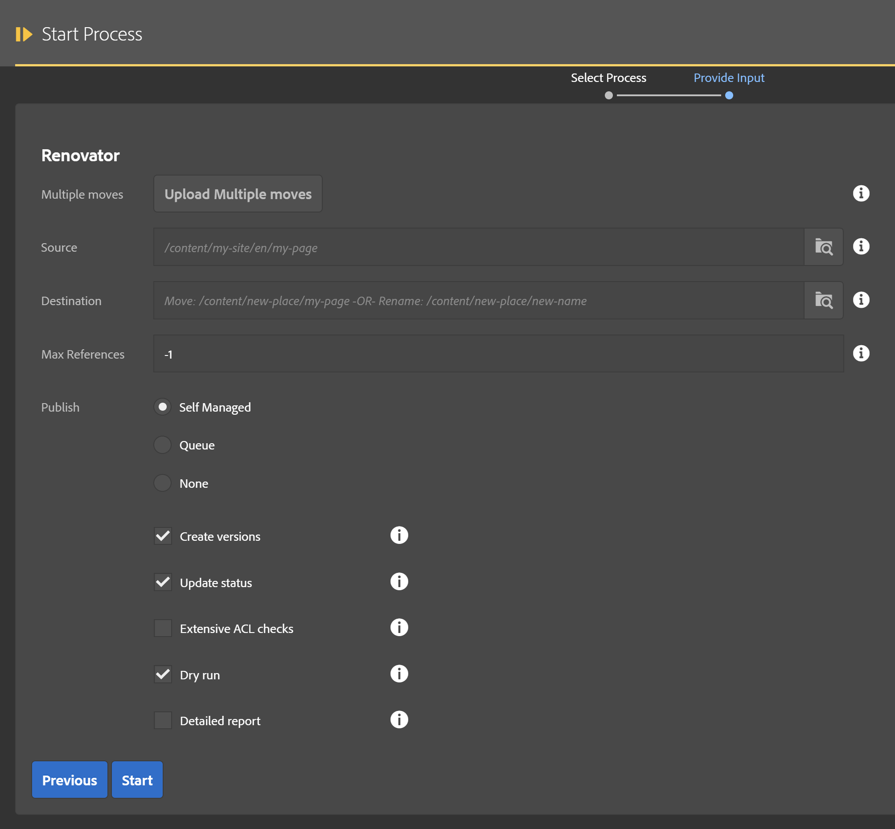
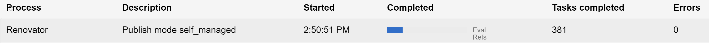
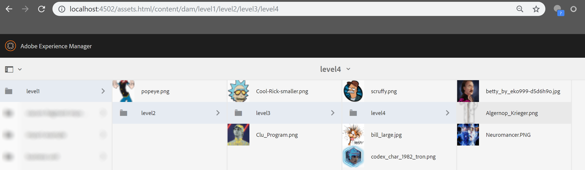
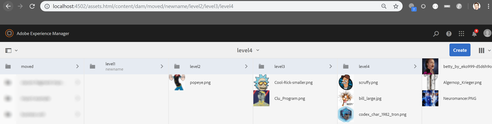
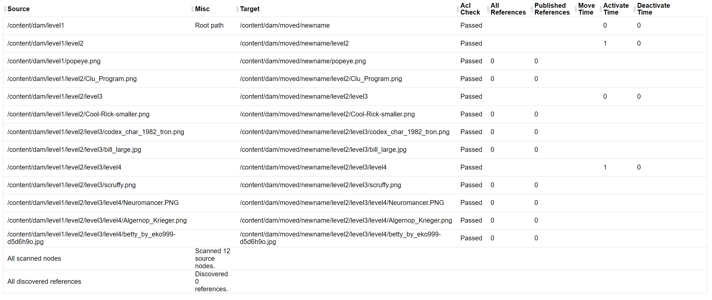

## About Renovator

Renovator assists the author in moving or renaming content in bulk.  All references are updated to reflect the changed page structure following this activity.  Publish options are also presented.  This process generates a report listing all affected pages, their new locations, number of references, and durations of move, unpublish, republish times (in milliseconds.)

* **Multiple moves**: If desired, multiple moves can be specified in a spreadsheet instead of moving one folder at a time.  This is explained below.
* **Source**: The page, folder, or asset being moved and/or renamed
* **Destination**: The full path of the destination for the folder or page.  This must include the desired name.  If you want to retain the current name then make sure destination ends with that same name.  Otherwise, change as desired.
* **Max references**: The maximum number of references to evaluate per page.  -1 defaults to all (recommended)
* **Publish mode**: You can use MCP to publish affected live content (self managed), defer to the standard product queue, or disable publishing (none).
* **Create versions**: If checked a page content affected by republishing will create a new version.
* **Update status**: If checked, node metadata for last published will be updated.
* **Extensive ACL Checks**: If checked, every child node is evaluated during step 1 (this can get very expensive for large trees!).  If unchecked, only base nodes are evaluated, such as the base node of each asset or page but not the children such as metadata or component nodes.  Recommended: Leave it unchecked.
* **Dry Run**: If checked, no moves or publish operations happen but the report is generated, and ACL checks are performed.  This lets you see what will be affected by this operation.
* **Detailed Report**: If checked, the final report will list all content moved by the process.  If unchecked, only summary counts are provided.

## Multiple moves

In the start process dialog, the source and destination fields allow moving one page or one folder (as well as all the children).  If you want to list a lot more sources and destinations, a simple spreadsheet can be prepared with that list as such:

1.  Create a new spreadsheet (the file name does not matter but it needs to be of type XLSX)
2.  In the first row, set the first two columns to "Source" and "Destination" respectively.  Order doesn't matter, and also if there are other columns they are ignored.
3.  For each move, add a row that specifies the source and destination of the move you want.  It is possible to list multiple sources that all have the same destination (merge folders) but you should not try to move the same source folder to multiple destinations.  That's just silly.
4.  Save the file as an XSLX spreadsheet and close Excel (this step is important)
5.  When starting the Renovator process, leave source and destination blank and provide the spredsheet for the "Multiple Moves" field.
6.  Set all other fields as needed, it is recommended to use a dry run the first time in order to validate the file as well as report what will be affected. 

## Runtime

The steps of this operation are:

1. Eval Struct[ures].  This step examines the trees being moved and calculates where things need to go and what operations to use. Failures in this step will abort the rest of the process.
2. Eval Refs.  This step looks at all content which will be moved and finds any other content that references this content.  Failures in this step will abort the rest of the process.
3. Validate ACLs.  Evalate all content being moved as well as referencing content that requires updates.  Confirm the user has necessary permission to change and, if requested, republish content.  The process will halt if there are any failures in this step.
4. Build Destination.  For folder moves, a destination folder structure is built ahead of time.  For page moves this step does nothing. Failures in this step will abort the rest of the process.
5. Move tree. This moves each folder, asset, and page to their new locations, updates references.  Failures in this step will abort the rest of the process.
6. Activate tree.  For folder moves, the new folder structure is activated.    Failures do not abort the rest of the process but are caputred in the error report.
7. Activate new.  This step activates additional content which was detected during the move process as already being published.  Failures do not abort the rest of the process but are caputred in the error report.
8. Activate references.  Any content referencing the moved content, and was already live, will be republished in this step.    Failures do not abort the rest of the process but are caputred in the error report.
9. Deactivate old.  All folders and pages are deactivated in their former locations.    Failures do not abort the rest of the process but are caputred in the error report.
10. Remove source.  If everything was successful, the old source paths are removed from the JCR.

## Move example

In this example, the folder "level1" is moved and also renamed.  The source provded was /content/dam/level1 and it has this structure:

The destination of the move was /content/dam/moved/newname.  Note that the "moved" folder was created automatically and the node name is no longer level1 but instead is "newname."  The jcr:title is still level1 however.

The detailed report of this operation is as follows:

