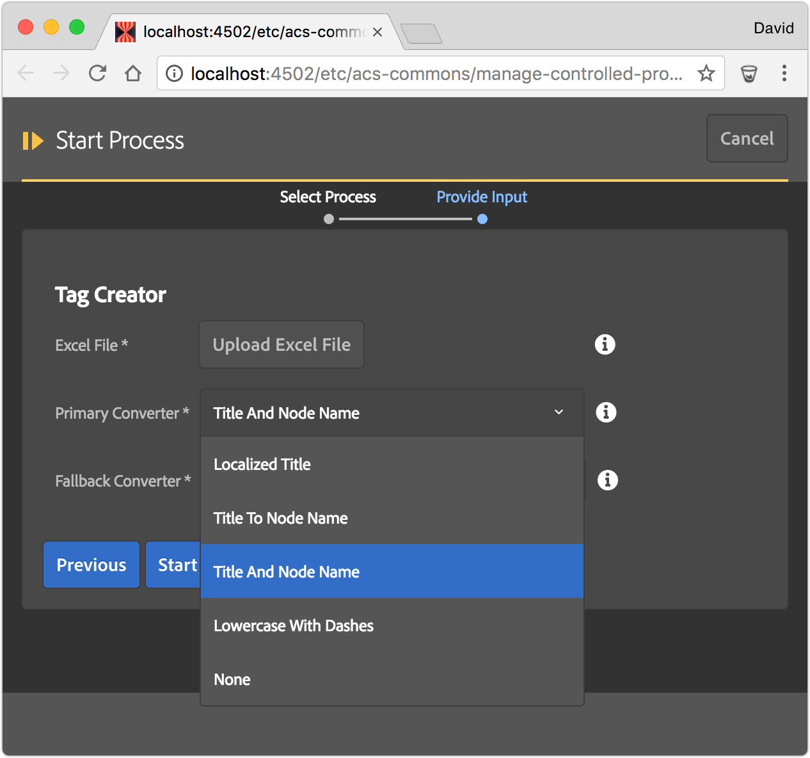

> This replaces [ACS AEM Tools' Tag Maker](https://adobe-consulting-services.github.io/acs-aem-tools/features/tag-maker/index.html). 

Tag Creator is a tool aimed at the creation of Tag taxonomies in AEM. Excel provides a simple, flexible and natural way of modeling Tag taxonomies outside of AEM, however transforming the Excel into AEM Tags can be an arduous process, especially for very large taxonomies.

Tag Creator bridges this gap by ingesting a Excel file, and creating the AEM Tag trees defined in the Excel file.

* **Excel File**: The Excel (xlsx) file that contains the Tag definitions. *Note this is NOT a CSV file.*
* **Primary Converter**: The Data Converter (see below) to initially parse the Excel cell data with. 
* **Fallback Converter**: The Data Converter (see below) to parse the Excel cell data with if the Primary Converter cannot parse the data. 
	* This is useful when mixing Data Converter types in a single file. For example: 90% of the cells can use "Lowercase with Dashes" but 10% need explicit node names using Title and Node Name. Instead of creating all cells using the "Title and Node Name" format with the `{{"{{"}} ... }}`, only those that need the explicit title can define that format.
	* If all cells can be processed by the Primary Converter then this can be set to None.

## Data Converters

Tag Creator comes w/ four Tag Data Converters. These data converts transform the data in the Excel cells to Tag Titles and Node Names.

Note: The first column is treated as the Tag Namespace.

### Title to Node Name

* Tag title: The cell value as is
* Node name: Transforms the cell value using `JcrUtil.createValidName(..)` and forces the result to lower-case

### Lowercase with Dashes

* Tag title: The cell value as-is
* Node name: Transforms the cell value using the following rules:
 * Removes leading and trailing whitespace
 * Converts to lower-case
 * Replaces all '&' with ' and '
 * Replaces all '/' with ' or '
 * Replaces all '%' with ' percent '
 * Replaces all non-alphanumeric characters with '-'
 * Removes all instances of '-' from the start
 * Removes all instances of '-' form the end

### Title and Node Name

Expects the cell value to be in the following format: `Tag Title {{ "{{ node name "}}}}`

* Tag title: Everything in the cell before first instance of `{{"{{"}}` with leading and trailing white-space removed.
* Node name: Everything between `{{"{{"}}` and `}}` with leading and trailing white-space removed.

### Localized Title

Expects the cell value to be in the following format: `default[Default Title] locale_code1[Localized Title] ... locale_codeN[Localized Title] {{ "{{ node name "}}}}`

* Localized Tag titles 
  * Default: `default[Default Title]` the faux locale of "default" indicates the default Tag title (`[cq:Tag]@jcr:title`). If no default is provided the first localized title is used as the default title value.
  * Locales: Each localized title is provided via a space seperated list in the format of `locale_code[Local Title]`
     * Examples:`en[Title] fr_fr[Titre] es[Titulo]`
* Node name: Everything between `{{"{{"}}` and `}}` with leading and trailing white-space removed. Note the node name is not localized.
